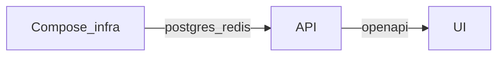

<h1 align="center">AI Starter Templates</h1>

<p align="center">
  <strong>SaaS starters with the boring parts already thought through.</strong><br />
  <em>Auth, billing, an API contract, and a deploy story you can run locally, not a slideshow.</em>
</p>

<p align="center">
  <strong>📖 Full docs: <a href="https://boringstack.xyz">boringstack.xyz</a></strong>
</p>

<p align="center">
  <a href="https://github.com/AI-Starter-Templates/api-template">api-template</a> ·
  <a href="https://github.com/AI-Starter-Templates/ui-template">ui-template</a> ·
  <a href="https://github.com/AI-Starter-Templates/infra-docker-compose-template">infra-docker-compose-template</a>
</p>

---

## What you get

Three **independent** template repos, cut from codebases that have been in production for **15 years**. Think auth, persistence, payments, email, logs, and how you actually boot the stack. The point is to stop rebuilding the same spine on every greenfield, whether a human or an agent is driving the editor.

- **Typed API surface.** The API publishes OpenAPI; the UI codegen keeps paths and response shapes lined up with the server.
- **Lint that backs up the folders.** A pile of custom ESLint rules on the API and UI sides so “where does this go?” and “did we just log a secret?” are mostly mechanical questions.
- **SaaS-shaped defaults.** Sessions, OAuth, Stripe webhooks, queues, audit trail, structured logging, env checks. Not a toy login page.
- **Runs on your machine.** [infra-docker-compose-template](https://github.com/AI-Starter-Templates/infra-docker-compose-template) gives Postgres, Redis, and Traefik for local or single-VPS flows. A **separate** K3s-focused repo is planned so Compose and cluster manifests never share one mega-repo.

## What we optimize for

### Minimal cost to run and maintain (COGS)

The templates bias toward **open source** and **self-hosted** building blocks for the spine—database, cache, queue, reverse proxy, and how you boot the stack with [infra-docker-compose-template](https://github.com/AI-Starter-Templates/infra-docker-compose-template) (and K8s paths later)—so recurring **vendor spend and surprise line items** stay low and as much of the **data plane** as possible runs on primitives you control.

### Maturity

Core infra is **battle-tested for years**: **Postgres**, **Redis**, **Traefik**, standard Docker workflows—not experimental hosted-only databases or bespoke orchestration for your system of record.

### Ownership

**No vendor lock-in** on that core: you run the infra, you hold the data, and there are **no hidden platform fees** for those layers. **Stripe** (billing) and **optional observability** (e.g. **Sentry** in the UI template) are integrations you can swap or self-host later; defaults still favor boring, portable foundations where it matters most.

### Plain SPA, sharp boundaries

The UI is a **Vite + React** SPA on purpose: **strong DX**, dev and bundling that stay **fast**, and **not** a hybrid stack that blurs server and client in ways that are awkward to own long term. **Separation of concerns** is strict—the UI owns rendering and client state; the **API delivers JSON** behind **OpenAPI**, not double duty as a document or template runtime. Each side does one job well, with less accidental coupling and less pressure on the API for presentation-shaped work.

## Prototypes vs Production

Lovable, Replit Agent, v0, Bolt, and similar tools are great for **seeing** whether an idea sticks. Pain shows up when that output gets treated like finished product: keys in the browser, SQL in handlers, unsigned webhooks, “auth” that falls over under basic review, logs full of customer data.

These repos start from the other assumption: you want defaults, a written contract for agents (`AGENT_CONTRACT.md` on the API), and a short security checklist, and you still want to move quickly.

## The three repos

| Repo                                                                                                       | Role                                                                                                                                                                                                                                                                                                 | Start here                                                                                                                                                                                                                                                                |
| ---------------------------------------------------------------------------------------------------------- | ---------------------------------------------------------------------------------------------------------------------------------------------------------------------------------------------------------------------------------------------------------------------------------------------------- | ------------------------------------------------------------------------------------------------------------------------------------------------------------------------------------------------------------------------------------------------------------------------- |
| [**api-template**](https://github.com/AI-Starter-Templates/api-template)                                   | **Bun + Elysia + Drizzle + Postgres.** JWT cookies, bcrypt, OAuth (Google / GitHub / LinkedIn), pluggable email, Stripe billing, cache, BullMQ, audit log, Pino, CSP/CORS/rate limits, Docker image. **14** custom ESLint plugins.                                                                   | [README](https://github.com/AI-Starter-Templates/api-template#readme) · [AGENT_CONTRACT.md](https://github.com/AI-Starter-Templates/api-template/blob/main/AGENT_CONTRACT.md) · [SECURITY.md](https://github.com/AI-Starter-Templates/api-template/blob/main/SECURITY.md) |
| [**ui-template**](https://github.com/AI-Starter-Templates/ui-template)                                     | **Vite + React + TypeScript** SPA: React Router, TanStack Query, Zustand, shadcn/ui, Tailwind tokens, **openapi-typescript** + **openapi-fetch** from the API (`pnpm generate:api`), Vitest, Playwright, Storybook, Sentry. **6** ESLint plugins, same architectural family as the API.         | [README](https://github.com/AI-Starter-Templates/ui-template#readme)                                                                                                                                                                                                      |
| [**infra-docker-compose-template**](https://github.com/AI-Starter-Templates/infra-docker-compose-template) | **Docker Compose + Traefik v3:** Postgres, Redis, **dev stack runs API + UI in Compose** (bind mounts for hot reload), prod profile with ACME, optional Prometheus/Grafana, runbooks (backups, firewall, hardening). **K3s/Kustomize** will ship in its **own** template repo later, not mixed here. | [README](https://github.com/AI-Starter-Templates/infra-docker-compose-template#readme)                                                                                                                                                                                    |

Each repo is its own clone with its own CI and merge bar. No monolith, no accidental 50k-line context window.

## How they fit together

[infra-docker-compose-template](https://github.com/AI-Starter-Templates/infra-docker-compose-template) brings up Postgres, Redis, Traefik, and **containerized** API/UI in dev (or production images when you use the prod profile). The API owns the domain and exports **OpenAPI** (Swagger while developing). The UI treats that file as truth: regenerate types when the server changes and let TypeScript argue with you before users do.



Hit **Use this template** on each GitHub repo, then lay the checkouts out as siblings. The API README uses **`../infra-docker-compose-template/compose`** from a sibling clone of that repo.

```text
your-project/
├── api/                              # from api-template
├── infra-docker-compose-template/    # from AI-Starter-Templates/infra-docker-compose-template
└── ui/                               # from ui-template
```

Skim each `README.md`. The API repo is the heaviest read (plugins, agent contract, security list).

## Why three repos (and fewer wasted tokens)

Smaller context per task: editing a route shouldn’t drag in Compose overlays or cluster YAML; tuning Traefik shouldn’t load the Drizzle schema.

Infra, API, and UI can move on different schedules. A Postgres bump doesn’t need to ship with a UI tweak.

Most “new SaaS” code is the same wiring repeated. Put that wiring in templates once, then spend the budget on the parts that are actually yours.

## Community

Stack and pattern questions: **[Org discussions](https://github.com/orgs/AI-Starter-Templates/discussions)** or the [org home](https://github.com/AI-Starter-Templates).

## Status

| Repo                                                                                                   | Status                                                                             |
| ------------------------------------------------------------------------------------------------------ | ---------------------------------------------------------------------------------- |
| [api-template](https://github.com/AI-Starter-Templates/api-template)                                   | Ready: auth, billing, email, OAuth, queues, audit log, structured logging, OpenAPI |
| [ui-template](https://github.com/AI-Starter-Templates/ui-template)                                     | Ready: SPA shell, contract-typed client, tests, E2E, Storybook                     |
| [infra-docker-compose-template](https://github.com/AI-Starter-Templates/infra-docker-compose-template) | Ready: Compose, Traefik, Postgres, Redis, optional observability, runbooks         |

## License

MIT on each template. Fork, rename, use it. Keep secrets out of git.
