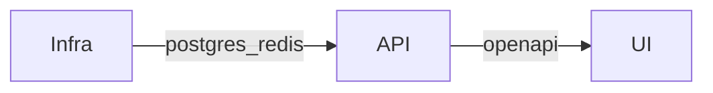

<h1 align="center">AI Starter Templates</h1>

<p align="center">
  <strong>SaaS starters with the boring parts already thought through.</strong><br />
  <em>Auth, billing, an API contract, and a deploy story you can run locally, not a slideshow.</em>
</p>

<p align="center">
  <a href="https://github.com/agjs/api-template">api-template</a> ·
  <a href="https://github.com/agjs/ui-template">ui-template</a> ·
  <a href="https://github.com/agjs/infra-template">infra-template</a>
</p>

---

## What you get

Three **independent** template repos, cut from codebases that have been in production for **15 years**. Think auth, persistence, payments, email, logs, and how you actually boot the stack. The point is to stop rebuilding the same spine on every greenfield, whether a human or an agent is driving the editor.

- **Typed API surface.** The API publishes OpenAPI; the UI codegen keeps paths and response shapes lined up with the server.
- **Lint that backs up the folders.** A pile of custom ESLint rules on the API and UI sides so “where does this go?” and “did we just log a secret?” are mostly mechanical questions.
- **SaaS-shaped defaults.** Sessions, OAuth, Stripe webhooks, queues, audit trail, structured logging, env checks. Not a toy login page.
- **Runs on your machine.** Compose for dependencies, and infra manifests when you outgrow a single box.

## Prototypes vs Production

Lovable, Replit Agent, v0, Bolt, and similar tools are great for **seeing** whether an idea sticks. Pain shows up when that output gets treated like finished product: keys in the browser, SQL in handlers, unsigned webhooks, “auth” that falls over under basic review, logs full of customer data.

These repos start from the other assumption: you want defaults, a written contract for agents (`AGENT_CONTRACT.md` on the API), and a short security checklist, and you still want to move quickly.

## The three repos

| Repo                                                         | Role                                                                                                                                                                                                                                                                                         | Start here                                                                                                                                                                                                                |
| ------------------------------------------------------------ | -------------------------------------------------------------------------------------------------------------------------------------------------------------------------------------------------------------------------------------------------------------------------------------------- | ------------------------------------------------------------------------------------------------------------------------------------------------------------------------------------------------------------------------- |
| [**api-template**](https://github.com/agjs/api-template)     | **Bun + Elysia + Drizzle + Postgres.** JWT cookies, bcrypt, OAuth (Google / GitHub / LinkedIn), pluggable email, Stripe billing, cache, BullMQ, audit log, Pino, CSP/CORS/rate limits, Docker image. **14** custom ESLint plugins.                                                           | [README](https://github.com/agjs/api-template#readme) · [AGENT_CONTRACT.md](https://github.com/agjs/api-template/blob/main/AGENT_CONTRACT.md) · [SECURITY.md](https://github.com/agjs/api-template/blob/main/SECURITY.md) |
| [**ui-template**](https://github.com/agjs/ui-template)       | **Vite + React + TypeScript** SPA: React Router, TanStack Query, Zustand, shadcn/ui, Tailwind tokens, **openapi-typescript** + **openapi-fetch** from the API (`pnpm generate:api`), MSW, Vitest, Playwright, Storybook, Sentry. **6** ESLint plugins, same architectural family as the API. | [README](https://github.com/agjs/ui-template#readme)                                                                                                                                                                      |
| [**infra-template**](https://github.com/agjs/infra-template) | **Docker Compose** for local and small single-host setups; **Kustomize** toward K3s/Kubernetes (CNPG, Vault, Traefik, cert-manager).                                                                                                                                                         | [README](https://github.com/agjs/infra-template#readme)                                                                                                                                                                   |

Each repo is its own clone with its own CI and merge bar. No monolith, no accidental 50k-line context window.

## How they fit together

Infra brings up what the API expects (Postgres and Redis in the Compose path from the API README). The API owns the domain and exports **OpenAPI** (Swagger while developing). The UI treats that file as truth: regenerate types when the server changes and let TypeScript argue with you before users do.



Hit **Use this template** on each GitHub repo, then lay the checkouts out as siblings (rename folders if you want shorter paths):

```text
your-project/
├── api/      # from api-template
├── infra/    # from infra-template
└── ui/       # from ui-template
```

Skim each `README.md`. The API repo is the heaviest read (plugins, agent contract, security list).

## Why three repos (and fewer wasted tokens)

Smaller context per task: editing a route shouldn’t drag in Kustomize patches; fiddling Traefik shouldn’t load the Drizzle schema.

Infra, API, and UI can move on different schedules. A Postgres bump doesn’t need to ship with a UI tweak.

Most “new SaaS” code is the same wiring repeated. Put that wiring in templates once, then spend the budget on the parts that are actually yours.

## Community

Stack and pattern questions: **[Discussions](https://github.com/agjs/ai-starter-templates/discussions)** on `ai-starter-templates`.

## Status

| Repo                                                     | Status                                                                             |
| -------------------------------------------------------- | ---------------------------------------------------------------------------------- |
| [api-template](https://github.com/agjs/api-template)     | Ready: auth, billing, email, OAuth, queues, audit log, structured logging, OpenAPI |
| [ui-template](https://github.com/agjs/ui-template)       | Ready: SPA shell, contract-typed client, tests, E2E, Storybook                     |
| [infra-template](https://github.com/agjs/infra-template) | Ready: Compose + Kustomize (CNPG, Vault, Traefik, cert-manager)                    |

## License

MIT on each template. Fork, rename, use it. Keep secrets out of git.
