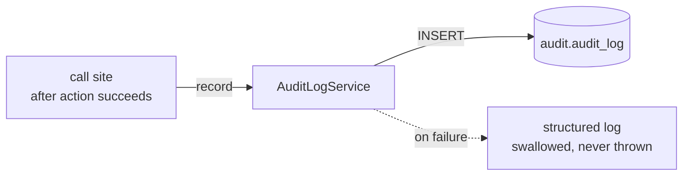

import { Aside } from "@astrojs/starlight/components";
import FaqGroup from "../../../components/FaqGroup.astro";
import FaqItem from "../../../components/FaqItem.astro";

The audit log is the answer to "who did what, when?" Auth events, OAuth link/unlink, billing actions, mutations on flagged resources; they all land in `audit.audit_log`.

The shape is deliberately boring: append-only table, structured `metadata` blob, time-ordered. The point is the discipline of writing to it, not the schema.

## How a write happens



The `void` prefix at call sites is load-bearing: it tells the reader (and the linter) the caller is deliberately not awaiting. Audit can't be allowed to fail a real request.

## Design choices

<FaqGroup>
  <FaqItem title="Separate Postgres schema (audit, not public)" open>
    Independent grants, retention, and archival; app migrations on `public` cannot touch audit rows.
  </FaqItem>
  <FaqItem title="Fire-and-forget writes (errors logged + swallowed)">
    A flaky audit table can never break a customer action.
  </FaqItem>
  <FaqItem title="Nullable userId + ON DELETE SET NULL">
    System events have no actor; "this account did X" history survives the user being scrubbed.
  </FaqItem>
  <FaqItem title="jsonb metadata">
    Add new fields without a migration; cost is no per-field index.
  </FaqItem>
  <FaqItem title="Centralized AUDIT_ACTIONS constant">
    Magic strings drift; admin queries depend on a stable vocabulary.
  </FaqItem>
</FaqGroup>

## The action vocabulary

Convention: `<area>.<verb>`. Examples:

- `auth.login_success`, `auth.password_reset_completed`
- `billing.checkout_session_created`
- `user.profile_updated`

A `<area>.<verb>` shape means admin queries can group cleanly:

```sql
SELECT action, count(*) FROM audit.audit_log
WHERE created_at > now() - interval '24 hours'
GROUP BY 1 ORDER BY 2 DESC;
```

New event types add a constant before the first call site. Both code review and the lint plugin treat magic-string actions as a smell.

## Using it

```ts
void auditLogService.record({
  userId: actor.id,                          // null for system events
  action: AUDIT_ACTIONS.USER_PROFILE_UPDATED,
  resource: `user:${user.id}`,               // optional
  metadata: { fieldsChanged: ["firstName"] },// optional, PII-free
});
```

For the rare flow that must observe the write (e.g. a security event that has to be persisted before responding), drop `void` and check `success`.

## What `metadata` is for

Structured context the action name doesn't capture. Keep it small and PII-free.

- Good: `{ planId: "pro_monthly", previousPlanId: "free" }`
- Bad: `{ email: "...", lastFourCardDigits: "..." }`

The lint plugin flags common leak patterns (keys named `password`, `token`, raw `email`).

## What userId should be

<FaqGroup>
  <FaqItem title="Authenticated user action" open>
    Actor's id.
  </FaqItem>
  <FaqItem title="System action (cron, webhook with no user context)">
    `null`.
  </FaqItem>
  <FaqItem title="Admin impersonating a user">
    Acting admin's id, with `metadata.actingAs` set to the target.
  </FaqItem>
</FaqGroup>

Never quietly attribute an admin's actions to the impersonated user.

## Adding a new event

1. Add a constant to `AUDIT_ACTIONS`.
2. After the action succeeds, `void auditLogService.record({...})`.
3. That's it. `/admin/audit-log` and the dashboard activity feed pick it up automatically because they query by action and recency.

## Retention

The template ships no retention policy on purpose. Three reasonable shapes:

- Cold storage: periodic `COPY ... TO` then `DELETE WHERE created_at < ...`.
- Partitioning: `pg_partman` by month, drop old partitions.
- None: for most B2B SaaS, an unbounded table is fine for years.

Pick consciously. Don't let the table grow to "huge and slow" and then think about it.

## Lint coverage

[`eslint-plugin-audit-log`](https://github.com/agjs/eslint-plugin-audit-log) flags:

- Mutations on flagged tables that skip the audit write.
- Magic-string `action` values that bypass `AUDIT_ACTIONS`.
- Metadata payloads that look like a PII leak.

## Source

[`src/lib/audit-log/`](https://github.com/AI-Starter-Templates/api-template/tree/main/src/lib/audit-log); service, types, constants. [`src/clients/postgres/schema/audit.schema.ts`](https://github.com/AI-Starter-Templates/api-template/blob/main/src/clients/postgres/schema/audit.schema.ts); the table.

## Related

- [Authentication](/api/auth/); every auth event writes here.
- [Lint as the contract](/architecture/lint-as-contract/); why the lint plugin matters.
