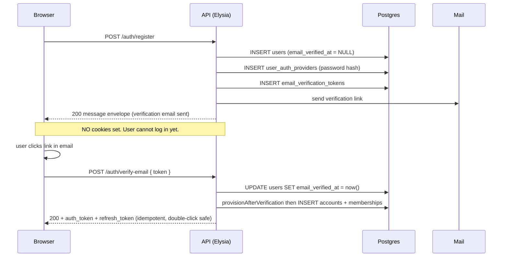
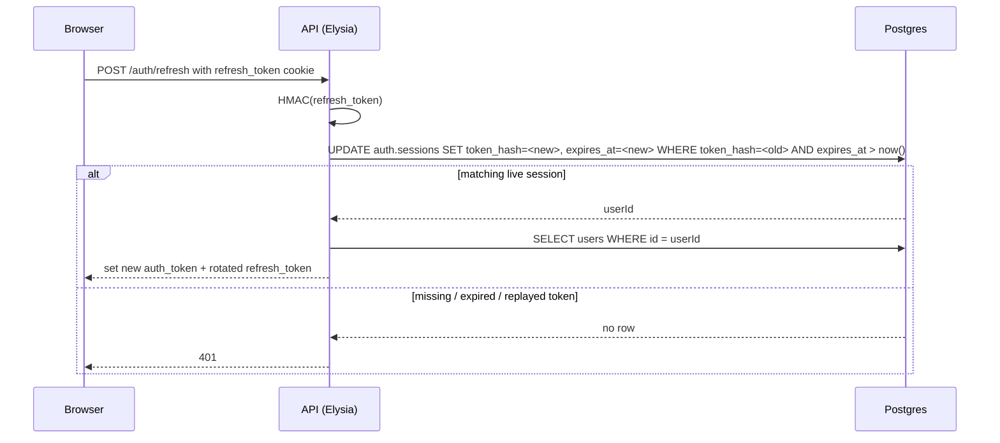
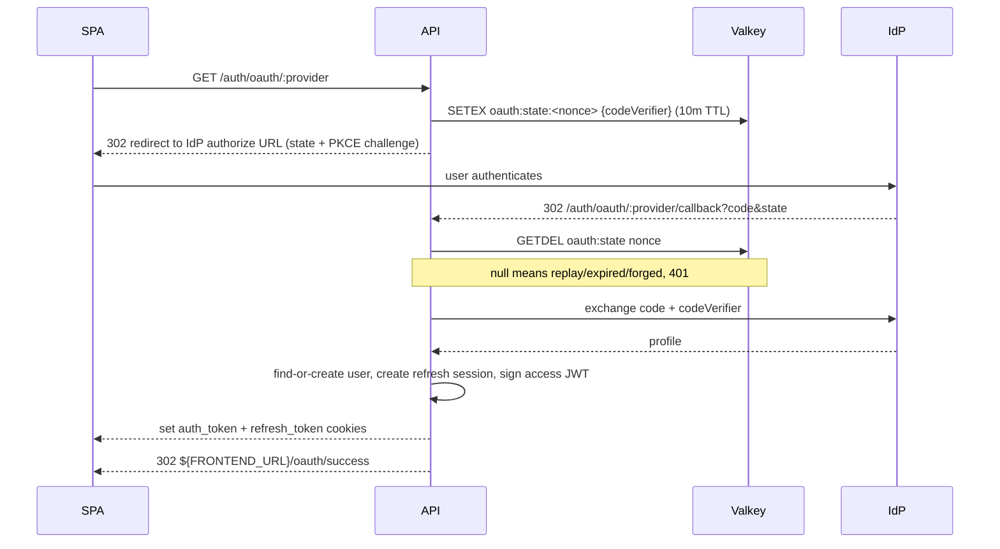

import { Aside } from "@astrojs/starlight/components";
import FaqGroup from "../../../components/FaqGroup.astro";
import FaqItem from "../../../components/FaqItem.astro";

Two login flows share one browser contract:

- Password: register / verify-email / login / forgot-password / reset-password.
- OAuth: Google, GitHub, LinkedIn. Server-side; the SPA never holds a client secret.

Both converge at the same point: `accountsService.provisionAfterVerification`, the single place that creates the personal account and owner membership. Without verification, there is no account, so abandoned signups leave no orphan tenant rows in the database.

Once verified, a session ends the same way regardless of which flow produced it:

- `auth_token`: a 15-minute stateless JWT in an `HttpOnly` cookie. The frontend never reads or stores it.
- `refresh_token`: a 30-day opaque `HttpOnly` cookie. The API stores only its HMAC hash in `auth.sessions`, rotates it on every refresh, and can revoke it on logout or password reset.

So the model is intentionally hybrid: fast stateless access checks, stateful refresh sessions for revocation and safer long-lived login.

## Verify-before-account

Password signup splits across two endpoints. `POST /auth/register` writes only the pending user row, the bcrypt hash, and a single-use verification token. No `app.accounts` row, no membership, no session cookies. The response is a `{ message }` envelope so the SPA can render "check your inbox at user@example.com." `POST /auth/verify-email` flips `users.email_verified_at`, atomically calls `provisionAfterVerification`, and *then* issues the auth + refresh cookies. That's where the user gets their account.



The OAuth flow lands at the same `provisionAfterVerification` call. Branches that converge there:

- Brand-new OAuth signup with a provider-verified email: user created, provisioned, session issued.
- Existing pending password-signup signing in with OAuth: user gets promoted to verified, the OAuth link is added, the account is provisioned. (This branch quietly fixed a pre-VBA bug where pending users could get OAuth-linked but never end up with an account.)
- Existing already-verified user adding another OAuth provider: link added; `provisionAfterVerification` is idempotent (returns the existing account and membership).

OAuth refuses to issue a session when the IdP says `emailVerified: false`. The transaction rolls back with no user row, no provider link, and no half-state. The caller has to verify through the password flow first.

`POST /auth/login` with a still-pending user (correct password, `email_verified_at` is null) returns **403 `EMAIL_NOT_VERIFIED`**. The check fires after the password verify so an attacker who doesn't already know the password can't enumerate which addresses are pending versus unknown. The UI surfaces a resend-verification CTA pinned to the email the user typed.

A daily `cleanStalePendingUsersJob` hard-deletes pending users older than 30 days (configurable). FK cascades drop the auth provider + verification token; `audit.audit_log` survives so the registration attempt remains traceable.

## How a request gets authenticated


`createAuthMiddleware` mounts this on protected route groups. Every handler in that group gets a typed `user` on its context. Token errors are categorized so the SPA can react cleanly (expired != malformed != missing).

## How refresh works



Refresh-token rotation means a replayed old refresh token no longer matches a row. Logout deletes the current refresh session. Password reset deletes all refresh sessions for that user.

## Design choices

<FaqGroup>
  <FaqItem title="JWT in HttpOnly cookie (not localStorage)" open>
    XSS cannot read the access token because it is never exposed to JavaScript.
  </FaqItem>
  <FaqItem title="SameSite=strict in prod, lax in dev">
    CSRF protection without breaking same-origin dev.
  </FaqItem>
  <FaqItem title="Short access JWT (15 minutes)">
    Normal API requests stay cheap: verify the cookie signature and expiry, then load the user row.
  </FaqItem>
  <FaqItem title="Stateful refresh sessions">
    Long-lived login lives in `auth.sessions`, keyed by a hash of an opaque token. The API can revoke one session or all sessions for a user.
  </FaqItem>
  <FaqItem title="Frontend never stores tokens">
    The SPA relies on browser-managed cookies and the generated OpenAPI client. Auth responses return `user`, not a bearer token.
  </FaqItem>
  <FaqItem title="Two tables: users and user_auth_providers">
    One user can hold a password and N OAuth links; no nullable password column.
  </FaqItem>
  <FaqItem title="OAuth state in Valkey, not in a cookie">
    State must survive the cross-origin redirect; cookies on the IdP domain do not work.
  </FaqItem>
  <FaqItem title="Read-and-delete state consumption">
    Replay attacks fail by construction.
  </FaqItem>
  <FaqItem title="No account exists without a verified email">
    `/register` writes only the pending user row. The personal account
    + owner membership get created only at verify-email time (or
    inline at the OAuth callback when the IdP asserts the email is
    verified). Abandoned signups don't leave orphan tenant rows.
  </FaqItem>
  <FaqItem title="`EMAIL_NOT_VERIFIED` (403) fires only after correct password">
    Password order on `/login` is: dummy-verify on lookup miss, then
    bcrypt, then check `email_verified_at`. An attacker who doesn't know
    the password can't enumerate pending users.
  </FaqItem>
</FaqGroup>

## The OAuth round-trip



The state record holds the PKCE code verifier. Reading it consumes it; a second callback with the same `state` finds nothing. The 10-minute TTL accommodates a slow IdP without leaving stale state lying around.

## Using it

A protected route looks like:

```ts
new Elysia()
  .use(createAuthMiddleware())
  .get("/me", ({ user }) => ({ user })); // user: IUser, type-safe
```

Unauthenticated callers get a categorized 401 (`tokenExpired`, `invalidToken`, `missingCookie`). The UI client tries one guarded `/auth/refresh` when it sees a 401, then retries the original request. If refresh fails, `ProtectedRoute` redirects to login.

## Session storage

The `auth.sessions` table stores:

- `user_id`
- `token_hash` (HMAC-SHA256 of the opaque refresh token, never the raw token)
- `expires_at`
- timestamps

Email-verification and password-reset tokens follow the same rule: raw token only goes to the user, hash goes to Postgres.

## Adding an OAuth provider

1. Add it to `OAUTH_PROVIDERS` and the env-key map in [`oauth.manifest.ts`](https://github.com/AI-Starter-Templates/api-template/blob/main/src/lib/oauth/oauth.manifest.ts).
2. Drop a provider module in `src/lib/oauth/providers/` using Arctic's class for that IdP.
3. Add the client-id/secret pair to the env schema with a cross-field invariant ("required when provider enabled").

The lint plugins refuse to merge a provider that skips the state-consume or PKCE wire-up.

## Lint coverage

- [`eslint-plugin-jwt-cookies`](https://github.com/agjs/eslint-plugin-jwt-cookies); cookie attributes and JWT verify call sites.
- [`eslint-plugin-oauth-security`](https://github.com/agjs/eslint-plugin-oauth-security); state + PKCE invariants on the callback path.

See [Lint as the contract](/architecture/lint-as-contract/) for why these matter.

<Aside type="caution" title="Rotating JWT_SECRET">
  Rotating `JWT_SECRET` invalidates access cookies and makes existing refresh
  token hashes impossible to match. That's the right behavior after a suspected
  leak; don't rotate casually.
</Aside>

## Source

[`src/api/auth/`](https://github.com/AI-Starter-Templates/api-template/tree/main/src/api/auth) and [`src/lib/oauth/`](https://github.com/AI-Starter-Templates/api-template/tree/main/src/lib/oauth) on GitHub; the routes, the services, the OAuth state store, and the providers.

## Related

- [Env validator](/api/env-validator/); enforces the OAuth-credentials-when-enabled invariant.
- [Audit log](/api/audit-log/); every auth event writes an audit row.
