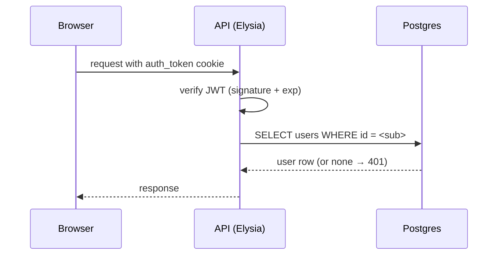
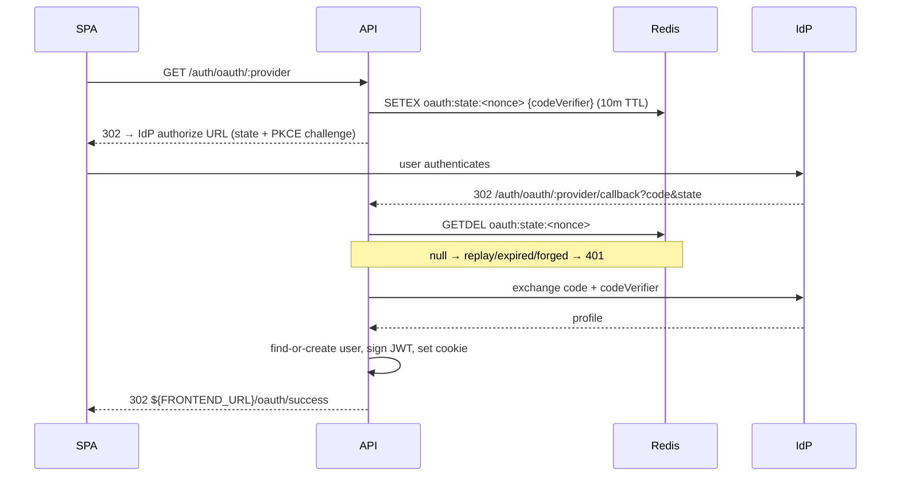

import { Aside } from "@astrojs/starlight/components";

Two flows share one session model:

- **Password**; register / login / verify-email / forgot-password / reset-password.
- **OAuth**; Google, GitHub, LinkedIn. Server-side: the SPA never holds a client secret.

Both end the same way: an `HttpOnly` cookie carrying a short-lived JWT.

## How a request gets authenticated



`createAuthMiddleware` is the seam. Mount it on a route group and every handler in that group gets a typed `user` on its context. Token errors are categorized so the SPA can react cleanly (expired ≠ malformed ≠ missing).

## Design choices

| Decision | Reason |
|---|---|
| JWT in `HttpOnly` cookie (not localStorage) | XSS can't steal the token |
| `SameSite=strict` in prod, `lax` in dev | CSRF protection without breaking same-origin dev |
| Short JWT TTL (7 days), no server-side revocation list | Cheap and stateless; rotate `JWT_SECRET` to mass-invalidate |
| Two tables: `users` ↔ `user_auth_providers` | One user can hold a password and N OAuth links; no `nullable` password column |
| OAuth state in Redis, not in a cookie | State must survive the cross-origin redirect; cookies on the IdP's domain don't work |
| Read-and-delete state consumption | Replay attacks fail by construction |

## The OAuth round-trip



The state record holds the PKCE code verifier. Reading it consumes it; a second callback with the same `state` finds nothing. The 10-minute TTL accommodates a slow IdP without leaving stale state lying around.

## Using it

A protected route looks like:

```ts
new Elysia()
  .use(createAuthMiddleware())
  .get("/me", ({ user }) => ({ user })); // user: IUser, type-safe
```

Unauthenticated callers get a categorized 401 (`tokenExpired`, `invalidToken`, `missingCookie`) so the SPA can refresh-and-retry or redirect to login.

## Adding an OAuth provider

1. Add it to `OAUTH_PROVIDERS` and the env-key map in [`oauth.manifest.ts`](https://github.com/AI-Starter-Templates/api-template/blob/main/src/lib/oauth/oauth.manifest.ts).
2. Drop a provider module in `src/lib/oauth/providers/` using Arctic's class for that IdP.
3. Add the client-id/secret pair to the env schema with a cross-field invariant ("required when provider enabled").

The lint plugins refuse to merge a provider that skips the state-consume or PKCE wire-up.

## Lint coverage

- [`eslint-plugin-jwt-cookies`](https://github.com/agjs/eslint-plugin-jwt-cookies); cookie attributes and JWT verify call sites.
- [`eslint-plugin-oauth-security`](https://github.com/agjs/eslint-plugin-oauth-security); state + PKCE invariants on the callback path.

See [Lint as the contract](/architecture/lint-as-contract/) for why these matter.

<Aside type="caution" title="Rotating JWT_SECRET">
  Rotating `JWT_SECRET` invalidates every outstanding cookie. That's the
  right behavior after a suspected leak; don't rotate casually.
</Aside>

## Source

[`src/api/auth/`](https://github.com/AI-Starter-Templates/api-template/tree/main/src/api/auth) and [`src/lib/oauth/`](https://github.com/AI-Starter-Templates/api-template/tree/main/src/lib/oauth) on GitHub; the routes, the services, the OAuth state store, and the providers.

## Related

- [Env validator](/api/env-validator/); enforces the OAuth-credentials-when-enabled invariant.
- [Audit log](/api/audit-log/); every auth event writes an audit row.
