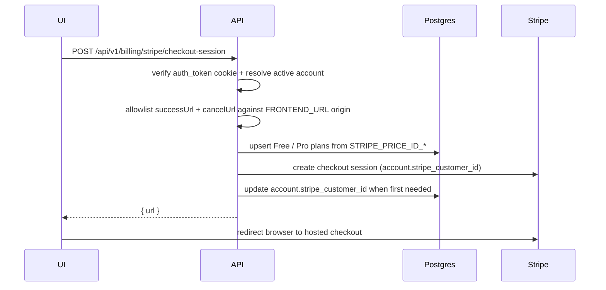
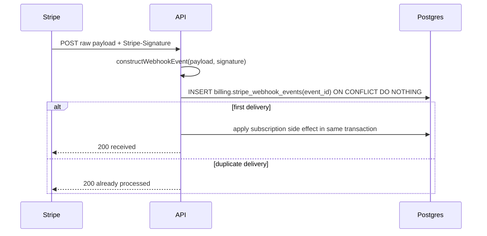

import { Aside } from "@astrojs/starlight/components";
import DataMatrix from "../../../components/docs-kit/DataMatrix";
import FeatureGrid from "../../../components/docs-kit/FeatureGrid";
import PageIntro from "../../../components/docs-kit/PageIntro";

<PageIntro
  eyebrow="Stripe without platform lock-in"
  actions={[
    { label: "ACL resolver", href: "/api/acl/" },
    { label: "Env validator", href: "/api/env-validator/" },
  ]}
  facts={[
    { value: "404", label: "when billing is disabled" },
    { value: "raw", label: "webhook body verification" },
    { value: "SQL", label: "idempotency claim" },
  ]}
>
  Billing is optional. When BILLING_ENABLED=false, the billing route group
  returns 404 and the API does not instantiate Stripe. When it is true, the env
  validator requires the Stripe secret key, webhook secret, and price IDs before
  the app listens.
</PageIntro>

The template ships the subscription spine, not a pricing strategy. It wires Stripe Checkout, Stripe Customer Portal, plan persistence, webhooks, audit events, and redirect safety. Forks can rename plans or add tiers once the product shape is real.

## How checkout works



The customer portal follows the same pattern: authenticated user, `returnUrl` allowlisted against `FRONTEND_URL`, Stripe returns a hosted URL.

## Design choices

<FeatureGrid
  columns={3}
  items={[
    {
      eyebrow: "flag",
      title: "Billing is feature-flagged",
      body: "Local apps boot without Stripe credentials. Production billing only boots when required env vars are present.",
    },
    {
      eyebrow: "plans",
      title: "Plans come from env",
      body: "STRIPE_PRICE_ID_FREE and STRIPE_PRICE_ID_PRO upsert default plan rows without manual SQL.",
    },
    {
      eyebrow: "cookie",
      title: "Customer routes are protected",
      body: "Checkout, portal, and plan reads use the same cookieAuth OpenAPI contract as the rest of the API.",
    },
    {
      eyebrow: "return",
      title: "Redirect URLs are allowlisted",
      body: "Stripe-hosted flows may only return to the configured FRONTEND_URL origin.",
    },
    {
      eyebrow: "webhook",
      title: "Raw body verification",
      body: "The webhook route passes the exact request payload to Stripe signature verification.",
    },
    {
      eyebrow: "idempotent",
      title: "Postgres-backed idempotency",
      body: "Every Stripe event id is claimed in the same transaction as the side effect.",
    },
  ]}
/>

## HTTP surface

<DataMatrix
  caption="Billing HTTP surface"
  columns={["Endpoint", "Auth", "Purpose"]}
  rows={[
    { cells: ["GET /api/v1/billing/plans", "cookie", "List configured plans."] },
    { cells: ["POST /api/v1/billing/stripe/checkout-session", "cookie", "Create a Stripe Checkout session for the active account."] },
    { cells: ["POST /api/v1/billing/stripe/portal-session", "cookie", "Create a Stripe Customer Portal session for the active account."] },
    { cells: ["POST /api/v1/billing/stripe/webhooks", "Stripe signature", "Receive Stripe events using the raw request body."] },
  ]}
/>

## Webhook flow



Handled events:

- `checkout.session.completed`: creates or updates `billing.account_plans` for the account and plan in session metadata.
- `customer.subscription.updated`: maps the active Stripe price id back to a local plan and updates the account plan; also tracks `past_due`, `unpaid`, `paused`, `canceled`, `incomplete`, `trialing`, and `active` for the [feature resolver](/api/acl/#status-driven-features).
- `customer.subscription.deleted`: marks the row revoked so the resolver falls back to the Free plan.
- `invoice.paid` / `invoice.payment_failed`: status transitions for the active plan row.

Unknown event types are logged at debug level and ignored. Late or out-of-order deliveries are tolerated because every status transition is keyed by `(account_id, stripe_event_received_at)`.

## Required env

<FeatureGrid
  columns={4}
  items={[
    { eyebrow: "toggle", title: "BILLING_ENABLED", body: "Turns the route group on; false means all billing paths return 404." },
    { eyebrow: "sdk", title: "STRIPE_SECRET_KEY", body: "Used by the Stripe SDK for Checkout, Portal, and webhook construction." },
    { eyebrow: "webhook", title: "STRIPE_WEBHOOK_SECRET", body: "Used to verify Stripe-Signature on raw webhook payloads." },
    { eyebrow: "plans", title: "STRIPE_PRICE_ID_FREE / PRO", body: "Seeds and keeps the built-in plan rows aligned with Stripe." },
  ]}
/>

<Aside type="tip" title="Local webhook testing">
  Keep billing off unless you are actively testing Stripe. When billing is on
  locally, use the Stripe CLI to forward events to
  `/api/v1/billing/stripe/webhooks` and paste the generated webhook secret into
  `.env`.
</Aside>

## Source

[`src/api/billing/`](https://github.com/AI-Starter-Templates/api-template/tree/main/src/api/billing) and [`src/clients/postgres/schema/billing.schema.ts`](https://github.com/AI-Starter-Templates/api-template/blob/main/src/clients/postgres/schema/billing.schema.ts) on GitHub.

## Operator queries

Read-only psql snippets for "what's the subscription state right now?" questions. Run inside the app database (`docker compose exec postgres psql -U app -d app`).

```sql
-- Active subscriptions grouped by plan.
SELECT plan_id, status, count(*)
FROM billing.account_plans
WHERE revoked_at IS NULL
GROUP BY 1, 2
ORDER BY 1, 2;
```

```sql
-- Accounts on the Pro plan, with when each started + last status transition.
SELECT a.name, ap.status, ap.created_at, ap.updated_at
FROM billing.account_plans ap
JOIN app.accounts a ON a.id = ap.account_id
WHERE ap.plan_id = 'pro'
  AND ap.revoked_at IS NULL
ORDER BY ap.updated_at DESC;
```

```sql
-- Webhook deliveries in the last 24 hours by event type.
SELECT event_type, count(*)
FROM billing.stripe_webhook_events
WHERE created_at > now() - interval '24 hours'
GROUP BY 1
ORDER BY 2 DESC;
```

```sql
-- Failed-payment accounts that need attention.
SELECT a.name, ap.plan_id, ap.status, ap.updated_at
FROM billing.account_plans ap
JOIN app.accounts a ON a.id = ap.account_id
WHERE ap.status IN ('past_due', 'unpaid', 'incomplete')
  AND ap.revoked_at IS NULL
ORDER BY ap.updated_at;
```

```sql
-- Confirm idempotency works: every webhook event_id should appear exactly once.
SELECT event_id, count(*)
FROM billing.stripe_webhook_events
GROUP BY 1
HAVING count(*) > 1;
```

## Related

- [Authentication](/api/auth/); customer billing routes use cookie auth.
- [ACL & feature resolution](/api/acl/); Stripe plan status drives the feature flags surfaced via `/me`.
- [Multi-tenant model](/api/multi-tenant/); Stripe customer id and active plan live on `accounts`, not `users`.
- [Audit log](/api/audit-log/); checkout and portal session creation write audit rows.
- [Env validator](/api/env-validator/); Stripe keys and price IDs are enforced when billing is enabled.
