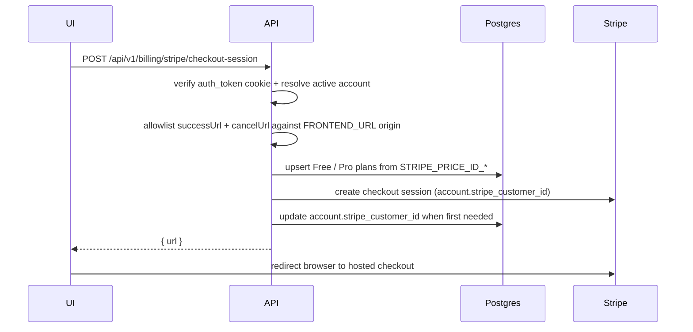
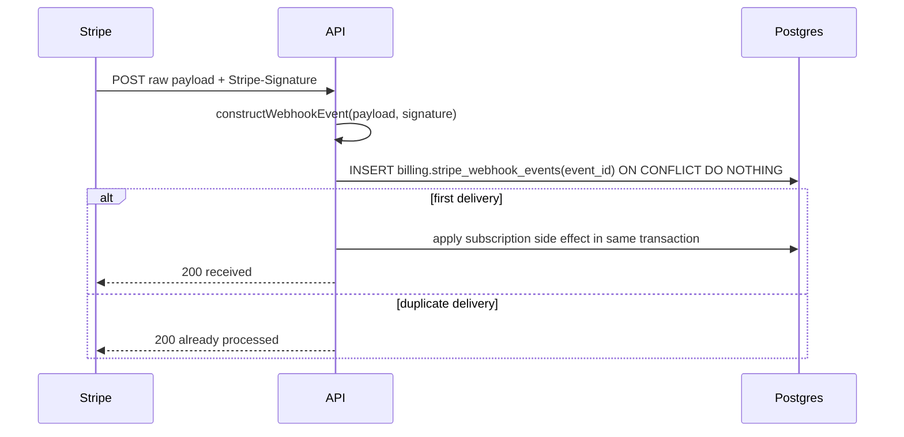

import { Aside } from "@astrojs/starlight/components";
import FaqGroup from "../../../components/FaqGroup.astro";
import FaqItem from "../../../components/FaqItem.astro";

Billing is optional. When `BILLING_ENABLED=false`, the billing route group returns 404 and the API does not instantiate Stripe. When it is true, the env validator requires the Stripe secret key, webhook secret, and the Free/Pro price IDs.

The template ships the subscription spine, not a pricing strategy. It wires Stripe Checkout, Stripe Customer Portal, plan persistence, webhooks, audit events, and redirect safety. Forks can rename plans or add tiers once the product shape is real.

## How checkout works

The customer portal follows the same pattern: authenticated user, `returnUrl` allowlisted against `FRONTEND_URL`, Stripe returns a hosted URL.

## Design choices

<FaqGroup>
  <FaqItem title="Billing is feature-flagged" open>
    Local apps boot without Stripe credentials. Production billing only boots when every required Stripe env var is present.
  </FaqItem>
  <FaqItem title="Plans come from env">
    `STRIPE_PRICE_ID_FREE` and `STRIPE_PRICE_ID_PRO` upsert the template's default plans, so a fresh database has usable plan rows without manual SQL.
  </FaqItem>
  <FaqItem title="Cookie-protected customer routes">
    Checkout, portal, and plan reads use the same `cookieAuth` OpenAPI contract as the rest of the authenticated API.
  </FaqItem>
  <FaqItem title="Redirect URL allowlist">
    Stripe-hosted flows may only return to the configured `FRONTEND_URL` origin. Arbitrary return URLs are rejected.
  </FaqItem>
  <FaqItem title="Raw-body webhook verification">
    The webhook route reads `request.text()` and passes the exact payload to Stripe signature verification.
  </FaqItem>
  <FaqItem title="Postgres-backed idempotency">
    Every Stripe event id is claimed in `billing.stripe_webhook_events` inside the same transaction as the side effect. Duplicate delivery becomes a logged no-op.
  </FaqItem>
</FaqGroup>

## HTTP surface

| Endpoint | Auth | Purpose |
| --- | --- | --- |
| `GET /api/v1/billing/plans` | cookie | List configured plans. |
| `POST /api/v1/billing/stripe/checkout-session` | cookie | Create a Stripe Checkout session for the active account. |
| `POST /api/v1/billing/stripe/portal-session` | cookie | Create a Stripe Customer Portal session for the active account. |
| `POST /api/v1/billing/stripe/webhooks` | Stripe signature | Receive Stripe events using the raw request body. |

## Webhook flow

Handled events:

- `checkout.session.completed`: creates or updates `billing.account_plans` for the account and plan in session metadata.
- `customer.subscription.updated`: maps the active Stripe price id back to a local plan and updates the account plan; also tracks `past_due`, `unpaid`, `paused`, `canceled`, `incomplete`, `trialing`, and `active` for the [feature resolver](/api/acl/#status-driven-features).
- `customer.subscription.deleted`: marks the row revoked so the resolver falls back to the Free plan.
- `invoice.paid` / `invoice.payment_failed`: status transitions for the active plan row.

Unknown event types are logged at debug level and ignored. Late or out-of-order deliveries are tolerated because every status transition is keyed by `(account_id, stripe_event_received_at)`.

## Required env

<FaqGroup>
  <FaqItem title="BILLING_ENABLED" open>
    Turns the route group on. `false` means all billing paths return 404.
  </FaqItem>
  <FaqItem title="STRIPE_SECRET_KEY">
    Used by the Stripe SDK for Checkout, Portal, and webhook construction.
  </FaqItem>
  <FaqItem title="STRIPE_WEBHOOK_SECRET">
    Used to verify `Stripe-Signature` on raw webhook payloads.
  </FaqItem>
  <FaqItem title="STRIPE_PRICE_ID_FREE / STRIPE_PRICE_ID_PRO">
    Seed and keep the built-in Free and Pro plan rows aligned with Stripe.
  </FaqItem>
</FaqGroup>

<Aside type="tip" title="Local webhook testing">
  Keep billing off unless you are actively testing Stripe. When billing is on
  locally, use the Stripe CLI to forward events to
  `/api/v1/billing/stripe/webhooks` and paste the generated webhook secret into
  `.env`.
</Aside>

## Source

[`src/api/billing/`](https://github.com/AI-Starter-Templates/api-template/tree/main/src/api/billing) and [`src/clients/postgres/schema/billing.schema.ts`](https://github.com/AI-Starter-Templates/api-template/blob/main/src/clients/postgres/schema/billing.schema.ts) on GitHub.

## Related

- [Authentication](/api/auth/); customer billing routes use cookie auth.
- [ACL & feature resolution](/api/acl/); Stripe plan status drives the feature flags surfaced via `/me`.
- [Multi-tenant model](/api/multi-tenant/); Stripe customer id and active plan live on `accounts`, not `users`.
- [Audit log](/api/audit-log/); checkout and portal session creation write audit rows.
- [Env validator](/api/env-validator/); Stripe keys and price IDs are enforced when billing is enabled.
