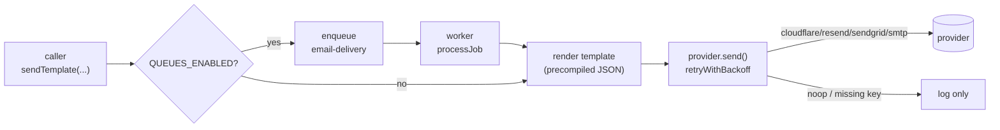

import { Aside } from "@astrojs/starlight/components";
import FaqGroup from "../../../components/FaqGroup.astro";
import FaqItem from "../../../components/FaqItem.astro";

Email has three independently swappable layers:

1. Provider: the wire to whoever actually delivers the mail.
2. Templates: Handlebars `.hbs` files precompiled to JSON at build time.
3. Dispatch: `sendTemplate(...)` chooses queue or inline based on env, so the call site doesn't care which.

The default is [Cloudflare Email Service](/topics/cloudflare-email/) because it's the cheapest at scale. Resend, SendGrid, and a plain SMTP provider ship alongside; swapping is a one-env-var change. SMTP is what you use locally against [Mailpit](/topics/email-in-dev/).

## How a send flows



Two retry layers stack when queues are on: the inner `retryWithBackoff` handles flickery HTTP responses, the outer BullMQ retry handles the case where the whole provider is down for minutes.

## Design choices

<FaqGroup>
  <FaqItem title="Single IEmailService interface" open>
    Adding Postmark or SES later is one file.
  </FaqItem>
  <FaqItem title="noop provider as fallback when keys are empty">
    Dev boots without credentials; tests stay deterministic.
  </FaqItem>
  <FaqItem title="Templates precompiled to JSON at build">
    No Handlebars parser in the hot path; no template-injection from user data.
  </FaqItem>
  <FaqItem title="sendTemplate() queue-aware, sendTemplateNow() inline">
    Workers (already inside a retry envelope) skip the queue; request handlers go through it.
  </FaqItem>
  <FaqItem title="Address masking in logs">
    Email addresses never reach the log pipeline raw.
  </FaqItem>
</FaqGroup>

## The provider contract

Every concrete provider implements one shape:

```ts
interface IEmailService {
  send: (msg: { to; subject; html; text? }) => Promise<{ id; provider }>;
  readonly providerName: "cloudflare" | "resend" | "sendgrid" | "smtp" | "noop";
}
```

The selector reads `EMAIL_PROVIDER`. If the matching key is empty, it returns the noop provider; dev never crashes, prod boot fails earlier at the env validator.

## Templates

Authors write `.hbs` files in `src/templates/email/templates/{auth,notifications}/`. The build script (`bun run build:templates`) compiles them to JSON. At runtime the template service reads the JSON and invokes the precompiled function. Net effect: zero parse cost per send, no template-injection surface.

Shared layout partials live in `components/`. `baseTemplateVariables()` injects common context (product name, support URL, current year) so templates don't repeat it.

## Using it

```ts
import { sendTemplate } from "../lib/email";

await sendTemplate({
  to: user.email,
  subject: "Verify your email",
  templatePath: "auth/verify-email",
  variables: { token, confirmationUrl },
});
```

The handler should not branch on queue vs inline; that decision lives in env config and in `sendTemplate` / `sendTemplateNow`.

## Adding a provider

1. Create `src/lib/email/providers/<name>.ts` implementing `IEmailService`.
2. Add it to the `EmailProviderName` union and the switch in `buildEmailService()`.
3. Add the API-key env var to the schema with the matching cross-field invariant.

The HTTP call should be wrapped in `retryWithBackoff` so transient 5xx responses get retried inside the call, not just at the queue level.

## Adding a template

1. Drop a `.hbs` file in the right subfolder.
2. Run `bun run build:templates` (or the watcher in dev).
3. Reference it: `templatePath: "<subfolder>/<name>"`.

## Lint coverage

[`eslint-plugin-structured-logging`](https://github.com/agjs/eslint-plugin-structured-logging) fails the build on unmasked email addresses in log calls or `console.log`-style leaks.

## Source

[`src/lib/email/`](https://github.com/AI-Starter-Templates/api-template/tree/main/src/lib/email); providers, dispatch, template service. [`src/templates/email/`](https://github.com/AI-Starter-Templates/api-template/tree/main/src/templates/email); the `.hbs` sources and build pipeline.

## Related

- [Cloudflare Email Service](/topics/cloudflare-email/); why it's the default.
- [Setup runbook](/runbooks/cloudflare-email-setup/); domain + token wire-up.
- [Queues](/api/queues/); the `email-delivery` queue on the worker side.
