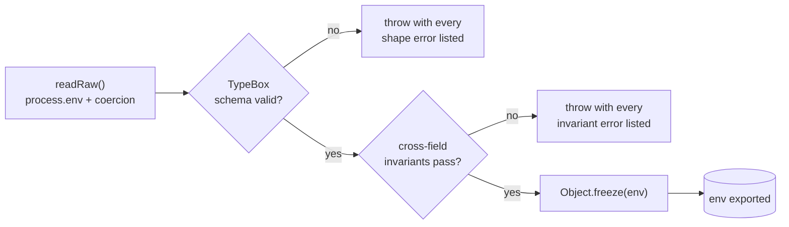

import { Aside } from "@astrojs/starlight/components";

`env` is **deploy-time configuration**, not runtime state. The validator runs once at boot, freezes the result, and exposes a typed `env` object. Anything that needs to change at runtime belongs in a service.

Two principles drive the design:

- **No silent fallbacks in production.** A missing or malformed var fails the boot, with a readable error listing *every* problem, not just the first.
- **One place to read `process.env`.** Direct `process.env.FOO` outside the validator is a lint error.

## How boot validates env



The two-pass split matters: running invariants on an already-shape-validated object means the error reads *"STRIPE_SECRET_KEY required when BILLING_ENABLED=true"*, not *"property STRIPE_SECRET_KEY should be string"*.

## Design choices

| Decision | Reason |
|---|---|
| TypeBox `t.Object({...})` for shape | Same library Elysia uses; nothing new to learn |
| Hand-written predicates for cross-field rules | Cross-field rules ("if A then B is required") don't fit a schema language cleanly |
| All errors aggregated, not fail-on-first | Fewer redeploys to discover the next missing var |
| Frozen `env` with derived `isProduction` / `isDevelopment` / `isTest` | Reads like `env.isProduction`, not `env.NODE_ENV === "production"` |
| Empty-string defaults for optional integration keys | Shape passes when feature is off; invariants enforce "if feature on, key non-empty" |
| `nonEmpty(value, testFallback)` for a few vars | Tests boot without per-test env setup; never applied in production |

## Shape vs. invariant

A **shape** rule expresses "this field must be a positive int between 1 and 65535." TypeBox does that:

```ts
PORT: t.Integer({ minimum: 1, maximum: 65535, default: 3000 }),
JWT_SECRET: t.String({ minLength: 32 }),
EMAIL_PROVIDER: t.Union([t.Literal("cloudflare"), t.Literal("resend"), t.Literal("sendgrid")]),
```

An **invariant** rule expresses "if A is true, B must be set." TypeBox can't say that cleanly. A predicate can:

```ts
if (env.BILLING_ENABLED && env.STRIPE_SECRET_KEY === "") {
  errors.push("STRIPE_SECRET_KEY required when BILLING_ENABLED=true");
}
```

Predicates each return `string[]` and fan into one aggregated check, so every problem surfaces in one boot attempt.

## Current invariant set

| Triggers when | Requires |
|---|---|
| `NODE_ENV=production` | `ALLOWED_ORIGINS` non-empty, all HTTPS, no wildcards |
| `NODE_ENV=production` | Matching email-provider key(s) non-empty (Cloudflare needs *both* account ID + token) |
| `AI_ENABLED=true` | `OPENAI_API_KEY` or `ANTHROPIC_API_KEY` depending on provider |
| `BILLING_ENABLED=true` | `STRIPE_SECRET_KEY` + `STRIPE_WEBHOOK_SECRET` |
| `NODE_ENV=production` + any Valkey-using feature | `REDIS_PASSWORD` non-empty |

`NODE_ENV=test` skips most of these so integration tests don't need real provider credentials.

## What a bad boot looks like

```
Invalid environment configuration:
  - JWT_SECRET: Expected string length greater or equal to 32
  - STRIPE_SECRET_KEY required when BILLING_ENABLED=true
  - STRIPE_WEBHOOK_SECRET required when BILLING_ENABLED=true
```

Three problems, one redeploy to fix all of them.

## Adding a new env var

1. Add the field to the TypeBox schema with the right type + default.
2. Add it to `readRaw()` with a parser helper (`toInt`, `toBool`, `toCsv`, `nonEmpty`, `toFloat`).
3. If it has a cross-field rule, write a `check*` predicate and add it to `checkInvariants()`.
4. Document it in `.env.example` (and in `compose/.env.example` if it flows through the prod profile).
5. Use `env.MY_VAR` everywhere. **Don't** touch `process.env` directly; the lint plugin will catch it.

## The lint contract

[`eslint-plugin-env-access`](https://github.com/agjs/eslint-plugin-env-access) is what makes the validator load-bearing:

- `process.env.X` is only allowed inside `src/config/env/`.
- The matching rule applies to `import.meta.env` on the UI side.

Without this rule, somebody eventually writes `const x = process.env.FEATURE_FLAG ?? "default"` deep in a handler; undocumented, untyped, unvalidated. The lint catches it on first try.

## Source

[`src/config/env/`](https://github.com/AI-Starter-Templates/api-template/tree/main/src/config/env); schema, validator, parsers. [`.env.example`](https://github.com/AI-Starter-Templates/api-template/blob/main/.env.example) is the per-var reference with comments.

## Related

- [Authentication](/api/auth/), [Email](/api/email/), [Queues](/api/queues/); per-feature env requirements.
- [Environment variables](/reference/env-vars/); consolidated index across all three repos.
- [Lint as the contract](/architecture/lint-as-contract/).
