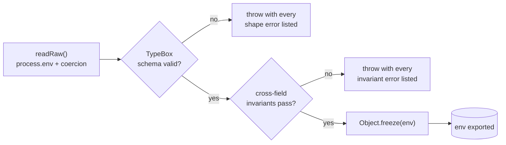

import CommandRun from "../../../components/docs-kit/CommandRun";
import FeatureGrid from "../../../components/docs-kit/FeatureGrid";
import PageIntro from "../../../components/docs-kit/PageIntro";
import SignalGrid from "../../../components/docs-kit/SignalGrid";

<PageIntro
  eyebrow="Boot-time configuration contract"
  actions={[
    { label: "Env reference", href: "/reference/env-vars/" },
    { label: "Lint contract", href: "/architecture/lint-as-contract/" },
  ]}
  facts={[
    { value: "TypeBox", label: "shape validation" },
    { value: "freeze", label: "runtime config object" },
    { value: "lint", label: "no direct process.env" },
  ]}
>
  Env is deploy-time configuration, not runtime state. The validator runs once
  at boot, lists every problem it finds, freezes the result, and exposes a typed
  env object to the rest of the app.
</PageIntro>

Two principles drive the design:

- No silent fallbacks in production. A missing or malformed var fails the boot, with a readable error listing every problem, not just the first.
- One place to read `process.env`. Direct `process.env.FOO` outside the validator is a lint error.

## How boot validates env



The two-pass split matters: running invariants on an already-shape-validated object means the error reads *"STRIPE_SECRET_KEY required when BILLING_ENABLED=true"*, not *"property STRIPE_SECRET_KEY should be string"*.

## Design choices

<SignalGrid
  columns={3}
  items={[
    {
      label: "shape",
      title: "TypeBox for field shape",
      body: "Same library Elysia uses; no extra validation DSL to learn.",
    },
    {
      label: "logic",
      title: "Predicates for cross-field rules",
      body: "If A then B rules stay readable as hand-written checks.",
    },
    {
      label: "errors",
      title: "All errors aggregate",
      body: "One failed boot lists every missing var instead of one redeploy per problem.",
    },
    {
      label: "runtime",
      title: "Frozen derived env",
      body: "Reads like env.isProduction, not repeated NODE_ENV string checks.",
    },
    {
      label: "optional",
      title: "Empty integration keys are allowed when off",
      body: "Shape passes while invariants enforce keys when a feature is enabled.",
    },
    {
      label: "tests",
      title: "Test fallbacks are explicit",
      body: "A few vars get nonEmpty(value, testFallback), never in production.",
    },
  ]}
/>

## Shape vs. invariant

A shape rule expresses "this field must be a positive int between 1 and 65535." TypeBox does that:

```ts
PORT: t.Integer({ minimum: 1, maximum: 65535, default: 3000 }),
PUBLIC_API_URL: t.String({ minLength: 1 }),
JWT_SECRET: t.String({ minLength: 32 }),
EMAIL_PROVIDER: t.Union([t.Literal("cloudflare"), t.Literal("resend"), t.Literal("sendgrid"), t.Literal("smtp")]),
```

An invariant rule expresses "if A is true, B must be set." TypeBox can't say that cleanly. A predicate can:

```ts
if (env.BILLING_ENABLED && env.STRIPE_SECRET_KEY === "") {
  errors.push("STRIPE_SECRET_KEY required when BILLING_ENABLED=true");
}
```

Predicates each return `string[]` and fan into one aggregated check, so every problem surfaces in one boot attempt.

## Current invariant set

<FeatureGrid
  columns={3}
  items={[
    { eyebrow: "cors", title: "Production origins", body: "Non-empty ALLOWED_ORIGINS entries must be https and wildcard-free." },
    { eyebrow: "email", title: "Provider keys", body: "Production requires the matching email-provider credentials." },
    { eyebrow: "urls", title: "Public URLs", body: "FRONTEND_URL, PUBLIC_API_URL, and notification settings URLs must be valid http(s) URLs." },
    { eyebrow: "oauth", title: "OAuth pairs", body: "Google, GitHub, and LinkedIn credentials must be supplied as client-id/client-secret pairs." },
    { eyebrow: "ai", title: "AI provider keys", body: "AI_ENABLED=true requires the matching OpenAI or Anthropic key." },
    { eyebrow: "stripe", title: "Billing keys", body: "BILLING_ENABLED=true requires Stripe secret, webhook secret, and price IDs." },
    { eyebrow: "valkey", title: "Production password", body: "Queues, cache, notification SSE, or OAuth require VALKEY_PASSWORD in production." },
  ]}
/>

`NODE_ENV=test` skips most of these so integration tests don't need real provider credentials.

## What a bad boot looks like

<CommandRun
  title="Bad boot output"
  caption="one boot attempt, every fix listed"
  command="bun run dev"
  output={[
    { tone: "warn", text: "JWT_SECRET: Expected string length greater or equal to 32" },
    { tone: "warn", text: "STRIPE_SECRET_KEY required when BILLING_ENABLED=true" },
    { tone: "warn", text: "STRIPE_WEBHOOK_SECRET required when BILLING_ENABLED=true" },
    { tone: "warn", text: "STRIPE_PRICE_ID_FREE required when BILLING_ENABLED=true" },
    { tone: "warn", text: "Google OAuth requires both client id and client secret" },
  ]}
/>

Several problems, one redeploy to fix all of them.

## Adding a new env var

1. Add the field to the TypeBox schema with the right type + default.
2. Add it to `readRaw()` with a parser helper (`toInt`, `toBool`, `toCsv`, `nonEmpty`, `toFloat`).
3. If it has a cross-field rule, write a `check*` predicate and add it to `checkInvariants()`.
4. Document it in `.env.example` (and in `compose/.env.example` if it flows through the prod profile).
5. Use `env.MY_VAR` everywhere. Don't touch `process.env` directly; the lint plugin will catch it.

## The lint contract

[`@boring-stack-pkg/eslint-plugin-env-access`](https://www.npmjs.com/package/@boring-stack-pkg/eslint-plugin-env-access) is what makes the validator load-bearing:

- `process.env.X` is only allowed inside `src/config/env/`.
- The matching rule applies to `import.meta.env` on the UI side.

Without this rule, somebody eventually writes `const x = process.env.FEATURE_FLAG ?? "default"` deep in a handler; undocumented, untyped, unvalidated. The lint catches it on first try.

## Source

[`src/config/env/`](https://github.com/AI-Starter-Templates/api-template/tree/main/src/config/env); schema, validator, parsers. [`.env.example`](https://github.com/AI-Starter-Templates/api-template/blob/main/.env.example) is the per-var reference with comments.

## Related

- [Authentication](/api/auth/), [Email](/api/email/), [Queues](/api/queues/); per-feature env requirements.
- [Environment variables](/reference/env-vars/); consolidated index across the repos.
- [Lint as the contract](/architecture/lint-as-contract/).
