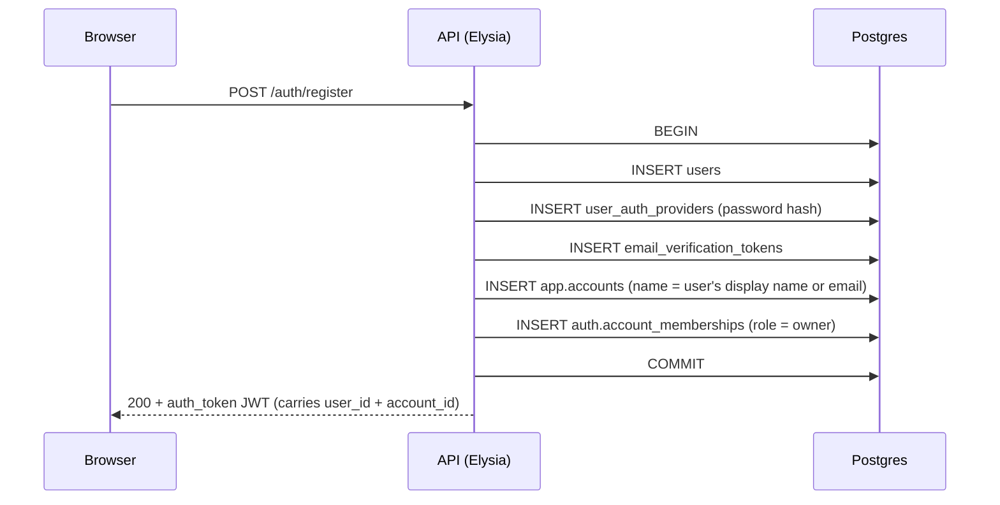

import { Aside } from "@astrojs/starlight/components";
import FaqGroup from "../../../components/FaqGroup.astro";
import FaqItem from "../../../components/FaqItem.astro";

## The shape

```
auth.users
  └── auth.account_memberships ─── app.accounts
                                     ├── app.account_invitations
                                     ├── app.account_feature_overrides
                                     ├── billing.account_plans
                                     └── app.widgets (and every other @account-scoped table)
```

Every account-scoped row carries `account_id`. Routes derive that ID from the JWT (the `aid` claim, populated at login / refresh / register / OAuth callback), never from URL params.

## Signup



A single transaction, so a partial failure can't leave an orphan user without an account. The `buildPersonalAccountName({ firstName, lastName, email })` util produces the account name; if both names are empty it falls back to the email.

## Memberships

`auth.account_memberships` is the (user, account, role) join. Two partial unique indexes lock down the invariants the application logic depends on:

- `uniq_account_memberships_active_user` — `(account_id, user_id) WHERE revoked_at IS NULL`. At most one active membership per `(user, account)`.
- `uniq_account_memberships_active_owner` — `(account_id) WHERE role = 'owner' AND revoked_at IS NULL`. At most one active owner per account.

Revoked memberships keep their row (soft-delete via `revoked_at`) so the audit trail survives.

## Invitations

```ts
POST   /api/v1/accounts/:id/invitations           // owner | admin
POST   /api/v1/invitations/accept                 // any authenticated user holding the raw token
POST   /api/v1/accounts/:id/invitations/:iid/resend
DELETE /api/v1/accounts/:id/invitations/:iid
```

<FaqGroup>
  <FaqItem title="Tokens are opaque, single-use, hashed at rest" open>
    The route response carries the raw token exactly once (so the caller can
    hand it to whatever email pipeline they want). The DB only stores
    `sha256(token + pepper)`.
  </FaqItem>
  <FaqItem title="Resend rotates the token">
    Rotating on resend invalidates any leaked old link — the caller re-emails
    the new raw token. Old emails stop working immediately.
  </FaqItem>
  <FaqItem title="Revoke is a soft-delete (`revoked_at`)">
    Subsequent accept attempts fail with `invitation_revoked`. The daily
    `cleanExpiredInvitationsJob` background sweep also soft-revokes unaccepted
    invitations past their TTL.
  </FaqItem>
  <FaqItem title="Seat-limit check fires twice">
    At invitation creation AND at acceptance time. An admin could revoke a seat
    between create + accept; the second check catches that.
  </FaqItem>
</FaqGroup>

## Owner lifecycle

<FaqGroup>
  <FaqItem title="Transfer ownership" open>
    `POST /api/v1/accounts/:id/transfer-ownership` (owner-only, cache-bypassing
    `resolveFreshMembership`). Atomically demotes the current owner to `admin`,
    promotes the target to `owner`. The partial unique index is never violated
    mid-transaction — `accountsService.transferOwnership` demotes the outgoing
    owner FIRST so the index never sees two owners simultaneously.
  </FaqItem>
  <FaqItem title="Cannot leave without transferring">
    An owner cannot leave their account; they must transfer first or delete the
    account. An owner cannot be removed by an admin.
  </FaqItem>
  <FaqItem title="Soft-delete with 30-day grace">
    `DELETE /api/v1/accounts/:id` (owner-only) sets `accounts.deleted_at =
    now()`. The `hardDeleteSoftDeletedAccountsJob` background sweep hard-deletes
    rows past the grace window, cascading to memberships, invitations, feature
    overrides, account_plans, and every `@account-scoped` application table.
    `audit.audit_log` survives by design — GDPR redaction (hash the user id,
    keep the row) is a separate path.
  </FaqItem>
</FaqGroup>

## Account switch

`POST /api/v1/accounts/switch` with a target `accountId` re-issues the JWT with the new active account in the `aid` claim. The client re-fetches `/me`. Old JWTs continue to work against the old account until their 15-minute access TTL expires; the refresh-time membership recheck blocks renewal if the user no longer has an active membership on that account.

## Cross-account isolation tests

`tests/api/widgets/widgets.routes.test.ts` is the proof point. Same user holds memberships in two accounts; resource IDs are unique across accounts; every method on Account B's widget returns 404 (not 403, not 200) when the request comes from Account A's JWT. The matrix is the canonical pattern to copy for any new account-scoped resource.

## Source

- [`src/api/accounts/`](https://github.com/AI-Starter-Templates/api-template/tree/main/src/api/accounts)
- [`src/clients/postgres/schema/app.schema.ts`](https://github.com/AI-Starter-Templates/api-template/blob/main/src/clients/postgres/schema/app.schema.ts) — `accounts`, `account_invitations`, `account_feature_overrides`, `widgets` (sample account-scoped resource).
- [`src/clients/postgres/schema/memberships.schema.ts`](https://github.com/AI-Starter-Templates/api-template/blob/main/src/clients/postgres/schema/memberships.schema.ts) — `account_memberships` with both partial unique indexes.

## Related

- [ACL & feature resolution](/api/acl/) — how role rules, feature gates, and the resolved feature set compose into a CASL ability.
- [Authentication](/api/auth/) — JWT issuance carries `aid` (active account); session refresh re-validates membership.
