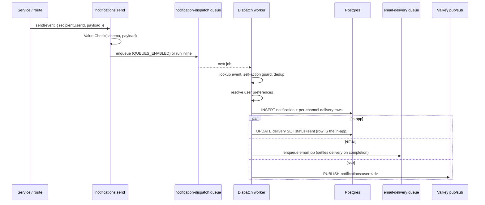
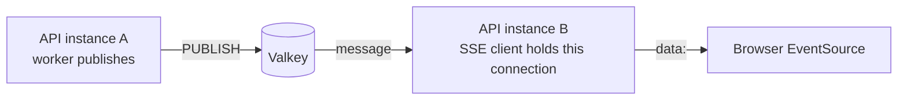

import { Aside } from "@astrojs/starlight/components";
import FaqGroup from "../../../components/FaqGroup.astro";
import FaqItem from "../../../components/FaqItem.astro";

A `notifications.send(event, args)` call validates the payload, enqueues a BullMQ job, and returns. A worker resolves the event definition, runs dedup + self-action guards, checks per-user preferences, persists the notification row + per-channel delivery rows, then fans out to channel handlers (in-app, email, SSE).

Framework only. The template ships no example events; fork users define them with `bun run new:notification-event <name>` and the scaffolder mints + registers the file.

## How a notification flows



## Design choices

<FaqGroup>
  <FaqItem title="Fire-and-forget at the call site" open>
    Mirrors the audit-log ergonomics already in the codebase: `void notifications.send(...)`. Delivery never blocks the originating request.
  </FaqItem>
  <FaqItem title="Async via BullMQ; same core inline when queues are off">
    `runNotificationDispatch` runs identically in the worker and the inline fallback, so dev and tests don't need a worker process.
  </FaqItem>
  <FaqItem title="Channels are pluggable">
    In-app and email ship by default. SSE is opt-in with `NOTIFICATIONS_SSE_ENABLED=true`. New channels (web-push, SMS, custom) implement `INotificationChannel` and register at boot via `channelRegistry.register(channel)`.
  </FaqItem>
  <FaqItem title="Events are typed via TypeBox">
    Author handlers receive a `payload` typed by the event's schema. The dispatcher validates with `Value.Check` before enqueuing; the worker re-validates before any handler runs.
  </FaqItem>
  <FaqItem title="Dedup is opt-in per event">
    Events declare `dedup: { key, windowSeconds }`. A unique index on `notification_dedup.dedup_key` short-circuits duplicate dispatches inside the window. Cleanup runs hourly via a repeatable maintenance job.
  </FaqItem>
  <FaqItem title="Preferences apply per (user, eventType, channel)">
    Disabled channels still record a `notification_delivery` row with `status: suppressed`, easier to debug "why didn't I get an email?" with a row to point at.
  </FaqItem>
  <FaqItem title="Framework ships zero example events">
    Forks define their own. Removing example product code on adoption is friction; the scaffolder makes adding the first one a one-liner.
  </FaqItem>
</FaqGroup>

## Authoring an event

```bash
bun run new:notification-event -- comment.replied
```

Generates `src/api/notifications/events/comment-replied.event.ts` and appends to the registry barrel. Edit the schema + render functions to match the domain:

```ts
import { t } from "elysia";
import { defineNotificationEvent } from "../../../lib/notifications";

export const commentRepliedEvent = defineNotificationEvent({
  type: "comment.replied",
  schema: t.Object({
    actorId: t.String({ format: "uuid" }),
    actorName: t.String(),
    parentCommentId: t.String({ format: "uuid" }),
    excerpt: t.String({ maxLength: 200 }),
  }),
  defaultChannels: ["in-app", "email"],
  dedup: {
    key: ({ recipientUserId, payload }) =>
      `comment.replied:${recipientUserId}:${payload.parentCommentId}`,
    windowSeconds: 3_600,
  },
  selfActionGuard: ({ recipientUserId, payload }) =>
    recipientUserId === payload.actorId,
  render: {
    inApp: ({ payload }) => ({
      title: `${payload.actorName} replied to your comment`,
      body: payload.excerpt,
      ctaUrl: `/comments/${payload.parentCommentId}`,
      ctaLabel: "View reply",
    }),
    email: {
      subject: ({ payload }) => `${payload.actorName} replied to your comment`,
      templatePath: "notifications/comment-replied",
      variables: ({ payload }) => ({
        actor: payload.actorName,
        excerpt: payload.excerpt,
      }),
    },
  },
});
```

## Sending one

```ts
import { notifications } from "@/lib/notifications";
import { commentRepliedEvent } from "@/api/notifications/events/comment-replied.event";

void notifications.send(commentRepliedEvent, {
  recipientUserId: parentComment.userId,
  payload: {
    actorId: currentUser.id,
    actorName: currentUser.displayName,
    parentCommentId: parentComment.id,
    excerpt: reply.body.slice(0, 200),
  },
});
```

The `payload` is TypeScript-checked at the call site against `commentRepliedEvent.schema`. A bad shape fails to compile.

## HTTP surface

| Endpoint | Purpose |
| --- | --- |
| `GET /api/v1/notifications` | List the current user's notifications with stable cursor pagination and an optional `status` filter. |
| `PATCH /api/v1/notifications/:id` | Mark read / archived. |
| `POST /api/v1/notifications/mark-all-read` | Bulk mark every unread row read. |
| `GET /api/v1/notifications/preferences` | List per-event-type, per-channel toggles. |
| `PUT /api/v1/notifications/preferences` | Bulk upsert preferences (UI submits the full settings page at once). |
| `GET /api/v1/notifications/stream` | Server-Sent Events stream for the current user. |

## Realtime: SSE + Valkey pub/sub

SSE is disabled unless `NOTIFICATIONS_SSE_ENABLED=true`. When enabled, the SSE endpoint subscribes to `notifications:user:<userId>` on Valkey. When the SSE channel implementation publishes after persistence, the message is forwarded to every connected client of that user, including clients on different API instances.



The SSE handler hooks the request's `AbortSignal`: when the tab closes, the generator's `finally` block disconnects the Valkey subscriber. No connection leak. If SSE is disabled, the endpoint returns 404 so the feature cannot accidentally look half-on.

Messages use a stable JSON envelope:

```json
{
  "type": "notification.created",
  "notification": {
    "id": "...",
    "eventType": "comment.replied",
    "title": "Someone replied",
    "body": "...",
    "ctaUrl": "/comments/...",
    "ctaLabel": "View reply",
    "status": "unread",
    "readAt": null,
    "createdAt": "2026-05-15T12:00:00.000Z"
  }
}
```

## Out of scope (v1)

<FaqGroup>
  <FaqItem title="Web Push (Push API + VAPID)" open>
    The channel registry leaves a clean seam; v1.1 lands `webPushChannel` without touching the dispatcher.
  </FaqItem>
  <FaqItem title="Migrating auth transactional emails">
    Email verification, password reset, etc. stay on the direct `sendTemplate(...)` path. Transactional ≠ subscription; preferences shouldn't be able to silence them.
  </FaqItem>
  <FaqItem title="Notification digest emails">
    A "you have 5 new" rollup is future work; the persistence model has the data ready.
  </FaqItem>
  <FaqItem title="Per-user throttling beyond dedup">
    Future. Dedup catches obvious duplicates; a separate rate-limit middleware would catch "100 different events in a minute."
  </FaqItem>
</FaqGroup>

## Source

- `src/api/notifications/`: HTTP routes, schemas, service, SSE handler, scaffolded events.
- `src/lib/notifications/`: channels, dispatch pipeline, event + channel registries, preferences, dedup, Valkey pub/sub.
- `src/queues/notification-dispatch/`: BullMQ queue + worker.
- `src/queues/notification-maintenance/`: repeatable dedup cleanup job.
- `src/clients/postgres/schema/notifications.schema.ts`: four tables in the `notifications` Postgres schema.

## Related

- [Queues](/api/queues/): the BullMQ shape this builds on.
- [Email](/api/email/): the email channel uses the same dispatch.
- [Audit log](/api/audit-log/): the ergonomic pattern this notification dispatcher mirrors.
