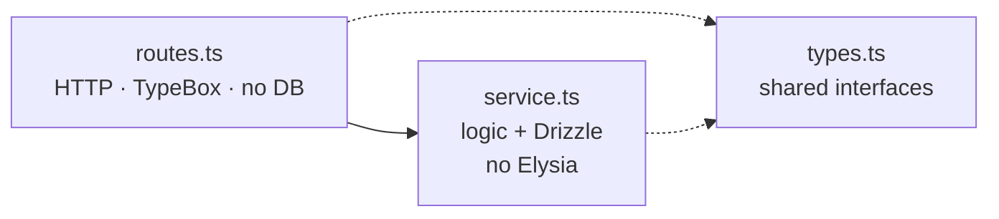

import DocFileTree from "../../../components/DocFileTree";
import FeatureGrid from "../../../components/docs-kit/FeatureGrid";
import PageIntro from "../../../components/docs-kit/PageIntro";
import SignalGrid from "../../../components/docs-kit/SignalGrid";

<PageIntro
  eyebrow="API product spine"
  actions={[
    { label: "Auth contract", href: "/api/auth/" },
    { label: "Queues", href: "/api/queues/" },
  ]}
  facts={[
    { value: "Elysia", label: "typed HTTP surface" },
    { value: "Drizzle", label: "SQL-shaped data layer" },
    { value: "BullMQ", label: "background work" },
  ]}
>
  The API layer owns security, data, and background work: auth, sessions,
  OAuth, email, queues, audit log, Stripe billing, structured logging, and an
  env validator that refuses to boot if anything is missing.
</PageIntro>

## How the layers split

Each API feature splits into three files with one job each: <code>routes.ts</code> owns HTTP and TypeBox validation but never touches the database; <code>service.ts</code> owns business logic and Drizzle queries but never imports Elysia; <code>types.ts</code> holds the shared interfaces both read. Lint rules forbid the cross-imports that would blur the split.

A feature is three files with three jobs. Lint plugins forbid them from leaking into each other: a `*.routes.ts` that imports `drizzle-orm` fails the build, and a `*.service.ts` that imports Elysia's `t` does too.

## Design choices

<SignalGrid
  columns={3}
  items={[
    {
      label: "features",
      title: "Per-feature folders",
      body: "Adding product behavior means one folder, not scattered route/service/model edits.",
    },
    {
      label: "lint",
      title: "Routes, services, and types stay separate",
      body: "The split survives refactors, new teammates, and agent-written code.",
    },
    {
      label: "env",
      title: "Frozen config at boot",
      body: "process.env is read in one validator. Misconfigured deployments fail before serving traffic.",
    },
    {
      label: "providers",
      title: "Pluggable infra",
      body: "Email, AI, cache, and queues swap through config; dev runs without vendor keys.",
    },
    {
      label: "data",
      title: "Drizzle ORM",
      body: "TS-first models with SQL-shaped schema and real migration files.",
    },
    {
      label: "contract",
      title: "OpenAPI emits the UI boundary",
      body: "The React app calls a generated client, so server changes become type errors instead of runtime surprises.",
    },
  ]}
/>

## File layout

<DocFileTree
  root="src/"
  title="API source map"
  caption="route surface, data plane, and workers"
  nodes={[
    { name: "index.ts", detail: "Entrypoint: env, Sentry, queues, listen" },
    { name: "config/", detail: "App composition, env, logger, queue bootstrap" },
    {
      name: "api/",
      detail: "Feature folders: auth, users, accounts, dashboard, billing, admin, health, notifications, widgets",
    },
    { name: "clients/postgres/", detail: "Drizzle client + per-domain schema modules" },
    { name: "lib/", detail: "Shared utilities: auth, email, audit-log, ai, cache, errors, notifications" },
    { name: "middleware/", detail: "Per-route Elysia plugins" },
    { name: "queues/", detail: "BullMQ queue/worker pairs" },
    { name: "templates/email/", detail: "Handlebars sources, compiled to JSON at build" },
  ]}
/>

A [feature folder](/reference/glossary#feature-folder) always looks like (for a hypothetical `posts` resource):

<DocFileTree
  root="src/api/posts/"
  title="Feature anatomy"
  caption="one concern per file"
  nodes={[
    { name: "posts.routes.ts", detail: "HTTP surface" },
    { name: "posts.service.ts", detail: "Business logic + DB" },
    { name: "posts.types.ts", detail: "Shapes shared between routes and service" },
    { name: "posts.schemas.ts", detail: "optional TypeBox request/response" },
  ]}
/>

The shipped `auth`, `users`, `accounts`, `billing`, `dashboard`, `admin`, `health`, `notifications` modules are framework. `widgets` is the only example domain feature, kept as the reference for the [account-scoped resource pattern](/api/multi-tenant/) (every read/write filters by `accountId`). Replace it with your own product domain. Add new resources with `bun run new:resource <name>`; the scaffolder writes the four-file anatomy and wires it into `config/routes.ts` so you can't forget a step.

## Cross-cutting concerns

<FeatureGrid
  columns={4}
  items={[
    { eyebrow: "auth", title: "Cookie sessions", body: "Short-lived access JWT cookies plus DB-backed refresh sessions.", href: "/api/auth/" },
    { eyebrow: "tenant", title: "Account boundary", body: "Accounts are the tenant boundary; users join via memberships with roles.", href: "/api/multi-tenant/" },
    { eyebrow: "acl", title: "Feature resolution", body: "Server-authoritative CASL ability plus plan and feature gates.", href: "/api/acl/" },
    { eyebrow: "billing", title: "Stripe spine", body: "Checkout, Customer Portal, raw-body webhooks, and DB-backed idempotency.", href: "/api/billing/" },
    { eyebrow: "email", title: "Provider abstraction", body: "Pluggable provider, precompiled templates, queue-aware dispatch.", href: "/api/email/" },
    { eyebrow: "queues", title: "Background work", body: "BullMQ with QueueManager and inline fallback when queues are disabled.", href: "/api/queues/" },
    { eyebrow: "audit", title: "Append-only trail", body: "Fire-and-forget append-only event log for user and system actions.", href: "/api/audit-log/" },
    { eyebrow: "env", title: "Boot guard", body: "TypeBox shape plus hand-written invariants before the API listens.", href: "/api/env-validator/" },
  ]}
/>

## Lint as the contract

The architecture is held in place by a family of [custom ESLint plugins](/architecture/lint-as-contract/). `bun run validate` is the merge gate.

## Source

[`api-template`](https://github.com/AI-Starter-Templates/api-template) on GitHub. Start in `src/api/` for the feature shape; `src/config/` for the boot wiring.

## Related

- [Lint as the contract](/architecture/lint-as-contract/); the family of plugins that keep these layers apart.
- [Authentication](/api/auth/); cookie sessions and refresh on the same spine.
- [ACL & feature resolution](/api/acl/); server-authoritative permissions and plan gates.
- [Multi-tenant model](/api/multi-tenant/); accountId as the scoping primitive.
- [Env validator](/api/env-validator/); the boot guard refusing misconfigured deploys.
