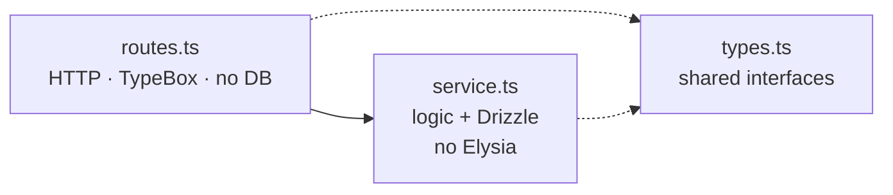

import { Aside, FileTree } from "@astrojs/starlight/components";
import FaqGroup from "../../../components/FaqGroup.astro";
import FaqItem from "../../../components/FaqItem.astro";

The API layer owns security, data, and background work. [Why BoringStack](/architecture/why-boringstack/) and [Separation of concerns](/architecture/separation-of-concerns/) describe how that fits the rest of the stack.

A production-shaped HTTP API: auth, sessions, OAuth, email, queues, audit log, Stripe billing, structured logging, env validator that refuses to boot if anything is missing. Architectural rules (routes vs services vs types, env access, queues) keep adding features cheap as the codebase grows.

## How the layers split

A feature is three files with three jobs. Lint plugins forbid them from leaking into each other: a `*.routes.ts` that imports `drizzle-orm` fails the build, and a `*.service.ts` that imports Elysia's `t` does too.

## Design choices

<FaqGroup>
  <FaqItem title="Per-feature folders" open>
    Adding a feature is one folder instead of edits across `routes/`, `services/`, and `models/`.
  </FaqItem>
  <FaqItem title="Routes / services / types enforced by lint">
    The split survives refactors and new authors.
  </FaqItem>
  <FaqItem title="Frozen `env` object">
    `process.env` only in the validator; misconfigured boots fail fast.
  </FaqItem>
  <FaqItem title="Pluggable infra">
    Email, AI, cache, and queues swap with an env var; dev runs without vendor keys.
  </FaqItem>
  <FaqItem title="Drizzle ORM">
    SQL-shaped schema and plain SQL migration files.
  </FaqItem>
</FaqGroup>

## File layout

<FileTree>
- src/
  - index.ts            Entrypoint: env, Sentry, queues, listen
  - config/             App composition, env, logger, queue bootstrap
  - api/                Feature folders (auth, users, accounts, dashboard, billing, admin, health, notifications, widgets)
  - clients/postgres/   Drizzle client + per-domain schema modules
  - lib/                Shared utilities (auth, email, audit-log, ai, cache, errors, notifications)
  - middleware/         Per-route Elysia plugins
  - queues/             BullMQ queue/worker pairs
  - templates/email/    Handlebars sources, compiled to JSON at build
</FileTree>

A feature folder always looks like (for a hypothetical `posts` resource):

<FileTree>
- src/api/posts/
  - posts.routes.ts        HTTP surface
  - posts.service.ts       Business logic + DB
  - posts.types.ts         Shapes shared between routes and service
  - posts.schemas.ts       (optional) TypeBox request/response
</FileTree>

The shipped `auth`, `users`, `accounts`, `billing`, `dashboard`, `admin`, `health`, `notifications` modules are framework. `widgets` is the only example domain feature — kept as the reference for the [account-scoped resource pattern](/api/multi-tenant/) (every read/write filters by `accountId`). Replace it with your own product domain. Add new resources with `bun run new:resource <name>`; the scaffolder writes the four-file anatomy and wires it into `config/routes.ts` so you can't forget a step.

## Cross-cutting concerns

Each lives in `src/lib/` or `src/config/` and has its own page:

- [Authentication](/api/auth/). Short-lived access JWT cookies plus DB-backed refresh sessions.
- [Multi-tenant model](/api/multi-tenant/). Accounts are the tenant boundary; users join via memberships with roles.
- [ACL & feature resolution](/api/acl/). Server-authoritative CASL ability + plan/feature gates derived from Stripe and admin overrides.
- [Billing](/api/billing/). Stripe Checkout, Customer Portal, raw-body webhooks, and DB-backed idempotency.
- [Email](/api/email/). Pluggable provider, precompiled templates, queue-aware dispatch.
- [Queues](/api/queues/). BullMQ with a `QueueManager`, inline fallback when disabled.
- [Audit log](/api/audit-log/). Fire-and-forget append-only event log.
- [Env validator](/api/env-validator/). TypeBox shape + hand-written invariants.

## Lint as the contract

The architecture is held in place by a family of [custom ESLint plugins](/architecture/lint-as-contract/). `bun run validate` is the merge gate.

## Source

[`api-template`](https://github.com/AI-Starter-Templates/api-template) on GitHub. Start in `src/api/` for the feature shape; `src/config/` for the boot wiring.
