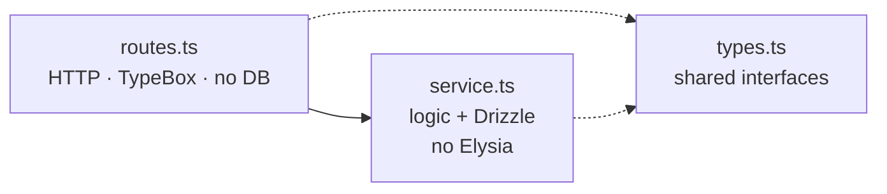

import { Aside, FileTree } from "@astrojs/starlight/components";

The api-template is a production-shaped HTTP API: auth, sessions, OAuth, email, queues, audit log, Stripe billing, structured logging, an env validator that refuses to boot if anything is missing. **Architectural rules** (routes vs services vs types, env access, queues) are what keep adding features cheap as the codebase grows.

## How the layers split

A feature is **three files with three jobs**. The lint plugins forbid them from leaking into each other: a `*.routes.ts` that imports `drizzle-orm` fails the build, and a `*.service.ts` that imports Elysia's `t` does too.

## Design choices

| Decision | Reason |
|---|---|
| Per-feature folders, not horizontal layers | Adding a feature is one folder, not edits across `routes/`, `services/`, `models/` |
| Routes/services/types separation enforced by lint | The rule survives refactors and new authors |
| Frozen `env` object, no `process.env` outside the validator | Misconfigured boots fail fast; runtime can't introduce new env dependencies |
| Pluggable infra (email provider, AI provider, cache, queues) | Each can be swapped with a one-env-var change; dev runs without keys |
| Drizzle, not Prisma | Real SQL shape; no shadow database; migrations are plain SQL files |

## File layout

<FileTree>
- src/
  - index.ts            Entrypoint: env, Sentry, queues, listen
  - config/             App composition, env, logger, queue bootstrap
  - api/                Feature folders (auth, users, widgets, dashboard, billing, admin, health)
  - clients/postgres/   Drizzle client + per-domain schema modules
  - lib/                Shared utilities (auth, email, audit-log, ai, cache, errors)
  - middleware/         Per-route Elysia plugins
  - queues/             BullMQ queue/worker pairs
  - templates/email/    Handlebars sources, compiled to JSON at build
</FileTree>

A feature folder always looks like:

<FileTree>
- src/api/widgets/
  - widgets.routes.ts        HTTP surface
  - widgets.service.ts       Business logic + DB
  - widgets.types.ts         Shapes shared between routes and service
  - widgets.schemas.ts       (optional) TypeBox request/response
</FileTree>

The reference implementation is `widgets`; copy-target for new resources. `bun run new:resource <name>` scaffolds the triple and wires it into `config/routes.ts` so you can't forget a step.

## Cross-cutting concerns

Each lives in `src/lib/` or `src/config/` and has its own page:

- **[Authentication](/api/auth/)**; cookie sessions + server-side OAuth.
- **[Email](/api/email/)**; pluggable provider, precompiled templates, queue-aware dispatch.
- **[Queues](/api/queues/)**; BullMQ with a `QueueManager`, inline fallback when disabled.
- **[Audit log](/api/audit-log/)**; fire-and-forget append-only event log.
- **[Env validator](/api/env-validator/)**; TypeBox shape + hand-written invariants.

## Lint as the contract

The architecture is held in place by a family of [custom ESLint plugins](/architecture/lint-as-contract/). Agents skip `AGENTS.md`; lint still enforces the rules. `bun run validate` is the merge gate.

## Source

[`api-template`](https://github.com/AI-Starter-Templates/api-template) on GitHub. Start in `src/api/` for the feature shape; `src/config/` for the boot wiring.
