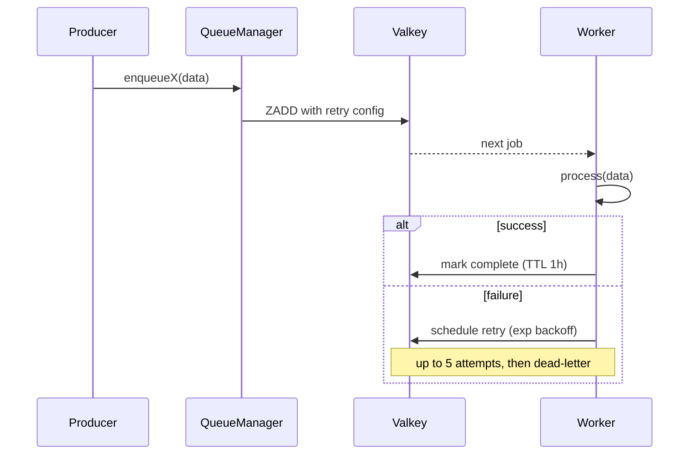

import { Aside } from "@astrojs/starlight/components";
import FaqGroup from "../../../components/FaqGroup.astro";
import FaqItem from "../../../components/FaqItem.astro";

Background work uses [BullMQ](https://docs.bullmq.io) over the same Valkey the cache lives on. The mental model:

- A **queue** is a named work buffer in Valkey.
- A **worker** is a long-lived process that pulls jobs off the queue and runs them.
- A **`QueueManager`** is a process-singleton that owns all queues + workers, so application code only ever talks to one object.

When `QUEUES_ENABLED=false`, every dispatch helper falls back to inline execution. Dev and tests run without a worker process.

## How a job runs

## Design choices

<FaqGroup>
  <FaqItem title="One QueueManager per process" open>
    Centralized lifecycle, shutdown, admin stats; new queues cannot accidentally skip the retry config.
  </FaqItem>
  <FaqItem title="Per-queue directory with five small files">
    Constants + queue + worker + setup + types stay together; producer and consumer cannot disagree on names.
  </FaqItem>
  <FaqItem title="Inline fallback when QUEUES_ENABLED=false">
    Dev and tests boot without Valkey or a separate worker process.
  </FaqItem>
  <FaqItem title="removeOnComplete: { age: 1h, count: 100 }">
    Bounded Valkey usage without losing recent successes for the dashboard.
  </FaqItem>
  <FaqItem title="removeOnFail: false">
    Failed jobs stick around for inspection; manual purge if needed.
  </FaqItem>
</FaqGroup>

## The shape of a queue

Every queue is a small directory under `src/queues/<name>/`:

<FaqGroup>
  <FaqItem title="name.constants.ts" open>
    Queue name, job name, retry defaults; one place so producer + consumer cannot drift.
  </FaqItem>
  <FaqItem title="name.types.ts">
    The job-data type. Strict: BullMQ serializes to JSON; type-drift here means 3 AM debugging.
  </FaqItem>
  <FaqItem title="name.queue.ts">
    BullMQ `Queue` factory.
  </FaqItem>
  <FaqItem title="name.worker.ts">
    BullMQ `Worker` + structured-logged event handlers.
  </FaqItem>
  <FaqItem title="name.setup.ts">
    Wires queue + worker together at boot.
  </FaqItem>
</FaqGroup>

The reference implementation is `email-delivery`; it's the simplest worker that exists (render a template, hand off to the email provider), so it's a good copy-target.

## QueueManager is the seam

Application code never imports `Queue` directly. It calls `manager.enqueueX(...)`. Why:

- One place to enforce retry/cleanup defaults across queues.
- Graceful shutdown: `manager.close()` shuts every worker + queue in parallel; signal handlers only know about the manager.
- Admin observability: `getStats()` returns waiting/active/completed/failed/delayed/paused counts for every managed queue.

A new queue therefore needs four additions to `QueueManager`: the constructor input, an `enqueue<Name>()` method, an entry in `getStats()`, and a `close()` line. The lint plugin catches workers that omit a `failed` handler or skip retry config.

## Idempotency

BullMQ retries on failure. If a worker dies after writing to the database but before marking the job complete, the same job runs again. Workers must be idempotent. Three patterns:

- Natural keys. "Send verification email for `userId=X`, `token=Y`" is idempotent: re-sending the same token is harmless.
- UNIQUE constraints plus catch. A second `INSERT` of the same audit row fails on the constraint; the worker treats unique-violation as success.
- Check-then-do, transactional. Read state, decide if work is still needed, write atomically.

Using BullMQ's `jobId` for deduplication only protects against simultaneous duplicate enqueues; not retries.

## Adding a queue

1. Create `src/queues/<name>/` following the per-queue directory pattern (constants, types, queue, worker, setup).
2. Add it to `QueueManager`'s constructor, an `enqueue<Name>()` method, `getStats()`, and `close()`.
3. Call `manager.enqueue<Name>(...)` from the producer.

## Dashboard

`WITH_BULLMQ=1` in the infra stack brings up [Bull-board](https://github.com/felixmosh/bull-board) at `http://bullmq.localhost`; jobs by state, retry timelines, manual retry/discard. Dev-only; not exposed in the prod profile. See [Profiles & overlays](/infra/profiles-and-overlays/).

## Lint coverage

[`eslint-plugin-bullmq`](https://github.com/agjs/eslint-plugin-bullmq) catches the common foot-guns: workers that don't handle `failed`, jobs that mutate shared state without idempotency, missing retry config.

## Source

[`src/queues/`](https://github.com/AI-Starter-Templates/api-template/tree/main/src/queues) on GitHub. [`src/config/setup-queues.ts`](https://github.com/AI-Starter-Templates/api-template/blob/main/src/config/setup-queues.ts) wires the manager into boot.

## Related

- [Email](/api/email/); the producer side; `sendTemplate()` goes through `email-delivery` when queues are on.
- [Lint as the contract](/architecture/lint-as-contract/); why machine-checked queue patterns matter.
