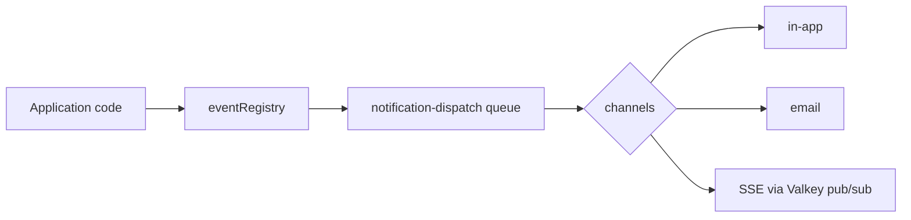

import FaqGroup from "../../../components/FaqGroup.astro";
import FaqItem from "../../../components/FaqItem.astro";

Products need work off the HTTP critical path: email, notifications, retries. BoringStack puts that work in the API with BullMQ on Valkey, shared queue patterns, and dispatch helpers. You ship events and mail without standing up a separate job platform first.

## What ships

<FaqGroup>
  <FaqItem title="BullMQ + QueueManager" open>
    Named queues and workers; centralized lifecycle, retries, and shutdown. See [Queues](/api/queues/).
  </FaqItem>
  <FaqItem title="Valkey">
    Same Redis-protocol store as cache; queue backend.
  </FaqItem>
  <FaqItem title="QUEUES_ENABLED">
    When off, dispatch runs inline. Dev and tests boot without a worker process.
  </FaqItem>
  <FaqItem title="Email">
    Pluggable providers, precompiled templates, queue-aware `sendTemplate()`. See [Email](/api/email/).
  </FaqItem>
  <FaqItem title="Notifications (`src/lib/notifications/`)">
    Event registry, dispatch job, channels, dedup, preferences, SSE pub/sub.
  </FaqItem>
</FaqGroup>

## Notifications flow

1. **Define an event.** `defineNotificationEvent` registers type, payload shape, and which channels apply.
2. **Emit.** Application code triggers the event; preferences and dedup run before enqueue.
3. **Dispatch job.** The `notification-dispatch` worker resolves channels and delivers (in-app row, email template, live SSE to connected clients).
4. **Maintenance.** A separate maintenance queue handles retention and housekeeping.

Extension lives under `src/lib/notifications/` (`events/`, `dispatch/`, `channels/`, `preferences/`, `pubsub/`, `dedup.service.ts`). Add an event with the scaffold script, register channels, enqueue through the dispatcher. Mail follows the same pattern via [email-delivery](/api/queues/).

## Email and audit

[Email](/api/email/) uses the same queue-or-inline pattern: precompiled Handlebars JSON, then the configured provider (Cloudflare, Resend, SendGrid, SMTP, noop).

[Audit log](/api/audit-log/) appends security-relevant events to a dedicated Postgres schema (`audit` namespace). Fire-and-forget from the API; query and retention are yours to extend.

## When to extract a piece

In-process is the default. Move work to a dedicated worker or service when:

- Dispatch or send rate needs isolation from API request latency.
- Another group owns delivery infrastructure.
- Background work needs its own scaling, deploy, or failure domain.
- Data or processing must run in a segregated environment.

Keep job shapes and contracts stable (payload types, idempotency rules) so API producers change little. BullMQ job names, channel interfaces, and OpenAPI-facing behavior stay the same; only where the worker runs changes.

## Related

- [Queues](/api/queues/)
- [Why BoringStack](/architecture/why-boringstack/)
- [Lint as the contract](/architecture/lint-as-contract/)
