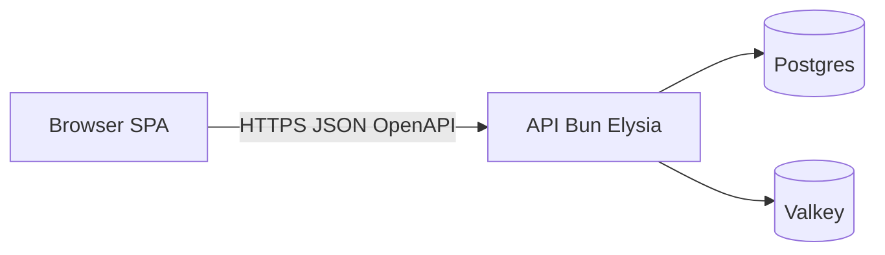

BoringStack splits the runtime into three layers. Each layer has one job. Together they are a product you can ship and operate.

## What each layer delivers

**API (`api-template`).** Authentication and authorization, input validation, business logic, database access, background jobs, secrets handling, and the audit trail. Security-sensitive work lives here.

**UI (`ui-template`).** Pages, components, client state, i18n, and the browser experience. Vite and React keep local feedback fast. Server state goes through TanStack Query and a typed API client.

**Infra (`infra-docker-compose-template`).** TLS termination, routing, Postgres, Valkey, optional observability overlays, backups, and production compose profiles. [OpenTofu bootstrap](/topics/provisioning-with-tofu/) can provision a Hetzner VPS and drop the stack in place.

## How the layers connect

Left to right: a browser SPA calls the Bun + Elysia API over HTTPS using a typed OpenAPI contract; the API alone talks to Postgres for durable state and to Valkey for cache and queue work. No browser-to-database path exists.

The API publishes OpenAPI at `/swagger/json`. The UI runs `pnpm generate:api` to refresh `schema.d.ts`. `openapi-fetch` rejects invalid paths and bodies at compile time. See [OpenAPI client](/ui/openapi-client/) and [Repository layout](/architecture/three-repos/) for wiring.

In production, Traefik serves the SPA and API on one apex host (`/` and `/api/*`). That simplifies TLS and cookies. The repositories and Docker images stay separate.

## What you gain

- Change the UI without rebuilding the API image.
- Ship an API fix or a UI tweak on its own cadence.
- Keep auth, sessions, and data access in one codebase with lint-enforced structure.
- Work in one sibling repo at a time; load only the layer you are changing.

## Related

- [Why BoringStack](/architecture/why-boringstack/)
- [Repository layout](/architecture/three-repos/)
- [Background work](/architecture/background-work/)
