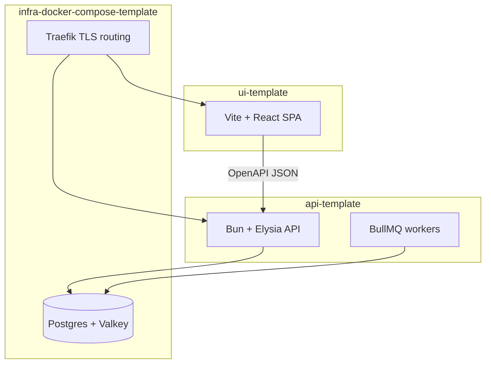

import { Aside } from "@astrojs/starlight/components";
import FaqGroup from "../../../components/FaqGroup.astro";
import FaqItem from "../../../components/FaqItem.astro";

BoringStack is for engineers who already write code and want a production-grade starting point: auth, contracts, deploy, background work, and architecture discipline already wired. You extend the product. You do not rebuild the spine on every greenfield.

## Fit check

| BoringStack is a good fit if... | It is probably the wrong fit if... |
| --- | --- |
| You are building a SaaS or B2B product with accounts, users, auth, billing, email, and background work. | You only need a static marketing site, brochure page, or no-code prototype. |
| You want to own the core runtime on a VPS: Postgres, Valkey, Traefik, Docker Compose. | You want a serverless-first Vercel/Netlify path where the platform owns most runtime decisions. |
| You want API and UI as separate jobs with an OpenAPI contract between them. | You prefer a single full-stack framework where server and client live in one app boundary. |
| You expect humans and AI agents to edit the code and need lint rules to keep architecture intact. | You are comfortable relying on conventions, README prose, and review discipline alone. |
| You want boring operational primitives now, with a path to managed Postgres or Kubernetes later. | You need Kubernetes, multi-region, or managed-everything infrastructure on day one. |

## Problems it solves

<FaqGroup>
  <FaqItem title="Rebuilding the same SaaS spine on every new project" open>
    Auth, sessions, OAuth, email, env validation, audit log, billing hooks, queues, all wired and documented.
  </FaqItem>
  <FaqItem title="API and UI drifting apart">
    OpenAPI at `/swagger/json`. `pnpm generate:api` refreshes a typed client. Contract drift fails the typecheck.
  </FaqItem>
  <FaqItem title="Architecture slipping during fast iteration (including AI-assisted edits)">
    Custom ESLint plugins encode the shape. [`validate`](/architecture/lint-as-contract/) is the merge gate.
  </FaqItem>
  <FaqItem title="Deploy and ops eating weeks before you ship features">
    Compose stack, Traefik TLS, optional [OpenTofu to Hetzner](/topics/provisioning-with-tofu/), observability overlays you can turn on.
  </FaqItem>
  <FaqItem title="User-facing events with no structure on day one">
    Notification events, dispatch jobs, and channels live in the API. See [Background work](/architecture/background-work/).
  </FaqItem>
</FaqGroup>

## What “boring” means

The name is deliberate. Boring means it just works.

Postgres, HTTP APIs, browsers, Docker Compose, TLS, Redis-protocol queues: pieces that have run in production for decades and still do. Nothing flashy. They are linked together in a way you can operate and work in without ceremony.

The inventory of choices is on [Stack at a glance](/architecture/stack/). This page is the why behind the name.

## Compared with common alternatives

| Decision point | BoringStack | Typical Vercel/serverless starter | Hosted backend starter | One-off SaaS boilerplate |
| --- | --- | --- | --- | --- |
| Deployment path | Single-host VPS first; optional OpenTofu bootstrap | Platform-first; VPS path is usually DIY | Hosted service first | Varies by vendor |
| Core data plane | Postgres + Valkey under your control | Usually external services | Hosted database/auth/storage | Varies |
| API/UI contract | OpenAPI generated client | Often framework-coupled or hand-rolled | SDK/client generated by provider | Varies |
| Auth/billing/queues/email | Wired as product infrastructure | Mostly app-specific assembly | Auth often built in; queues/billing/email vary | Often included, quality varies |
| Architecture enforcement | Custom lint plugins and `validate` gates | Mostly conventions | Mostly provider boundaries | Usually prose and examples |
| Best for | Product teams that want ownership and strong defaults | Fast frontend-heavy apps on a managed platform | Apps that fit the provider model | Buying a finished opinionated app shell |

The choice is not moral. BoringStack is intentionally biased toward ownership, explicit boundaries, low recurring infra cost, and code that remains understandable after many human and agent edits.

## The three layers

### API

Security, validation, persistence, background jobs, secrets, audit trail. The system of record lives here.

### UI

Rendering, interaction, client state, i18n. Vite keeps local feedback fast. The UI calls the API through a generated, typed client.

### Infra

TLS, routing, databases, queue store, optional metrics and logs. In production, same-origin path routing (`/` for the SPA, `/api/*` for the API) keeps browser security simple. The code boundaries stay separate.

[Separation of concerns](/architecture/separation-of-concerns/) goes deeper on what each layer delivers and how releases stay independent.

## Judgment baked in

The templates come from codebases that have been in production for many years. File layout, feature anatomy, env discipline, queue patterns, and deploy defaults are decisions you would otherwise make again on every project. You extend what ships. You do not reinvent the spine.

## Lint as load-bearing architecture

`AGENTS.md`, `CLAUDE.md`, and `AGENT_CONTRACT.md` explain intent. Custom ESLint plugins enforce it. Machine-checked rules survive refactors, new teammates, and agent-generated diffs. They cover where routes live, how env is read, and how queues are shaped. When lint fails, the fix is specific.

Architecture lives in tooling. Prose is context. Read [Lint as the contract](/architecture/lint-as-contract/).

<Aside type="tip" title="Working in one repo at a time">
  Sibling repos keep each layer's context small. Edit a route, a page, or a compose overlay without loading the whole stack into one tree.
</Aside>

## Room to grow

Email, notifications, and other background work already have a home in the API. When volume, team boundaries, or compliance need a dedicated process, you extract a piece and keep the same job contracts. See [Background work](/architecture/background-work/).

## Related

- [Quickstart](/quickstart/)
- [Repository layout](/architecture/three-repos/)
- [Lint as the contract](/architecture/lint-as-contract/)
