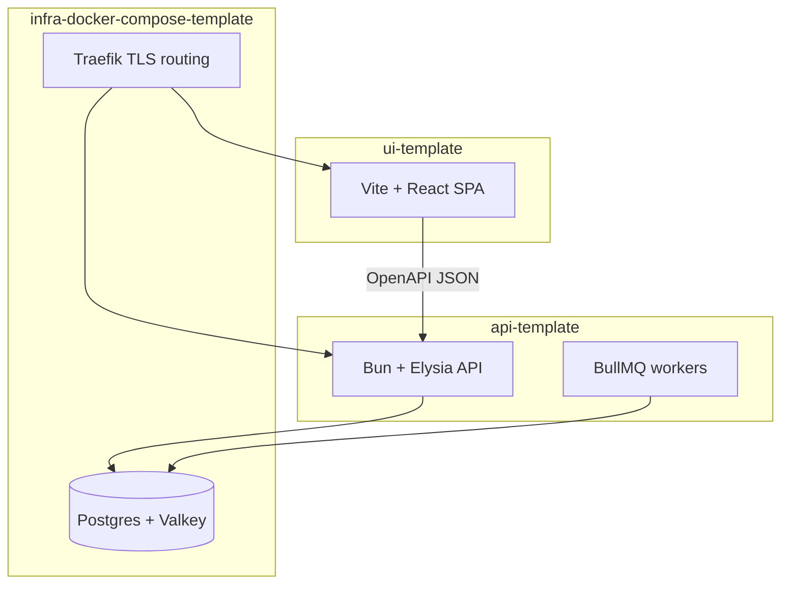

import DocCallout from "../../../components/DocCallout.tsx";
import FeatureGrid from "../../../components/docs-kit/FeatureGrid";
import PageIntro from "../../../components/docs-kit/PageIntro";
import SignalGrid from "../../../components/docs-kit/SignalGrid";

<PageIntro
  eyebrow="Why it exists"
  actions={[
    { label: "Start the stack", href: "/quickstart/" },
    { label: "See the contract", href: "/architecture/lint-as-contract/" },
  ]}
  facts={[
    { value: "auth", label: "sessions, OAuth, verification" },
    { value: "ops", label: "deploys, logs, backups" },
    { value: "AI", label: "rules agents can follow" },
  ]}
>
  BoringStack exists because rebuilding the same SaaS spine stopped feeling
  noble a long time ago. Auth, billing, email, queues, deploys, observability,
  env validation, and architecture rules are already composed, documented, and
  lint-enforced, so the first serious work is the product itself.
</PageIntro>

<SignalGrid
  columns={3}
  items={[
    {
      label: "Product time",
      title: "Start on the second one.",
      body: "The first clone already has the account, API, UI, job, email, and deploy shape you usually build before product work begins.",
    },
    {
      label: "Token budget",
      title: "Stop spending context on boilerplate.",
      body: "AI assistance gets more valuable when agents edit product behavior inside a codebase whose boring contracts already exist.",
    },
    {
      label: "Architecture",
      title: "Keep the spine as you move fast.",
      body: "Docs explain the why; lint and generated contracts keep routes, services, env, queues, and API clients from drifting.",
    },
  ]}
/>

## Fit check

| BoringStack is a good fit if...                                                                         | It is probably the wrong fit if...                                                              |
| ------------------------------------------------------------------------------------------------------- | ----------------------------------------------------------------------------------------------- |
| You are building a SaaS or B2B product with accounts, users, auth, billing, email, and background work. | You only need a static marketing site, brochure page, or no-code prototype.                     |
| You want to own the core runtime on a VPS: Postgres, Valkey, Traefik, Docker Compose.                   | You want a serverless-first Vercel/Netlify path where the platform owns most runtime decisions. |
| You want API and UI as separate jobs with an OpenAPI contract between them.                             | You prefer a single full-stack framework where server and client live in one app boundary.      |
| You expect humans and AI agents to edit the code and need lint rules to keep architecture intact.       | You are comfortable relying on conventions, README prose, and review discipline alone.          |
| You want boring operational primitives now, with a path to managed Postgres or Kubernetes later.        | You need Kubernetes, multi-region, or managed-everything infrastructure on day one.             |

## Problems it solves

<FeatureGrid
  columns={3}
  items={[
    {
      eyebrow: "spine",
      title: "No more rebuilding the same SaaS base.",
      body: "Auth, sessions, OAuth, email, env validation, audit log, billing hooks, and queues are wired and documented.",
    },
    {
      eyebrow: "contract",
      title: "API and UI move together.",
      body: "OpenAPI at /swagger/json feeds the generated UI client; contract drift fails typecheck instead of shipping.",
      href: "/ui/openapi-client/",
    },
    {
      eyebrow: "agents",
      title: "Fast edits still hit architecture rails.",
      body: "Custom ESLint plugins encode route, service, env, and queue shape. validate is the merge gate.",
      href: "/architecture/lint-as-contract/",
    },
    {
      eyebrow: "ops",
      title: "Deploys stop eating the first week.",
      body: "Compose, Traefik TLS, optional OpenTofu, observability, logs, and backups already have a home.",
      href: "/topics/deployment/",
    },
    {
      eyebrow: "events",
      title: "Background work has a real lane.",
      body: "Notification events, dispatch jobs, email, and queues live in the API instead of ad-hoc frontend retries.",
      href: "/architecture/background-work/",
    },
    {
      eyebrow: "cost",
      title: "The core app can run off the platform meter.",
      body: "Postgres, Valkey, workers, and web traffic can start on one capable VPS before you buy managed services.",
    },
  ]}
/>

## What “boring” means

The name is deliberate. Boring means it just works.

Postgres, HTTP APIs, browsers, Docker Compose, TLS, Redis-protocol queues: proven pieces that run in production for decades. Nothing flashy. They are linked together in a way you can operate and work in without ceremony.

The inventory of choices is on [Stack at a glance](/architecture/stack/). This page is the why behind the name.

## COGS-first by default

Most starters optimize for signup speed and leave the operating bill as tomorrow's problem. BoringStack optimizes for the part that quietly decides whether a small product can survive: cost of goods sold.

The core runtime is open source and self-hostable:

- Data plane: Postgres + Valkey.
- Edge and deploy: Docker Compose + Traefik on a VPS.
- Background work: BullMQ on Valkey.
- Observability: Prometheus, Grafana, Loki, Promtail, and Alertmanager as an opt-in overlay.
- Error tracking: hosted Sentry if you want it, self-hosted GlitchTip if margin matters.
- Email development: Mailpit locally; Cloudflare Email, SMTP, Resend, or SendGrid in production.
- Provisioning: OpenTofu instead of click-by-click cloud setup.

That does not mean "never use SaaS." Stripe, Cloudflare, Sentry, Resend, SendGrid, Neon, Supabase, and other managed services can all make sense. The point is that BoringStack does not force your core application onto a platform meter before you have revenue. You can start nearly free on one capable VPS, then buy managed services only where the trade-off is worth it.

## Compared with common alternatives

| Decision point            | BoringStack                                           | Typical Vercel/serverless starter              | Hosted backend starter                         | One-off SaaS boilerplate                |
| ------------------------- | ----------------------------------------------------- | ---------------------------------------------- | ---------------------------------------------- | --------------------------------------- |
| Deployment path           | Single-host VPS first; optional OpenTofu bootstrap    | Platform-first; VPS path is usually DIY        | Hosted service first                           | Varies by vendor                        |
| Core data plane           | Postgres + Valkey under your control                  | Usually external services                      | Hosted database/auth/storage                   | Varies                                  |
| COGS posture              | Open-source core; one VPS can carry the whole app     | Usage-based platform bill grows with traffic   | Vendor pricing becomes part of the app shape   | Varies                                  |
| API/UI contract           | OpenAPI generated client                              | Often framework-coupled or hand-rolled         | SDK/client generated by provider               | Varies                                  |
| Auth/billing/queues/email | Wired as product infrastructure                       | Mostly app-specific assembly                   | Auth often built in; queues/billing/email vary | Often included, quality varies          |
| Architecture enforcement  | Custom lint plugins and `validate` gates              | Mostly conventions                             | Mostly provider boundaries                     | Usually prose and examples              |
| Best for                  | Product teams that want ownership and strong defaults | Fast frontend-heavy apps on a managed platform | Apps that fit the provider model               | Buying a finished opinionated app shell |

The choice is not moral. BoringStack is intentionally biased toward ownership, explicit boundaries, low recurring infra cost, and code that remains understandable after many human and agent edits.

## The three layers

### API

Security, validation, persistence, background jobs, secrets, audit trail. The system of record lives here.

### UI

Rendering, interaction, client state, i18n. Vite keeps local feedback fast. The UI calls the API through a generated, typed client.

### Infra

TLS, routing, databases, queue store, optional metrics and logs. In production, same-origin path routing (`/` for the SPA, `/api/*` for the API) keeps browser security simple. The code boundaries stay separate.

[Separation of concerns](/architecture/separation-of-concerns/) goes deeper on what each layer delivers and how releases stay independent.

## Judgment baked in

The templates come from codebases that have been in production for many years. File layout, feature anatomy, env discipline, queue patterns, and deploy defaults are decisions you would otherwise make again on every project. You extend what ships. You do not reinvent the spine.

## Lint as load-bearing architecture

`AGENTS.md`, `CLAUDE.md`, and `AGENT_CONTRACT.md` explain intent. Custom ESLint plugins enforce it. Machine-checked rules survive refactors, new teammates, and agent-generated diffs. They cover where routes live, how env is read, and how queues are shaped. When lint fails, the fix is specific.

Architecture lives in tooling. Prose is context. Read [Lint as the contract](/architecture/lint-as-contract/).

<DocCallout
  variant="tip"
  title="Working in one repo at a time"
  eyebrow="Context control"
>
  Sibling repos keep each layer's context small. Edit a route, a page, or a
  compose overlay without loading the whole stack into one tree.
</DocCallout>

## Room to grow

Email, notifications, and other background work already have a home in the API. When volume, team boundaries, or compliance need a dedicated process, you extract a piece and keep the same job contracts. See [Background work](/architecture/background-work/).

## Related

- [Quickstart](/quickstart/)
- [Repository layout](/architecture/three-repos/)
- [Lint as the contract](/architecture/lint-as-contract/)
