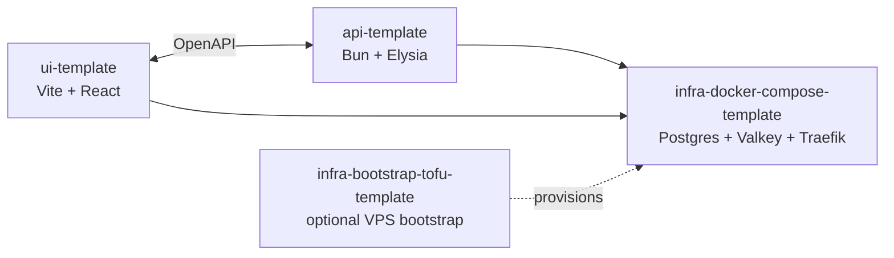

import { Card, CardGrid } from "@astrojs/starlight/components";

BoringStack's ambition is simple: be the best production-ready starter on the internet for engineers who want to ship a real product, not a demo that collapses the first time security, cost, deploy, or maintenance matters.

- Product momentum like AI app builders, but for software engineers: fork it, boot it, understand it, own it.
- Production spine on day one: auth, OAuth, billing hooks, email, queues, audit log, notifications, env validation, deploy.
- COGS-first architecture: open-source runtime primitives, one VPS path, optional self-hosted observability, no mandatory platform tax.
- Agent-ready codebase: ESLint rules hold the architecture so human and AI-generated diffs get concrete errors, not vibes.

Read [Why BoringStack](/architecture/why-boringstack/) for the decision guide, then [Quickstart](/quickstart/) when you want to clone.

## Why it exists

AI builders are incredible for proving an idea quickly. The hard part comes next: secrets, auth, webhooks, billing, background jobs, deploys, logs, backups, tenant boundaries, and keeping cloud spend sane. BoringStack starts from that next phase.

The core bias is ownership and low COGS. Postgres, Valkey, Traefik, Docker Compose, Prometheus, Grafana, Loki, GlitchTip, Mailpit, WUD, and OpenTofu are all open-source building blocks you can run yourself. Paid services are integrations, not the foundation.

## The templates

<CardGrid>
  <Card title="api-template" icon="rocket">
    Bun · Elysia · Drizzle · Postgres · Valkey · BullMQ. Cookie auth with
    refresh sessions, OAuth, Stripe billing, email, queues, audit log, and an
    env validator that fails the boot rather than your customers.
    [Overview →](/api/overview/)
  </Card>
  <Card title="ui-template" icon="laptop">
    Vite · React 19 · TanStack Query · shadcn/ui · Playwright. Typed OpenAPI
    client, custom ESLint rules that enforce the architecture, working e2e
    harness. Drift between server and client is a compile error.
    [Overview →](/ui/overview/)
  </Card>
  <Card title="infra-docker-compose-template" icon="setting">
    Postgres · Valkey · Traefik. Opt-in overlays for GlitchTip,
    Prometheus + Grafana + Loki, BullMQ dashboard, WUD, and Mailpit. One
    `./scripts/compose-up.sh` boots the lot. [Overview →](/infra/overview/)
  </Card>
  <Card title="infra-bootstrap-tofu-template" icon="seti:terraform">
    Optional fourth template. One `tofu apply` puts a Hetzner VPS behind
    Cloudflare with the docker-compose stack already running.
    [Walkthrough →](/topics/provisioning-with-tofu/)
  </Card>
</CardGrid>

## Where next

- New here? Start with the [Quickstart](/quickstart/): fork, clone, boot, sign in.
- Deciding whether it fits? Read [Why BoringStack](/architecture/why-boringstack/) for a fit check, trade-offs, and comparison.
- Deploying to a VPS? [Deployment](/topics/deployment/), [Firewall & TLS](/runbooks/firewall-and-tls/), [Cloudflare Email setup](/runbooks/cloudflare-email-setup/).
- Looking up an env var or a command? [Environment variables](/reference/env-vars/) · [Commands cheatsheet](/reference/commands/).
