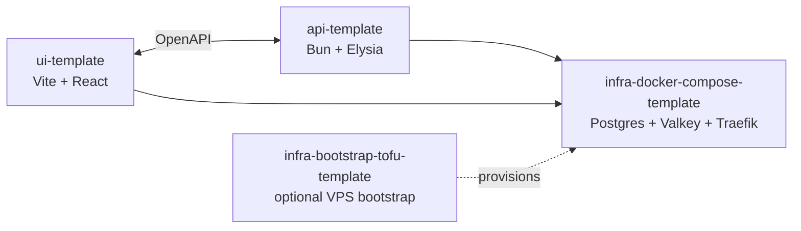

import { Card, CardGrid } from "@astrojs/starlight/components";

BoringStack is for product engineers who want a real SaaS starting point, not another login-page demo.

- Boot a full local stack in minutes: Postgres, Valkey, Bun API, Vite UI.
- Start with SaaS-shaped defaults: cookie auth, OAuth, billing hooks, email, queues, audit log, notifications.
- Keep humans and agents inside the same architecture: ESLint rules fail the diff with errors you can fix.
- Deploy to a VPS you control: Compose, Traefik, GHCR images, Cloudflare, optional OpenTofu.

Read [Why BoringStack](/architecture/why-boringstack/) for the decision guide, then [Quickstart](/quickstart/) when you want to clone.

## The templates

<CardGrid>
  <Card title="api-template" icon="rocket">
    Bun · Elysia · Drizzle · Postgres · Valkey · BullMQ. Cookie auth with
    refresh sessions, OAuth, Stripe billing, email, queues, audit log, and an
    env validator that fails the boot rather than your customers.
    [Overview →](/api/overview/)
  </Card>
  <Card title="ui-template" icon="laptop">
    Vite · React 19 · TanStack Query · shadcn/ui · Playwright. Typed OpenAPI
    client, custom ESLint rules that enforce the architecture, working e2e
    harness. Drift between server and client is a compile error.
    [Overview →](/ui/overview/)
  </Card>
  <Card title="infra-docker-compose-template" icon="setting">
    Postgres · Valkey · Traefik. Opt-in overlays for GlitchTip,
    Prometheus + Grafana + Loki, BullMQ dashboard, WUD, and Mailpit. One
    `./scripts/compose-up.sh` boots the lot. [Overview →](/infra/overview/)
  </Card>
  <Card title="infra-bootstrap-tofu-template" icon="seti:terraform">
    Optional fourth template. One `tofu apply` puts a Hetzner VPS behind
    Cloudflare with the docker-compose stack already running.
    [Walkthrough →](/topics/provisioning-with-tofu/)
  </Card>
</CardGrid>

## Where next

- New here? Start with the [Quickstart](/quickstart/) — fork, clone, boot, sign in.
- Deciding whether it fits? Read [Why BoringStack](/architecture/why-boringstack/) — fit check, trade-offs, comparison.
- Deploying to a VPS? [Deployment](/topics/deployment/), [Firewall & TLS](/runbooks/firewall-and-tls/), [Cloudflare Email setup](/runbooks/cloudflare-email-setup/).
- Looking up an env var or a command? [Environment variables](/reference/env-vars/) · [Commands cheatsheet](/reference/commands/).
