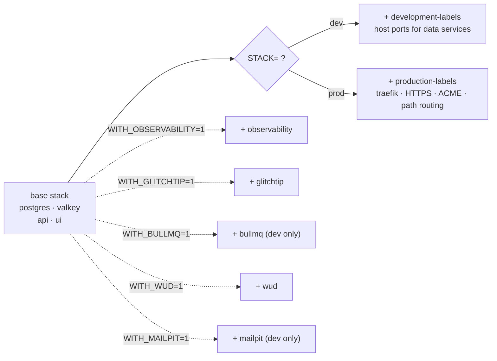

import { Aside } from "@astrojs/starlight/components";
import FaqGroup from "../../../components/FaqGroup.tsx";
import FaqItem from "../../../components/FaqItem.tsx";

The infra stack defaults small: Postgres + Valkey + your apps. Everything else (observability, error tracking, queue dashboard, image-update detection, local email catcher) is opt-in via a flag. Traefik runs in the prod profile only; dev uses Vite's dev-server proxy for same-origin DX. Composition happens in `dev.sh`, which assembles the `docker-compose` invocation based on env vars.

## How a stack is assembled



The result is a single `docker compose -f ... -f ... --profile ...` command. `dev.sh` is plain bash; you can read exactly what gets merged.

## Design choices

<FaqGroup>
  <FaqItem title="Base stack always-on, everything else opt-in" open>
    First-time setup boots fast and uses minimal RAM.
  </FaqItem>
  <FaqItem title="Flags compose freely (WITH_OBSERVABILITY=1 WITH_GLITCHTIP=1 ...)">
    No combinatorial config files; each overlay is independent.
  </FaqItem>
  <FaqItem title="Separate dev / prod overlays for labels">
    HTTPS, ACME, and security headers live in prod-only files.
  </FaqItem>
  <FaqItem title="WITH_BULLMQ only valid in dev">
    Bull-board has no auth and no place in production.
  </FaqItem>
  <FaqItem title="Profiles + overlay files (not one giant file)">
    `docker compose config` stays readable; overlays can be skipped cleanly.
  </FaqItem>
</FaqGroup>

## The full opt-in matrix

<FaqGroup>
  <FaqItem title="WITH_OBSERVABILITY=1" open>
    Adds Prometheus, Grafana, Loki, Promtail, Alertmanager, and exporters.
  </FaqItem>
  <FaqItem title="WITH_GLITCHTIP=1">
    GlitchTip (Sentry-compatible error tracking); reuses base Postgres + Valkey.
  </FaqItem>
  <FaqItem title="WITH_BULLMQ=1">
    Bull-board UI at `bullmq.localhost`; dev only.
  </FaqItem>
  <FaqItem title="WITH_WUD=1">
    WUD watches container images and notifies when newer tags exist; Discord webhook optional.
  </FaqItem>
  <FaqItem title="WITH_MAILPIT=1">
    Mailpit SMTP catcher at `:8025`; dev only.
  </FaqItem>
</FaqGroup>

Combinations: `WITH_OBSERVABILITY=1 WITH_GLITCHTIP=1 ./scripts/compose-up.sh` is supported (and runs in CI).

## STACK=dev vs STACK=prod

<FaqGroup>
  <FaqItem title="API + UI" open>
    **dev:** bind-mounted source, hot reload. **prod:** pre-built images pulled from GHCR.
  </FaqItem>
  <FaqItem title="Traefik">
    **dev:** not started; Vite dev-server proxies `/api/*` directly. **prod:** started; terminates TLS, path-routes `/api/*` and `/health` to api, everything else to ui.
  </FaqItem>
  <FaqItem title="Host(s)">
    **dev:** `http://localhost:3001`. **prod:** `https://${PUBLIC_UI_HOST}` (one domain, same-origin).
  </FaqItem>
  <FaqItem title="TLS">
    **dev:** none. **prod:** Let's Encrypt ACME via Traefik.
  </FaqItem>
  <FaqItem title="Data ports">
    **dev:** Postgres on `:5432`, Valkey on `:6379` published to host. **prod:** internal-only, not published.
  </FaqItem>
</FaqGroup>

`STACK=prod` adds Traefik and path-routing on top of the same data plane (Postgres + Valkey). No CORS in either profile.

## Reading what's actually running

```bash
# What did dev.sh assemble?
STACK=dev WITH_OBSERVABILITY=1 ./dev.sh config | less

# Service status of the live stack
./dev.sh ps
```

`./dev.sh` forwards every argument to `docker compose` with the merged file list; so any compose command works (`logs`, `exec`, `top`, etc.).

## Adding an overlay

1. Write a new `docker-compose.<name>.yml` with the additional services.
2. Add a `WITH_<NAME>=1` clause in `dev.sh` mirroring the existing ones.
3. Document the flag in `compose/.env.example`.
4. Update the [Commands cheatsheet](/reference/commands/).

Overlays are independent files, so you can ship one without touching the base.

## Source

[`compose/dev.sh`](https://github.com/AI-Starter-Templates/infra-docker-compose-template/blob/main/compose/dev.sh); the orchestrator. [`compose/docker-compose.*.yml`](https://github.com/AI-Starter-Templates/infra-docker-compose-template/tree/main/compose); the base + overlays.

## Related

- [Infra overview](/infra/overview/); service inventory.
- [Resource limits](/infra/resource-limits/); sizing per service.
- [Commands cheatsheet](/reference/commands/); every flag in one place.
