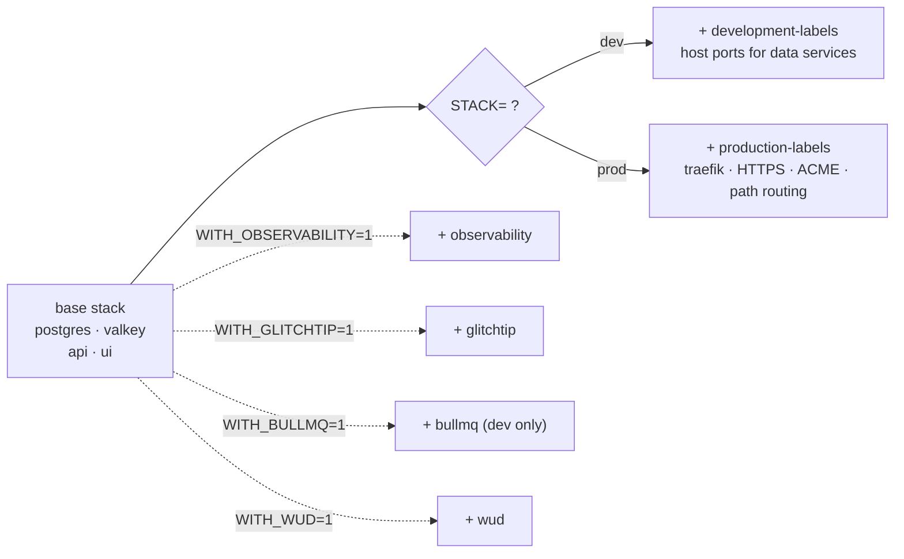

import { Aside } from "@astrojs/starlight/components";

The infra stack is built so the **default** is small (Postgres + Valkey + your apps) and everything else; observability, error tracking, queue dashboard, image-update detection; is **opt-in via a flag**. Traefik runs in the prod profile only — dev uses Vite's dev-server proxy for same-origin DX. The composition happens in `dev.sh`, which assembles the `docker-compose` invocation based on env vars.

## How a stack is assembled



The result is a single `docker compose -f ... -f ... --profile ...` command. `dev.sh` is plain bash; you can read exactly what gets merged.

## Design choices

| Decision | Reason |
|---|---|
| Base stack always-on, everything else opt-in | First-time setup boots fast and uses minimal RAM |
| Flags compose freely (`WITH_OBSERVABILITY=1 WITH_GLITCHTIP=1 ...`) | No combinatorial config files; each overlay is independent |
| Separate `dev` / `prod` overlays for labels | HTTPS, ACME, and security headers live in prod-only files |
| `WITH_BULLMQ` only valid in dev | Bull-board has no auth and no place in production |
| Profiles + overlay files (not just one giant file) | `docker compose config` stays readable; overlays can be skipped cleanly |

## The full opt-in matrix

| Flag | Adds |
|---|---|
| `WITH_OBSERVABILITY=1` | Prometheus, Grafana, Loki, Promtail, Alertmanager + exporters |
| `WITH_GLITCHTIP=1` | GlitchTip (Sentry-compatible error tracking); reuses base Postgres + Valkey |
| `WITH_BULLMQ=1` | Bull-board UI at `bullmq.localhost`; dev only |
| `WITH_WUD=1` | What's-Up-Docker image-update detector; Discord webhook optional |

Combinations: `WITH_OBSERVABILITY=1 WITH_GLITCHTIP=1 ./scripts/compose-up.sh` is supported (and runs in CI).

## STACK=dev vs STACK=prod

| Aspect | `dev` | `prod` |
|---|---|---|
| API + UI | Bind-mounted source, hot reload | Built images from `Dockerfile.prod` |
| Traefik | Not started — Vite's dev-server proxies `/api/*` directly | Started — terminates TLS, path-routes `/api/*` + `/health` → api, everything else → ui |
| Host(s) | `http://localhost:3001` | `https://${PUBLIC_UI_HOST}` (one domain, same-origin) |
| TLS | None | Let's Encrypt ACME via Traefik |
| Data ports | Postgres on `:5432`, Valkey on `:6379` published to host | Internal-only, not published |

`STACK=prod` adds Traefik and path-routing on top of the same data plane (Postgres + Valkey). No CORS in either profile.

## Reading what's actually running

```bash
# What did dev.sh assemble?
STACK=dev WITH_OBSERVABILITY=1 ./dev.sh config | less

# Service status of the live stack
./dev.sh ps
```

`./dev.sh` forwards every argument to `docker compose` with the merged file list; so any compose command works (`logs`, `exec`, `top`, etc.).

## Adding an overlay

1. Write a new `docker-compose.<name>.yml` with the additional services.
2. Add a `WITH_<NAME>=1` clause in `dev.sh` mirroring the existing ones.
3. Document the flag in `compose/.env.example`.
4. Update the [Commands cheatsheet](/reference/commands/).

Overlays are independent files, so you can ship one without touching the base.

## Source

[`compose/dev.sh`](https://github.com/AI-Starter-Templates/infra-docker-compose-template/blob/main/compose/dev.sh); the orchestrator. [`compose/docker-compose.*.yml`](https://github.com/AI-Starter-Templates/infra-docker-compose-template/tree/main/compose); the base + overlays.

## Related

- [Infra overview](/infra/overview/); service inventory.
- [Resource limits](/infra/resource-limits/); sizing per service.
- [Commands cheatsheet](/reference/commands/); every flag in one table.
