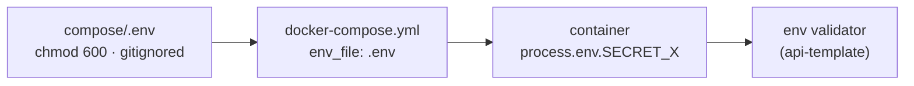

import { Aside } from "@astrojs/starlight/components";
import FaqGroup from "../../../components/FaqGroup.astro";
import FaqItem from "../../../components/FaqItem.astro";

The infra stack puts secrets in `compose/.env` (gitignored) and passes them to containers via `env_file:` references. That's it. No Docker secrets, no Vault, no SOPS, deliberately. For a single-host stack, env files + filesystem permissions are the pragmatic floor.

When you outgrow that floor, there are well-trodden paths up. Until then, every step you add is complexity for a problem you don't have yet.

## How a secret flows



The container sees a normal environment variable. The api-template's validator refuses to boot in production if anything required is missing or malformed. See [Env validator](/api/env-validator/).

## Design choices

<FaqGroup>
  <FaqItem title="compose/.env is the single source" open>
    One file to back up, one file to protect; no scattered config.
  </FaqItem>
  <FaqItem title="Gitignored, file mode 600">
    Filesystem permissions are the access control.
  </FaqItem>
  <FaqItem title="env_file: references, not inline environment: blocks">
    Avoids leaking secrets into `docker-compose.yml`.
  </FaqItem>
  <FaqItem title="No vendor secret manager by default">
    Adding one is harder to undo than to add later.
  </FaqItem>
  <FaqItem title="Validator-fail-fast on missing required secrets">
    Misconfiguration shows up at boot, not at the first request.
  </FaqItem>
</FaqGroup>

## Bootstrapping

```bash
cp compose/.env.example compose/.env
chmod 600 compose/.env
# Edit compose/.env, fill in real values
```

Every secret in `.env.example` has a comment explaining what it's for and where it's required.

## What counts as a secret

<FaqGroup>
  <FaqItem title="Database (POSTGRES_PASSWORD)" open>
    Rotation cadence: annually, or after a suspected leak.
  </FaqItem>
  <FaqItem title="Auth (JWT_SECRET, 32+ chars)">
    Signs access cookies and hashes refresh tokens. Rotate after any incident; otherwise leave alone.
  </FaqItem>
  <FaqItem title="OAuth (*_OAUTH_CLIENT_SECRET)">
    Per provider policy; rotate after staff turnover.
  </FaqItem>
  <FaqItem title="Provider keys (Resend, Cloudflare, Stripe)">
    When a key is leaked; per vendor rotation guidance.
  </FaqItem>
  <FaqItem title="Webhook secrets (STRIPE_WEBHOOK_SECRET)">
    When the webhook endpoint is regenerated.
  </FaqItem>
</FaqGroup>

Cosmetic config (`POSTGRES_USER`, `EMAIL_FROM`) isn't a secret; it's just config. Don't put it through the same rotation rigor.

## Rotation playbooks

### Postgres password

1. Generate a new strong password.
2. Update `POSTGRES_PASSWORD` in `compose/.env`.
3. `ALTER USER app WITH PASSWORD '...';` inside Postgres.
4. `./dev.sh restart` to recycle the app containers with the new connection string.

### JWT secret

1. Update `JWT_SECRET` (32+ chars) in `compose/.env`.
2. `./dev.sh restart api`.
3. Every access cookie and refresh session is invalidated. Users get a 401 and re-login.

### OAuth secret

1. Rotate at the provider (Google / GitHub / LinkedIn dashboard).
2. Update the matching `*_OAUTH_CLIENT_SECRET` in `compose/.env`.
3. `./dev.sh restart api`. No user-visible impact unless they're mid-OAuth at the moment.

### Provider key (Resend / Cloudflare / Stripe)

1. Provision a new key alongside the old one.
2. Update `compose/.env`, restart the API.
3. Confirm send/charge works.
4. Revoke the old key.

The "provision new before revoking old" overlap pattern avoids a window where the system is broken.

## On a leak

1. Rotate immediately. Don't wait for the post-mortem.
2. Audit the audit log: `SELECT * FROM audit.audit_log WHERE created_at > '<leak time>'`. Look for anomalies.
3. Force re-login by rotating `JWT_SECRET` if session integrity is in doubt.
4. Check git history. If a `.env` was accidentally committed: `git log -p compose/.env`. Assume every secret in it has been compromised.

## When to graduate

Env files plus 600 permissions stop being adequate when one of these is true:

- Multiple operators with different scopes: "Alice can read backups, Bob can read app secrets, nobody can read both" needs a secret manager.
- Audit-trail requirements: SOC 2, HIPAA, and similar want a log of who read which secret when.
- Automated rotation: rotation more often than humans can do reliably.

Common upgrade paths:

- [SOPS](https://github.com/getsops/sops) + age: encrypted env files in git. Cheapest upgrade, no infra to run.
- [Hashicorp Vault](https://www.vaultproject.io): purpose-built, all the features. Adds a service to run + back up.
- Cloud-provider KMS / Secrets Manager: AWS / GCP / Azure native. Easy if you're already on that cloud.

## Backups

`compose/.env` is the most security-sensitive file in the repo and the most important to back up. Treat it like a private SSH key: encrypted, off-host, and recoverable without the live server.

See [Backups](/runbooks/backups/) for the Postgres side; the `.env` itself is small enough to commit to a private secrets repo or stash in a password manager.

## Source

[`compose/.env.example`](https://github.com/AI-Starter-Templates/infra-docker-compose-template/blob/main/compose/.env.example); the per-var reference with comments.

## Related

- [Env validator](/api/env-validator/); the layer that refuses to boot if required secrets are missing.
- [Environment variables](/reference/env-vars/); consolidated index across the repos.
