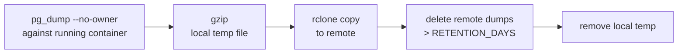

import { Aside } from "@astrojs/starlight/components";
import FaqGroup from "../../../components/FaqGroup.astro";
import FaqItem from "../../../components/FaqItem.astro";

The infra template ships `scripts/backup-wrapper.example.sh`: `pg_dump` → gzip → `rclone copy` to a remote of your choice, with retention. Designed to be safe to run from cron; idempotent, logs to stdout, exits non-zero on failure.

## What the script does



Plain bash. ~80 lines. Read it before pointing at production.

## Design choices

<FaqGroup>
  <FaqItem title="rclone, not vendor-specific tools" open>
    One config talks to S3, B2, Storj, Wasabi, even your own host via SFTP.
  </FaqItem>
  <FaqItem title="Gzip locally before upload">
    Saves bandwidth and storage; pg_dump compresses well.
  </FaqItem>
  <FaqItem title="pg_dump, not file-level snapshots">
    Logical dumps survive Postgres version upgrades; file-level does not.
  </FaqItem>
  <FaqItem title="Retention enforced remotely">
    The remote is the source of truth for what exists.
  </FaqItem>
  <FaqItem title="BACKUP_DRY_RUN=1 mode">
    First run prints the plan; promote to real once you trust it.
  </FaqItem>
  <FaqItem title="Exits non-zero on any failure">
    Cron mail capture surfaces failures automatically.
  </FaqItem>
</FaqGroup>

## What to configure

In `compose/.env` (the script sources it):

<FaqGroup>
  <FaqItem title="POSTGRES_USER and POSTGRES_DB" open>
    What to dump.
  </FaqItem>
  <FaqItem title="RCLONE_REMOTE_NAME">
    The rclone remote alias (configured separately via `rclone config`).
  </FaqItem>
  <FaqItem title="RCLONE_REMOTE_PATH">
    Path within the remote.
  </FaqItem>
  <FaqItem title="BACKUP_RETENTION_DAYS">
    Default 30.
  </FaqItem>
  <FaqItem title="BACKUP_DRY_RUN=1">
    Print what would happen; skip side effects.
  </FaqItem>
</FaqGroup>

## Setting it up

1. Configure rclone once: `rclone config` on the host. Pick a remote (S3, B2, etc.), name it `backup` (or anything; match `RCLONE_REMOTE_NAME`).
2. Copy the wrapper: `cp scripts/backup-wrapper.example.sh scripts/backup-wrapper.sh && chmod +x scripts/backup-wrapper.sh`.
3. Dry-run: `BACKUP_DRY_RUN=1 ./scripts/backup-wrapper.sh`. Verify the plan reads correctly.
4. Real run: drop the flag, run once manually, confirm a file lands in the remote.
5. Schedule it. Drop a cron entry:
   ```bash
   # /etc/cron.d/backups; daily at 03:15
   15 3 * * * root /path/to/infra-docker-compose-template/scripts/backup-wrapper.sh
   ```

## Retention math

<FaqGroup>
  <FaqItem title="Daily, 30 days" open>
    Default retention 30 backups: a month of point-in-time recovery.
  </FaqItem>
  <FaqItem title="Daily, with monthly retention">
    Custom; see below. Years of monthly snapshots, days of recent.
  </FaqItem>
</FaqGroup>

For longer retention (compliance, year-over-year audits), run two crons with different `RCLONE_REMOTE_PATH` values:

```bash
# Daily, 30 days
15 3 * * * ... RCLONE_REMOTE_PATH=daily BACKUP_RETENTION_DAYS=30 ...

# Monthly, kept forever (no retention)
15 4 1 * * ... RCLONE_REMOTE_PATH=monthly BACKUP_RETENTION_DAYS=99999 ...
```

## Restore drill

A backup you can't restore is not a backup. Run the drill quarterly.

1. Pick a recent backup. `rclone ls backup:db/`.
2. Download to a workstation. `rclone copy backup:db/<file>.sql.gz ./`.
3. `gunzip` it.
4. Spin up a throwaway Postgres locally. `docker run --rm -d --name pg-restore -e POSTGRES_PASSWORD=test postgres:17`.
5. Restore. `cat <file>.sql | docker exec -i pg-restore psql -U postgres`.
6. Sanity-query. Row counts in the main tables; `users`, `audit_log`, whatever's important.

If any step fails, the runbook is broken. Fix it before you need it.

## Encryption

The script uploads gzip'd SQL; readable to anyone with access to the remote. Two patterns to encrypt:

- Server-side at the remote. S3, B2, etc. all support encryption-at-rest. Easiest; you trust the provider.
- Client-side via rclone crypt. `rclone config` a crypt-wrapped remote on top of the bucket. Encrypted before leaving the host.

For sensitive data, client-side is the right answer. Document the password in your secret store; without it, the backups are useless.

## What's not backed up

- Valkey. Cache + queues, not authoritative. If you can't rebuild it, that's an architecture problem, not a backup problem.
- Audit log table. It is backed up because it's part of Postgres. Noting it because some templates treat audit separately.
- `compose/.env`. Back up separately; it's small enough to live in a private secrets repo or password manager.
- Container images. Pull from registry on restore; not part of the backup loop.

## Source

[`scripts/backup-wrapper.example.sh`](https://github.com/AI-Starter-Templates/infra-docker-compose-template/blob/main/scripts/backup-wrapper.example.sh) · [`docs/backup-offsite.md`](https://github.com/AI-Starter-Templates/infra-docker-compose-template/blob/main/docs/backup-offsite.md) in the infra repo.

## Related

- [Secrets](/infra/secrets/); back up `compose/.env` separately.
- [Deployment](/topics/deployment/); where this script lives in the broader operational picture.
