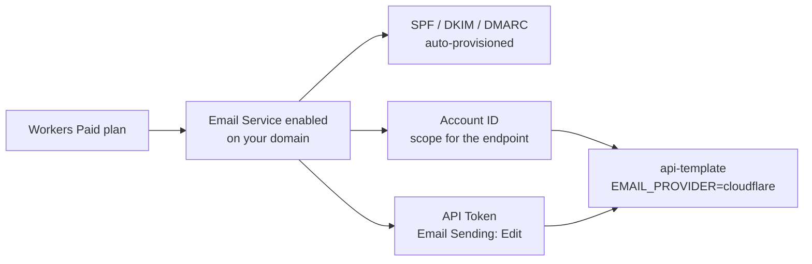

import { Aside, Steps } from "@astrojs/starlight/components";

This runbook takes a fresh Cloudflare account from "nothing" to "the api-template is sending mail via Cloudflare Email Service." It's a single one-time setup; rotations later are just step 4.

For *why* Cloudflare is the default, see [Cloudflare Email Service](/topics/cloudflare-email/).

## Prerequisites

- A Cloudflare account that owns (or proxies) the domain you'll send from.
- Admin access to that account.
- A real email address for the API token's audit trail.

## How the pieces fit



You need both the account ID (in the endpoint URL) and the API token (in the bearer header). Lose either and sends fail.

## Setup

<Steps>

1. Enable Workers Paid. Cloudflare dashboard → Workers & Pages → Plans → upgrade to Workers Paid. Email Service is bundled into this plan; there's no separate billing line. ([Current pricing](https://www.cloudflare.com/plans/developer-platform/).)

2. Enable Email Service on your domain. Dashboard → Email → Email Routing or Email Sending → enable for the domain. Cloudflare auto-provisions the required DNS records (SPF, DKIM, DMARC) because the zone is on Cloudflare. That removes the usual hand-edited DNS step, where most transactional-email setups go wrong. Wait for the dashboard to show all three records as Active (usually under a minute).

3. Capture the Account ID. Dashboard → any domain → right sidebar → "Account ID". 32 hex characters. Drop it into `compose/.env`:

   ```bash
   CLOUDFLARE_ACCOUNT_ID=<your-account-id>
   ```

4. Scope an API token. Dashboard → My Profile → API Tokens → Create Token → Custom Token with:
   - Permissions: `Email Sending: Edit` only (principle of least privilege).
   - Account resources: include the specific account.
   - TTL: indefinite for now; rotate quarterly or after any staff change.

   Copy the token (you can't view it again). Drop it into `compose/.env`:

   ```bash
   CLOUDFLARE_EMAIL_API_TOKEN=<your-token>
   ```

5. Set the sender + provider.

   ```bash
   EMAIL_PROVIDER=cloudflare        # already the default
   EMAIL_FROM=noreply@<your-domain>
   ```

   `EMAIL_FROM` must be on a domain you've enabled Email Service for. Sending from a domain that isn't enabled returns a 403.

6. Smoke-test.

   ```bash
   # Restart the API to pick up the new env
   ./dev.sh restart api

   # Trigger a send; register a test user, or hit an admin endpoint
   # that triggers a transactional email.

   # Tail the API log to see the send result
   ./dev.sh logs -f api | grep email
   ```

   Success looks like `event="email_sent" provider="cloudflare"`. Failure logs the response body; usually an unverified-domain error or a permission-scope mistake.

</Steps>

## New-account verified-senders gotcha

Brand-new Cloudflare accounts have a sender-verification lock: you can only send to addresses you've verified, until the account is approved for unrestricted sending. The check is usually automatic within a few days for legitimate use. If you need to ship before then:

- Verify the few addresses you need for testing (dashboard → Email → verify recipient).
- Or contact Cloudflare support with your use case to fast-track the unlock.

## Validating SPF / DKIM / DMARC

Once the dashboard shows the records active:

```bash
dig +short TXT <your-domain> | grep "v=spf1"
dig +short TXT cf-<...>._domainkey.<your-domain>
dig +short TXT _dmarc.<your-domain>
```

All three should return a value. If any are empty, the Cloudflare auto-provision didn't complete; re-toggle Email Service in the dashboard.

## Rotation

Every quarter, or after any staff change:

1. Create a new API token with the same scope.
2. Update `CLOUDFLARE_EMAIL_API_TOKEN` in `compose/.env`.
3. `./dev.sh restart api`.
4. Confirm a send works with the new token.
5. Revoke the old token in the dashboard.

## Switching to Resend / SendGrid

The api-template is provider-agnostic. Swapping is one env var:

```bash
EMAIL_PROVIDER=resend
RESEND_API_KEY=re_xxx
```

The env validator refuses to boot in production if the matching key is missing. See [Email](/api/email/) and [Cloudflare Email Service](/topics/cloudflare-email/) for the abstraction.

## Source

- Provider implementation: [`src/lib/email/providers/cloudflare.ts`](https://github.com/AI-Starter-Templates/api-template/blob/main/src/lib/email/providers/cloudflare.ts) in the api-template.
- Cloudflare's own docs: [developers.cloudflare.com/email-service](https://developers.cloudflare.com/email-service/).
