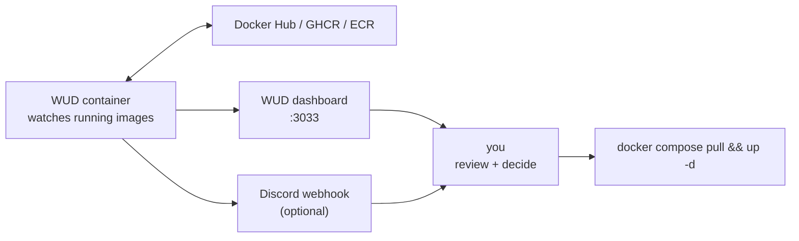

import { Aside } from "@astrojs/starlight/components";
import FaqGroup from "../../../components/FaqGroup.tsx";
import FaqItem from "../../../components/FaqItem.tsx";

`WITH_WUD=1` brings up [WUD](https://getwud.github.io/wud/): it watches every running container's image and pings a Discord webhook when a newer tag is available. Manual `docker compose pull` + recreate is still the apply step. No surprise restarts.

## Why notify-only

Auto-pull-and-restart risks restarting production with a broken image. The template's stance:

- Detection automated. You always know when a base image moves.
- Application manual. A human reviews the changelog before bumping.

One philosophical step less aggressive than Watchtower. Pick Watchtower if you want hands-off; pick this if you want a human in the loop.

## How it works



WUD doesn't mount `docker-compose.yml` read-write. By design. It can't modify your stack, only inform.

## Design choices

<FaqGroup>
  <FaqItem title="Notify-only, not auto-pull" open>
    Auto-pull can restart production at bad times; notify-only keeps humans in the loop.
  </FaqItem>
  <FaqItem title="Discord webhook over email">
    Lower friction; survives email filters; team-visible.
  </FaqItem>
  <FaqItem title="WUD dashboard at :3033 as fallback">
    Works even when Discord is unreachable or not configured.
  </FaqItem>
  <FaqItem title="Does not auto-edit docker-compose.yml">
    Pinning tags in git is the source of truth.
  </FaqItem>
</FaqGroup>

## Setup

In `compose/.env`:

```bash
# Optional: Discord webhook for notifications.
# Without it, WUD still runs and exposes results at http://localhost:3033/
WUD_TRIGGER_DISCORD_WEBHOOK=https://discord.com/api/webhooks/...
```

Bring up the overlay:

```bash
WITH_WUD=1 ./scripts/compose-up.sh
```

WUD scans the running containers, queries the registry for each image, and posts when a newer tag is found.

## What gets watched

By default, every container in the running stack. WUD reads each container's image reference and checks the registry's tags. Configure inclusions/exclusions via container labels in `docker-compose.yml`:

```yaml
services:
  myservice:
    image: myimage:1.0
    labels:
      wud.watch: "true"          # opt in (default)
      wud.tag.include: "^1\\.\\d+$"  # only watch 1.x tags
```

## The apply step

When WUD pings you about, say, a new `postgres:17.1`:

1. Read the [Postgres release notes](https://www.postgresql.org/docs/release/). Look for breaking changes.
2. Pin the new tag in `compose/docker-compose.yml`: `image: postgres:17.1-alpine`.
3. Take a Postgres backup ([Backups](/runbooks/backups/)).
4. Pull and restart:
   ```bash
   docker compose pull postgres
   docker compose up -d postgres
   ```
5. Verify: `./dev.sh logs -f postgres`, then a few sanity SQL queries.
6. Commit the bumped `docker-compose.yml`.

For the app images (`api`, `ui`), the new tag is published to GHCR by the release workflow when the app repo pushes. Apply it on the VPS:

```bash
docker compose pull api ui
docker compose up -d
```

To pin a specific version instead of tracking `latest`, set `API_IMAGE_TAG` / `UI_IMAGE_TAG` in `compose/.env` (e.g. `sha-abc1234` or `0.3.0`) and `compose pull` only when you bump those values.

## Rollback

Pin the old tag in `docker-compose.yml`, redeploy. Image tags are immutable (good registries enforce this), so the previous image is still pullable. For Postgres specifically, in-place downgrade between major versions isn't supported; you'd restore from backup. Minor versions downgrade cleanly.

## When to skip WUD

- You use [Renovate](https://github.com/renovatebot/renovate) on this repo. Renovate opens PRs for image bumps; same intent, integrated into your PR review flow. Don't run both.
- You're on a managed runtime (ECS, GKE, etc.) where the platform handles image rollouts.
- You don't ship to production. Dev-only stacks don't need this.

## Source

[`compose/docker-compose.wud.yml`](https://github.com/AI-Starter-Templates/infra-docker-compose-template/blob/main/compose/docker-compose.wud.yml) · [`docs/image-update-detection.md`](https://github.com/AI-Starter-Templates/infra-docker-compose-template/blob/main/docs/image-update-detection.md) · [WUD docs](https://getwud.github.io/wud/).

## Related

- [Deployment](/topics/deployment/); where image management fits in the broader picture.
- [Profiles & overlays](/infra/profiles-and-overlays/); how `WITH_WUD=1` composes into the stack.
