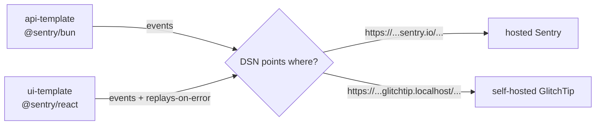

import { Aside } from "@astrojs/starlight/components";

Both `api-template` and `ui-template` ship a Sentry SDK. The same SDK talks to:

- **Hosted [Sentry](https://sentry.io)**; fastest setup, paid past the free tier.
- **Self-hosted [GlitchTip](https://glitchtip.com)**; Sentry-API-compatible, runs as an overlay in the infra stack (`WITH_GLITCHTIP=1`). Zero per-event cost.

The SDKs don't know which one they're talking to. Choosing is a one-env-var change.

## Design choices

| Decision | Reason |
|---|---|
| Sentry SDK on both sides (not a custom shim) | One vocabulary, one DX, one set of breadcrumbs |
| GlitchTip as the self-host option | Wire-compatible with Sentry; runs on the same Postgres + Valkey the app already uses |
| Empty DSN → SDK is a no-op | Dev stays clean; tests don't ship error reports |
| Replay-on-error on, full-session replays off | Captures the broken flow without storing healthy sessions |
| Single env var per side: `SENTRY_DSN` (API), `VITE_SENTRY_DSN` (UI) | Same protocol regardless of backend; swap is one redeploy |

## How it's wired



API side: Sentry initialises once at boot. If `SENTRY_DSN` is empty, init is a no-op. The shared `captureError` helper is wired into unhandled-rejection and uncaught-exception handlers, so anything that escapes the request loop reaches the backend.

UI side: Sentry initialises once at app mount when `VITE_SENTRY_DSN` is set. Replays-on-error capture the broken flow; full-session replays are off so you don't accidentally collect a video of every customer.

## Self-hosting with GlitchTip

GlitchTip is Apache-licensed and Sentry-API-compatible. The infra stack provides it as an overlay:

```bash
WITH_GLITCHTIP=1 ./dev.sh up -d
```

First boot bootstraps a superuser, a default org, and two projects (`API` and `Frontend`). Visit `http://glitchtip.localhost`, grab each project's DSN, and drop them into the matching env vars.

The overlay reuses the base stack's Postgres (in a separate `glitchtip` database) and Valkey (DB 1). Adding GlitchTip costs two extra containers, not a separate database server.

For production hardening (Basic Auth, HTTPS, real SMTP), see the [GlitchTip docs in the infra repo](https://github.com/AI-Starter-Templates/infra-docker-compose-template/blob/main/docs/glitchtip.md).

## Switching backends

Change only the DSN:

| Backend | API var | UI var |
|---|---|---|
| Sentry | `SENTRY_DSN=https://...@sentry.io/...` | `VITE_SENTRY_DSN=https://...@sentry.io/...` |
| GlitchTip (self-hosted) | `SENTRY_DSN=https://...@glitchtip.example.com/...` | `VITE_SENTRY_DSN=https://...@glitchtip.example.com/...` |

No SDK changes. The infrastructure is the variable, not the code.

<Aside type="tip" title="When to use which">
  **Hosted Sentry:** you'd rather pay the monthly fee than run another container.
  **GlitchTip:** you're already on the infra stack and "another container" is free.
  DX is identical either way.
</Aside>

## Source

- API init: [`src/config/sentry.ts`](https://github.com/AI-Starter-Templates/api-template/blob/main/src/config/sentry.ts) + [`src/config/error-handlers.ts`](https://github.com/AI-Starter-Templates/api-template/blob/main/src/config/error-handlers.ts).
- UI init: [`src/app/main.tsx`](https://github.com/AI-Starter-Templates/ui-template/blob/main/src/app/main.tsx).
- GlitchTip overlay: [`compose/docker-compose.glitchtip.yml`](https://github.com/AI-Starter-Templates/infra-docker-compose-template/blob/main/compose/docker-compose.glitchtip.yml).
