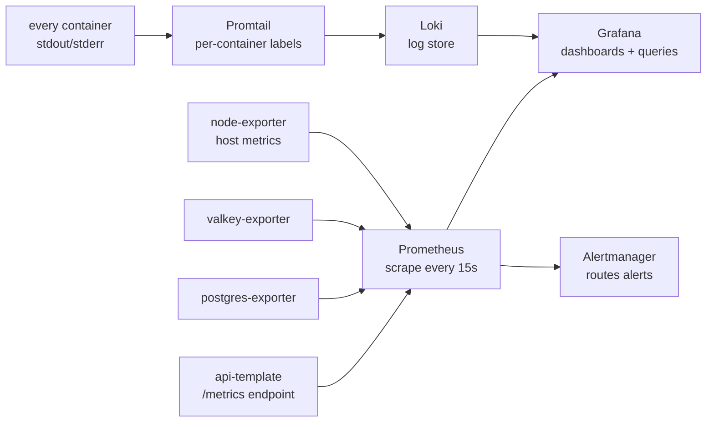

import { Aside } from "@astrojs/starlight/components";

`WITH_OBSERVABILITY=1` adds a full metrics-and-logs stack to the infra. It runs on the same host as the app; no SaaS, no per-event billing.

The default install is "enough to debug a production incident at 3 AM": app metrics, system metrics, container metrics, and every container's logs queryable in one Grafana.

## How signals flow



## Design choices

| Decision | Reason |
|---|---|
| Self-hosted, not SaaS | Zero per-event cost; data stays on your infra |
| Prometheus + Loki, not OpenTelemetry collector | Two well-known projects beat one unfamiliar abstraction |
| Promtail labels logs per container | "Show me api-prod errors in the last hour" is one filter, not a regex |
| Grafana auto-provisions datasources | Stack boots usable; no manual wiring after `up -d` |
| Alertmanager included but not wired by default | Pager strategy is project-specific; the plumbing's there when you need it |
| Bundled exporters: node, postgres, valkey | The metrics you'll actually consult during an incident |

## What you get out of the box

| Component | Where | Default |
|---|---|---|
| Grafana | `:3010` (host) | admin / change-me (override via env) |
| Prometheus | internal | Configurable retention (see `compose/prometheus/prometheus.yml`) |
| Loki | internal | Per-container labels; configurable retention |
| Promtail | sidecar | Scrapes `/var/lib/docker/containers/*.log` |
| node-exporter | host metrics | CPU, memory, disk, network |
| postgres-exporter | Postgres metrics | Connections, transactions, table sizes |
| valkey-exporter | Valkey metrics | Hit ratio, evictions, memory |
| Alertmanager | internal | Routes defined in `alertmanager/` |

Drop dashboard JSON exports into `compose/grafana/dashboards/` and Grafana auto-loads them within 30s. Datasources and the dashboard provider are already wired in `compose/grafana/provisioning/`.

## Querying

**Metrics (Prometheus, PromQL):**

```bash
# 5-minute API request rate by route
rate(http_requests_total[5m]) by (route)

# Postgres connection count
pg_stat_database_numbackends{datname="app"}

# Worker job throughput
rate(bullmq_jobs_completed_total[1m])
```

See the [PromQL cheatsheet](https://github.com/AI-Starter-Templates/infra-docker-compose-template/blob/main/docs/promql-cheatsheet.md) in the infra repo for more.

**Logs (Loki, LogQL):**

```bash
# All API errors in the last hour
{container="api-prod"} |= "level=error"

# Worker jobs by status
{container=~"api.*"} | json | event="email_delivery_completed"
```

See the [LogQL cheatsheet](https://github.com/AI-Starter-Templates/infra-docker-compose-template/blob/main/docs/logql-cheatsheet.md).

## Adding an alert

1. Drop a rule file in `compose/prometheus/rules/` (e.g. `api-error-rate.yml`).
2. Configure routing in `compose/alertmanager/alertmanager.yml`.
3. `docker compose restart prometheus alertmanager`.

Alertmanager can route to Slack, email, PagerDuty, or a webhook. The template ships the structure; you fill in your receiver.

## Adding a custom app metric

The api-template's `/metrics` endpoint uses the standard Prometheus client library. Define a counter / gauge / histogram in `src/lib/metrics/`, increment it from your code, and Prometheus picks it up on the next scrape. The convention is one file per metric domain (`http-metrics.ts`, `queue-metrics.ts`).

## Cost

The overlay is light on memory at the default sizing; see [Resource limits](/infra/resource-limits/) for the per-service knobs. Disk grows with retention windows; tune them in `compose/prometheus/prometheus.yml` and `compose/docker-compose.observability.yml` if storage matters.

## Source

[`compose/docker-compose.observability.yml`](https://github.com/AI-Starter-Templates/infra-docker-compose-template/blob/main/compose/docker-compose.observability.yml) · [`compose/prometheus/`](https://github.com/AI-Starter-Templates/infra-docker-compose-template/tree/main/compose/prometheus) · [`compose/grafana/`](https://github.com/AI-Starter-Templates/infra-docker-compose-template/tree/main/compose/grafana) · [`compose/promtail/`](https://github.com/AI-Starter-Templates/infra-docker-compose-template/tree/main/compose/promtail).

## Related

- [Error tracking](/topics/error-tracking/); Sentry/GlitchTip for exceptions specifically.
- [Resource limits](/infra/resource-limits/); what you'll watch with these dashboards.
