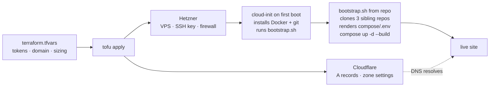

import { Aside } from "@astrojs/starlight/components";

<Aside type="note" title="Planned, not shipped yet">
  This page describes `infra-bootstrap-tofu-template`, a planned fourth
  sibling repo. It does not exist yet; this page is the spec we're
  building against. Once it ships, the repo URL replaces this notice.
</Aside>

BoringStack's [Deployment](/topics/deployment/) story is deliberately boring: SSH into a VPS, install Docker, clone three repos, `compose up`. That works, and some operators prefer it.

The OpenTofu template is the alternative for people who'd rather drive the same outcome from a single declarative apply.

## The promise

You start with: a domain on Cloudflare, a Hetzner account, and a `terraform.tfvars` filled in.

You run: `tofu apply`.

You get: a live BoringStack at `https://<your-domain>` in a few minutes; VPS provisioned, DNS configured, HTTPS already valid, demo user seeded.

## What one apply does



## Design choices

| Decision | Reason |
|---|---|
| **OpenTofu, not Terraform** | Terraform is BUSL-licensed; OpenTofu is the MPL-licensed fork, drop-in compatible. Same `.tf` files work in both |
| **Cloud-init for the entry point, bootstrap.sh for the work** | Cloud-init installs Docker + git and runs a single script committed in the repo. Stack-specific logic lives in readable bash; debuggable, testable, versioned; not YAML interpolation |
| **Hetzner module first, others swappable** | Hetzner is the cheapest production-viable VPS shop. The bootstrap module is provider-agnostic (cloud-init is universal), so replacing the VPS module is the only thing that changes for DigitalOcean / OVH / Linode |
| **Single `vps_type` variable using provider-native size names** | `cx32`, `s-2vcpu-4gb`; the same names the provider's docs, support, and billing page use. Don't invent an abstraction layer |
| **Opinionated Cloudflare zone defaults** | SSL mode `full_strict`, Always Use HTTPS on, HSTS 6mo, TLS min 1.2, browser integrity check on. Matches what `production-labels.yml` expects; each setting is one override away |
| **DNS: apex + `api.` + `www.`** | `www.` is a CNAME to apex with a redirect rule. Both work; nobody is stuck typing the wrong one |
| **State stays local by default** | Single-operator default; an S3 backend block is one paste away for teams |
| **Secrets in `terraform.tfvars` (gitignored)** | Same pragmatic floor as `compose/.env`; upgrade to a secret manager when team size demands it |
| **Outputs print, never side-effect** | Apply prints the IP, ssh command, and site URL. Never auto-opens anything |
| **Fourth sibling repo, not folded into infra** | Same logic as the planned Kubernetes template: separation lets operators skip the tool entirely |

## What stays manual

OpenTofu can't paper over the things providers don't expose APIs for:

| Step | Why it's manual |
|---|---|
| Add the domain to Cloudflare | You have to *own* it; registrar transfer or NS change |
| Upgrade Cloudflare to Workers Paid | Billing decision; no API to flip the switch |
| Create OAuth apps at Google / GitHub / LinkedIn | No provider APIs for OAuth client registration |
| Create Stripe products + prices | Stripe's Terraform provider exists but is beta; most teams click through anyway |
| Enable Cloudflare Email Service | Beta product; some toggles aren't in the Cloudflare provider yet |

Each of these is one-time per project and documented in its own runbook ([Cloudflare Email setup](/runbooks/cloudflare-email-setup/), etc.).

## `terraform.tfvars` shape

The interface is one file with every knob:

```hcl
# Required
hetzner_api_token    = "..."
cloudflare_api_token = "..."
cloudflare_zone_id   = "..."
domain               = "boringstack.example"

# VPS sizing; Hetzner-native names
vps_type     = "cx32"          # 4 vCPU / 8 GB
vps_location = "fsn1"

# Repos to clone on first boot (override for forks)
api_repo   = "https://github.com/AI-Starter-Templates/api-template"
ui_repo    = "https://github.com/AI-Starter-Templates/ui-template"
infra_repo = "https://github.com/AI-Starter-Templates/infra-docker-compose-template"

# Optional integrations; leave empty to skip
email_provider               = "cloudflare"
cloudflare_email_api_token   = ""
google_oauth_client_id       = ""
google_oauth_client_secret   = ""
stripe_secret_key            = ""
# ... etc
```

Everything in `terraform.tfvars.example` ships with comments explaining what it's for and which features it enables.

## Repo layout

| Path | Purpose |
|---|---|
| `main.tf` | Top-level composition; wires modules to variables, declares outputs |
| `variables.tf` | Input variable declarations with type + description |
| `outputs.tf` | VPS IP, DNS records, ready-to-paste `ssh` command, site URL |
| `terraform.tfvars.example` | All knobs with comments; copy to `terraform.tfvars` and fill in |
| `modules/hetzner/` | VPS + SSH key + firewall + cloud-init injection |
| `modules/cloudflare/` | DNS records + opinionated zone settings |
| `modules/bootstrap/` | Cloud-init template that installs Docker + git, then runs `bootstrap.sh` |
| `bootstrap.sh` | Versioned shell script: clones repos, renders `compose/.env`, runs `compose up` |
| `DEPLOY.md` | Step-by-step apply walkthrough |

## State management

For a single operator: state file is local, gitignored. Default config.

For a team: point the OpenTofu backend at S3 (or any S3-compatible store; Cloudflare R2, Backblaze B2, Hetzner Object Storage). One block in `main.tf`:

```hcl
terraform {
  backend "s3" {
    bucket = "boringstack-tofu-state"
    key    = "boringstack/terraform.tfstate"
    region = "..."
  }
}
```

The state file holds secrets (cloud-init renders with sensitive values). Encrypt at rest; restrict bucket access. Same posture as everywhere else in BoringStack.

## After the initial apply

OpenTofu owns the **infrastructure**. Git owns the **code**.

Code updates are the same pull-and-rebuild as the manual deployment path:

```bash
ssh <vps>
cd ai-starter-templates/infra-docker-compose-template
git -C ../api-template pull
git -C ../ui-template pull
git pull
STACK=prod ./scripts/compose-up.sh --build
```

Infrastructure changes; VPS resize, DNS record edit, firewall rule; happen as `tofu apply`.

## Scaling up

When single-host stops being enough, the upgrade path stays inside OpenTofu without rewrites:

| Step | Stays inside the same Tofu config? |
|---|---|
| Bigger VPS | Yes; bump `vps_type`, apply, cloud-init re-runs |
| Move Postgres to managed (Neon / Crunchy / RDS) | Yes; drop the Postgres service from compose, add the managed-DB module |
| Multiple API replicas behind Hetzner Load Balancer | Yes; adds a `modules/loadbalancer/` and parameterizes VPS count |
| Multi-region | Effectively no; that's when the planned Kubernetes template earns its place |

The progression: vertical → managed data → horizontal stateless → cluster. Each step is additive to the Tofu config, not a rewrite.

## Swapping the cloud provider

The `bootstrap` module talks to cloud-init, which every major cloud accepts. Swapping Hetzner for DigitalOcean / OVH / Linode is replacing `module "vps"` in `main.tf` with the matching module; the rest of the graph (Cloudflare, bootstrap, outputs) doesn't change. Per-provider modules ship as they prove themselves.

## When to skip OpenTofu

- You like the SSH-and-edit flow and don't see the win.
- You're already on a different IaC tool (Pulumi, AWS CDK, Crossplane).
- You're deploying to a managed platform (Vercel, Render, Fly) that handles provisioning itself.

The other three repos work fine without this one. It's a convenience layer, not a dependency.

## Related

- [Deployment](/topics/deployment/): the manual path this automates.
- [Firewall & TLS](/runbooks/firewall-and-tls/): handled by the Hetzner module's firewall rules.
- [Backups](/runbooks/backups/): cron + rclone, baked into `bootstrap.sh`.
- [Cloudflare Email setup](/runbooks/cloudflare-email-setup/): the bit that stays manual after `apply`.
