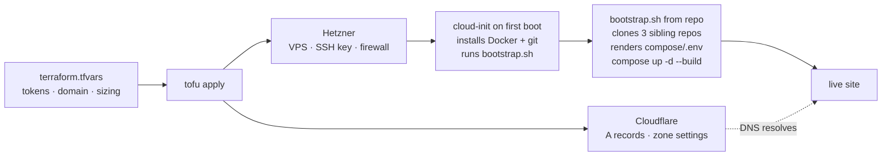

import { Aside } from "@astrojs/starlight/components";

BoringStack's [Deployment](/topics/deployment/) story is deliberately boring: SSH into a VPS, install Docker, clone three repos, `compose up`. That works, and some operators prefer it.

The OpenTofu template is the alternative for people who'd rather drive the same outcome from a single declarative apply. Source lives at [AI-Starter-Templates/infra-bootstrap-tofu-template](https://github.com/AI-Starter-Templates/infra-bootstrap-tofu-template).

## The promise

You start with a domain on Cloudflare, a Hetzner account, and a `terraform.tfvars` filled in.

You run `tofu apply`.

A few minutes later the site is live at `https://<your-domain>`: VPS provisioned, DNS configured, HTTPS valid, demo user seeded.

## What one apply does



## Prerequisites

| What | Where |
|---|---|
| Domain on Cloudflare | Registered at Cloudflare Registrar, or NS-pointed to Cloudflare |
| Hetzner Cloud account | Sign up at [Hetzner Cloud](https://www.hetzner.com), payment method on file |
| Hetzner API token | Hetzner Cloud Console, project, Security, API Tokens, Read & Write |
| Cloudflare API token | Cloudflare, My Profile, API Tokens, Custom Token. Scope: `Zone:DNS:Edit`, `Zone:Zone Settings:Edit`, `Zone:Rulesets:Edit` on the target zone |
| Cloudflare zone ID | The zone's overview page in the dashboard, right sidebar |
| SSH key | `ssh-keygen -t ed25519` if you don't have one; paste the `.pub` contents |
| OpenTofu binary | `brew install opentofu` on macOS, [install docs](https://opentofu.org/docs/intro/install/) elsewhere |

## Apply

```bash
git clone https://github.com/AI-Starter-Templates/infra-bootstrap-tofu-template
cd infra-bootstrap-tofu-template

cp terraform.tfvars.example terraform.tfvars
$EDITOR terraform.tfvars

tofu init       # downloads providers, writes the lock file
tofu fmt -recursive
tofu validate   # confirms the config parses and the graph is wire-correct
tofu plan       # preview what apply will do
tofu apply
```

`apply` itself finishes in a minute or two. The Hetzner server is up, but cloud-init is still bootstrapping the stack in the background.

## Wait for cloud-init

Bootstrap (Docker install, repo clones, image builds, first `compose up`) runs in the background after the server boots. A few minutes on first run.

```bash
# Blocks until cloud-init is done:
ssh root@$(tofu output -raw vps_ipv4) 'cloud-init status --wait'

# Or watch the log live:
ssh root@$(tofu output -raw vps_ipv4) 'tail -f /var/log/boringstack-bootstrap.log'
```

## Verify

```bash
# The site
curl -sI $(tofu output -raw site_url)/health
# Expected: 200 OK with a CF-Ray header

# Sign in
open $(tofu output -raw site_url)
# Email:    demo@example.com
# Password: password123
```

## Design choices

| Decision | Reason |
|---|---|
| **OpenTofu, not Terraform** | Terraform is BUSL-licensed; OpenTofu is the MPL-licensed fork, drop-in compatible. Same `.tf` files work in both |
| **Cloud-init for the entry point, bootstrap.sh for the work** | Cloud-init installs Docker plus git and runs a single script committed in the repo. Stack-specific logic lives in readable bash: debuggable, testable, versioned |
| **Hetzner module first, others swappable** | Hetzner is the cheapest production-viable VPS shop. The bootstrap module is provider-agnostic (cloud-init is universal), so replacing the VPS module is the only thing that changes for DigitalOcean / OVH / Linode |
| **Single `vps_type` variable using provider-native size names** | `cx32`, `s-2vcpu-4gb`: the same names the provider's docs, support, and billing page use |
| **Opinionated Cloudflare zone defaults** | SSL strict, HSTS 6mo, TLS min 1.2, browser integrity on. Matches what `production-labels.yml` expects; each setting is one override away |
| **DNS: apex + `www.` only** | One A/AAAA pair on the apex serves both the SPA and `/api/*` via same-origin path routing. `www.` is a CNAME to apex with a redirect rule. No `api.` subdomain — Traefik path-routes `/api/*` on the same host. |
| **State stays local by default** | Single-operator default; an S3 backend block is one paste away for teams |
| **Secrets in `terraform.tfvars` (gitignored)** | Same pragmatic floor as `compose/.env`; upgrade to a secret manager when team size demands it |
| **Outputs print, never side-effect** | Apply prints the IP, ssh command, and site URL. Never auto-opens anything |
| **Fourth sibling repo, not folded into infra** | Same logic as the planned Kubernetes template: separation lets operators skip the tool entirely |

## What stays manual

OpenTofu can't paper over the things providers don't expose APIs for:

| Step | Why it's manual |
|---|---|
| Add the domain to Cloudflare | You have to *own* it: registrar transfer or NS change |
| Upgrade Cloudflare to Workers Paid | Billing decision; no API to flip the switch |
| Create OAuth apps at Google / GitHub / LinkedIn | No provider APIs for OAuth client registration |
| Create Stripe products and prices | Stripe's Terraform provider exists but is beta; most teams click through anyway |
| Enable Cloudflare Email Service | Beta product; some toggles aren't in the Cloudflare provider yet |

Each of these is one-time per project and documented in its own runbook (for example [Cloudflare Email setup](/runbooks/cloudflare-email-setup/)).

Once you have the credentials, paste them into `terraform.tfvars` and `tofu apply` again. Cloud-init re-renders `compose/.env` and restarts the API.

## `terraform.tfvars` shape

One file with every knob:

```hcl
# Required
hetzner_api_token    = "..."
cloudflare_api_token = "..."
cloudflare_zone_id   = "..."
domain               = "boringstack.example"

# VPS sizing, Hetzner-native names
vps_type     = "cx32"          # 4 vCPU / 8 GB
vps_location = "fsn1"

# Stack secrets
jwt_secret        = "..."  # 32+ chars
postgres_password = "..."
valkey_password   = "..."
acme_email        = "ops@example.com"

# Optional integrations, leave empty to skip
email_provider             = "cloudflare"
cloudflare_email_api_token = ""
google_oauth_client_id     = ""
stripe_secret_key          = ""
# ... etc
```

Everything in `terraform.tfvars.example` ships with comments explaining what it's for and which features it enables.

## Repo layout

| Path | Purpose |
|---|---|
| `main.tf` | Top-level composition: wires modules to variables, declares outputs |
| `variables.tf` | Input variable declarations with type and description |
| `outputs.tf` | VPS IP, DNS records, ready-to-paste `ssh` command, site URL |
| `terraform.tfvars.example` | All knobs with comments; copy to `terraform.tfvars` and fill in |
| `modules/hetzner/` | VPS, SSH key, firewall, cloud-init injection |
| `modules/cloudflare/` | DNS records, opinionated zone settings, redirect rules |
| `modules/bootstrap/` | Cloud-init template that installs Docker plus git, then runs `bootstrap.sh` |
| `bootstrap.sh` | Versioned shell script: clones repos, renders `compose/.env`, runs `compose up` |

## State management

For a single operator: state file is local, gitignored. Default config.

For a team: point the OpenTofu backend at S3 (or any S3-compatible store: Cloudflare R2, Backblaze B2, Hetzner Object Storage). One block in `main.tf`:

```hcl
terraform {
  backend "s3" {
    bucket = "boringstack-tofu-state"
    key    = "boringstack/terraform.tfstate"
    region = "..."
  }
}
```

The state file holds secrets (cloud-init renders with sensitive values). Encrypt at rest; restrict bucket access. Same posture as everywhere else in BoringStack.

## Updating

OpenTofu owns the **infrastructure**. Git owns the **code**.

Code updates are the same pull-and-rebuild as the manual deployment path:

```bash
ssh root@$(tofu output -raw vps_ipv4)
cd /opt/boringstack/infra
git -C ../api-template pull
git -C ../ui-template pull
git pull
STACK=prod ./scripts/compose-up.sh --build
```

Infrastructure changes (VPS resize, DNS record edit, firewall rule): edit `terraform.tfvars` or the modules, then `tofu apply`.

## Scaling up

When single-host stops being enough, the upgrade path stays inside OpenTofu without rewrites:

| Step | Stays inside the same Tofu config? |
|---|---|
| Bigger VPS | Yes: bump `vps_type`, apply, cloud-init re-runs |
| Move Postgres to managed (Neon / Crunchy / RDS) | Yes: drop the Postgres service from compose, add the managed-DB module |
| Multiple API replicas behind Hetzner Load Balancer | Yes: adds a `modules/loadbalancer/` and parameterizes VPS count |
| Multi-region | No: that's when the planned Kubernetes template earns its place |

The progression: vertical, managed data, horizontal stateless, cluster. Each step is additive, not a rewrite.

## Swapping the cloud provider

The `bootstrap` module talks to cloud-init, which every major cloud accepts. Swapping Hetzner for DigitalOcean / OVH / Linode means replacing `module "vps"` in `main.tf` with the matching module; the rest of the graph (Cloudflare, bootstrap, outputs) doesn't change. Per-provider modules ship as they prove themselves.

## Destroying

```bash
tofu destroy
```

Wipes the Hetzner server, removes the Cloudflare records, deletes the firewall and SSH key. Cloudflare zone settings revert to defaults. The state file remains; `rm terraform.tfstate*` for full cleanup.

## Troubleshooting

| Symptom | First place to look |
|---|---|
| `apply` fails on a Hetzner resource | Hetzner API status plus token scope (must be Read & Write) |
| `apply` fails on a Cloudflare resource | Token scope (`Zone:DNS:Edit` etc.) plus zone ID matches the domain |
| `apply` succeeds but site is unreachable | `ssh ... 'cloud-init status'`: bootstrap may still be running |
| Site returns 522 from Cloudflare | Origin not responding: check `docker compose logs traefik api` on the server |
| Site returns 525 from Cloudflare | TLS handshake failed; ACME hasn't issued yet: wait or check Traefik logs |
| "Unexpected attribute" errors in the editor | Stale OpenTofu language-server cache. Run `tofu init` once and re-open |
| Cron backups don't run | `rclone config` on the server: the cron entry references a remote that must be configured |

## When to skip OpenTofu

- You like the SSH-and-edit flow and don't see the win.
- You're already on a different IaC tool (Pulumi, AWS CDK, Crossplane).
- You're deploying to a managed platform (Vercel, Render, Fly) that handles provisioning itself.

The other three repos work fine without this one. It's a convenience layer, not a dependency.

## Related

- [Deployment](/topics/deployment/): the manual path this automates.
- [Firewall & TLS](/runbooks/firewall-and-tls/): handled by the Hetzner module's firewall rules.
- [Backups](/runbooks/backups/): cron plus rclone, baked into `bootstrap.sh`.
- [Cloudflare Email setup](/runbooks/cloudflare-email-setup/): the bit that stays manual after `apply`.
