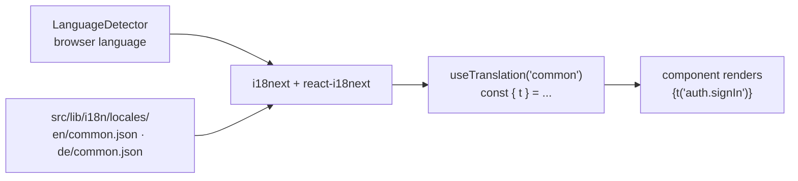

import { Aside } from "@astrojs/starlight/components";
import FaqGroup from "../../../components/FaqGroup.tsx";
import FaqItem from "../../../components/FaqItem.tsx";

The ui-template uses [react-i18next](https://react.i18next.com) for translation. Keys are type-safe (typos fail the build) and hardcoded strings in JSX are a lint error, so a forgotten translation can't ship.

## Design choices

<FaqGroup>
  <FaqItem title="Single common namespace by default" open>
    Keep it simple; split into more namespaces only when one balloons past ~200 keys.
  </FaqItem>
  <FaqItem title="Locales detected from the browser, fallback to first in VITE_LOCALES">
    Friendly default for international visitors; predictable for tests.
  </FaqItem>
  <FaqItem title="English + German out of the box">
    Two locales prove the pipeline; pick any two you actually need and replace.
  </FaqItem>
  <FaqItem title="Catalog files are plain JSON">
    Trivial to diff, translate, and review.
  </FaqItem>
  <FaqItem title="No Suspense for translations">
    Avoids a flash of fallback UI during i18n init.
  </FaqItem>
  <FaqItem title="Hardcoded JSX strings rejected by lint">
    Forgotten translations cannot ship; the linter catches the JSX literal.
  </FaqItem>
</FaqGroup>

## How it's wired



<p class="bs-diagram-caption">Translation flow: the LanguageDetector reads the browser's preferred language; JSON catalogs under <code>src/lib/i18n/locales/</code> feed i18next; the <code>useTranslation('common')</code> hook returns <code>t</code>; components call <code>t('key')</code> with statically-checked keys.</p>

## Using it

```tsx
import { useTranslation } from "react-i18next";

const SignInButton = () => {
  const { t } = useTranslation();
  return <button>{t("auth.signIn")}</button>;
};
```

A missing key in any locale that's listed in `VITE_LOCALES` is a build-time concern, not a runtime one; the type generation step would flag a key that exists in `en` but not in `de` (or vice versa).

## Adding a locale

1. Drop `<lang>/common.json` under `src/lib/i18n/locales/<lang>/`.
2. Add `<lang>` to `VITE_LOCALES` (comma-separated).
3. Update the import in `src/lib/i18n/config.ts` to register the catalog.

The language detector picks it up automatically; users on browsers in that locale start seeing it.

## Adding a key

1. Add `"my.new.key": "English copy"` to `en/common.json`.
2. Add the translation to every other locale's `common.json` (an `_TODO_` placeholder works as a build-tolerant intermediate).
3. Use it: `t("my.new.key")`.

For interpolation, [react-i18next docs](https://react.i18next.com/guides/quick-start#using-with-react) cover the syntax. For pluralization, the `_one` / `_other` suffix convention.

## Patterns to avoid

- Concatenating translated fragments: `t("the") + " " + t("button")`. Word order is language-specific; build full sentences as keys.
- Translation IDs that are sentences: `t("Click here to continue")`. Hard to refactor when the copy changes; use semantic keys like `t("checkout.continue")`.
- Hardcoded `aria-label` / `placeholder`: these are content, not technical strings. The lint rule applies.

## Lint coverage

The ui-template's lint config bans hardcoded JSX strings on user-facing text. Numbers, technical identifiers, and `data-*` attributes are exempt. Static `t("…")` keys are also checked against the English catalog by [`@boring-stack-pkg/eslint-plugin-i18n-keys`](https://www.npmjs.com/package/@boring-stack-pkg/eslint-plugin-i18n-keys) so a typo cannot ship. See [Architecture rules](/ui/architecture-rules/) and [Lint as the contract](/architecture/lint-as-contract/).

## Source

[`src/lib/i18n/`](https://github.com/AI-Starter-Templates/ui-template/tree/main/src/lib/i18n); config, locales, and the catalog JSON.

## Related

- [Architecture rules](/ui/architecture-rules/); the component anatomy that hosts `t("…")` calls.
- [UI template overview](/ui/overview/); where the i18n layer sits in the SPA shell.
- [Lint as the contract](/architecture/lint-as-contract/); the `eslint-plugin-i18n-keys` rule that catches typos at build.
- [Testing](/ui/testing/); how view-object tests stay locale-stable.
