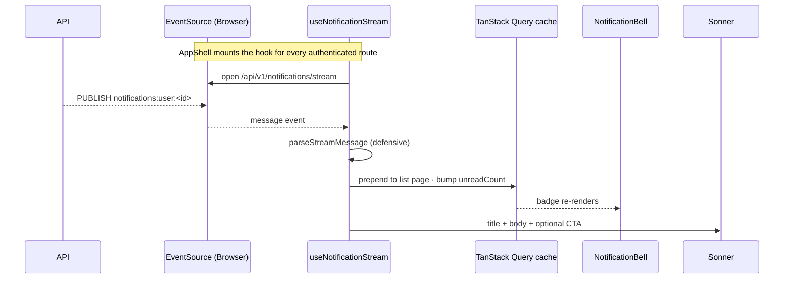

import { Aside, FileTree } from "@astrojs/starlight/components";
import FaqGroup from "../../../components/FaqGroup.astro";
import FaqItem from "../../../components/FaqItem.astro";

The UI consumes the [API notifications subsystem](/api/notifications/). The feed lives in a TanStack Query infinite list, mutations are optimistic with rollback, and an optional SSE `EventSource` keeps the cache live while the user is authenticated. The bell + popover mount inside the new `AppShell`, so every authenticated route gets them for free.

The backend ships pre-rendered `{ title, body, ctaUrl, ctaLabel }` strings. The UI renders them as plain content, no per-event-type switches.

## Flow



## Folder shape

<FileTree>
- src/features/notifications/
  - Notifications.constants.ts
  - Notifications.queries.ts
  - Notifications.utils.ts
  - Notifications.stream-utils.ts
  - Notifications.types.ts
  - useNotificationStream.ts
  - components/
    - NotificationBell/
    - NotificationCenterPopover/
    - NotificationListItem/
    - NotificationsPage/
    - NotificationsPreferencesPage/
    - PreferenceRow/
    - PreferenceCell/
</FileTree>

Same anatomy as `features/dashboard/` (queries + utils at the feature root, components in `components/<Name>/` with the 8-file layout).

## Queries

`Notifications.queries.ts` exposes the full surface:

```ts
useNotificationsList(status?: "unread" | "read" | "archived")
useUnreadNotificationCount()
useMarkNotificationRead()      // optimistic
useArchiveNotification()       // optimistic
useMarkAllNotificationsRead()  // optimistic
useNotificationPreferences()
useUpdateNotificationPreferences()
```

`useUnreadNotificationCount` reads from the list cache when present and falls back to a server query otherwise. Every mutation snapshots the cache, applies the optimistic write, and rolls back if the request fails. `onSettled` invalidates both list and unread-count keys so the UI reconciles with the server.

## Realtime

`useNotificationStream` is mounted once in `AppShell.hooks.ts`. It opens a credentialed `EventSource` against `${VITE_API_URL}/api/v1/notifications/stream` as soon as the user is loaded, and closes it on unmount. The backend endpoint is available only when `NOTIFICATIONS_SSE_ENABLED=true`; otherwise notifications still work through the paginated feed and mutations, just without live push.

```ts
mergeStreamNotificationIntoCache(qc, notification);
toast(notification.title, {
  description: notification.body,
  action: notification.ctaUrl !== null
    ? { label: notification.ctaLabel ?? t("notifications.openCta"),
        onClick: () => { void navigate(notification.ctaUrl); } }
    : undefined
});
```

Defensive parse: malformed JSON or messages with the wrong shape are dropped with a warn log, never thrown.

## Routes

| Path | Component |
| --- | --- |
| `/notifications` | `NotificationsPage` |
| `/notifications/preferences` | `NotificationsPreferencesPage` |

Both wrap inside `<AppShell>`, which holds the header, bell, logout, and the SSE hook.

## Adding a new notification UI

You don't. The backend ships pre-rendered strings; the UI is event-agnostic by design. To add a new event type, the API defines it (see [API notifications](/api/notifications/)) and the bell, page, and toast pick it up with no UI change.

If you ever need a per-event-type visual treatment (badge colour, icon), branch on `notification.eventType` inside `NotificationListItem` only. Don't fork the page.

## Out of scope (v1)

<FaqGroup>
  <FaqItem title="Web Push (Push API + VAPID + service worker)" open>
    Deferred to v1.1 in lockstep with the backend's `web-push` channel.
  </FaqItem>
  <FaqItem title="Cross-tab sync via BroadcastChannel">
    Each tab holds its own SSE connection; the badge converges via cache invalidation.
  </FaqItem>
  <FaqItem title="Notification grouping">
    Backend doesn't roll up "3 people liked your post" yet; UI doesn't either.
  </FaqItem>
  <FaqItem title="Per-event-type custom rendering">
    Backend ships pre-rendered strings; UI stays event-agnostic.
  </FaqItem>
</FaqGroup>

## Related

- [API notifications](/api/notifications/): the dispatcher, channels, and SSE source.
- [OpenAPI client](/ui/openapi-client/): how the typed client surfaces the notifications endpoints.
- [Component anatomy](/ui/architecture-rules/): the 8-file layout these components follow.
