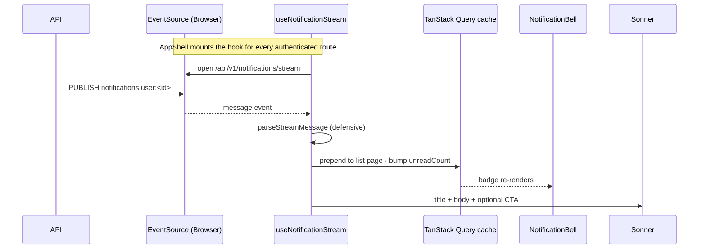

import DocFileTree from "../../../components/DocFileTree";
import FaqGroup from "../../../components/FaqGroup.tsx";
import FaqItem from "../../../components/FaqItem.tsx";

The UI consumes the [API notifications subsystem](/api/notifications/). The feed is a TanStack Query infinite list, mutations are optimistic with rollback, and an optional SSE `EventSource` keeps the cache live while the user is authenticated. The bell + popover mount inside the new `AppShell`, so every authenticated route gets them for free.

The backend ships pre-rendered `{ title, body, ctaUrl, ctaLabel }` strings. The UI renders them as plain content, no per-event-type switches.

## Flow



## Folder shape

<DocFileTree
  root="src/features/notifications/"
  title="Notification feature map"
  caption="queries, mutations, cache helpers, and UI pieces"
  nodes={[
    { name: "Notifications.constants.ts" },
    { name: "Notifications.list.queries.ts", detail: "feed and unread count reads" },
    { name: "Notifications.mutations.ts", detail: "optimistic mark-read/archive operations" },
    { name: "Notifications.preferences.queries.ts", detail: "preference grid reads and writes" },
    { name: "Notifications.cache.ts", detail: "cache merge and rollback helpers" },
    { name: "Notifications.utils.ts" },
    { name: "Notifications.stream-utils.ts", detail: "defensive SSE parsing" },
    { name: "Notifications.types.ts" },
    { name: "useNotificationStream.ts", detail: "mounted once from AppShell" },
    {
      name: "components/",
      children: [
        { name: "NotificationBell/" },
        { name: "NotificationCenterPopover/" },
        { name: "NotificationListItem/" },
        { name: "NotificationsPage/" },
        { name: "NotificationsPreferencesPage/" },
        { name: "PreferenceRow/" },
        { name: "PreferenceCell/" },
      ],
    },
  ]}
/>

Same anatomy as `features/dashboard/` (queries + utils at the feature root, components in `components/<Name>/` with the 8-file layout). The query surface is split across three files (reads, mutations, preferences) to keep each file under the `max-hooks-per-file` threshold enforced by [`eslint-plugin-react-component-architecture`](https://github.com/agjs/eslint-plugin-react-component-architecture).

## Queries

The full hook surface, grouped by file:

```ts
// Notifications.list.queries.ts
useNotificationsList(status?: "unread" | "read" | "archived")
useUnreadNotificationCount()

// Notifications.mutations.ts
useMarkNotificationRead()      // optimistic
useArchiveNotification()       // optimistic
useMarkAllNotificationsRead()  // optimistic

// Notifications.preferences.queries.ts
useNotificationPreferences()
useUpdateNotificationPreferences()
```

`useUnreadNotificationCount` reads from the list cache when present and falls back to a server query otherwise. Every mutation snapshots the cache, applies the optimistic write via the helpers in `Notifications.cache.ts`, and rolls back if the request fails. `onSettled` invalidates both list and unread-count keys so the UI reconciles with the server.

## Realtime

`useNotificationStream` is mounted once in `AppShell.hooks.ts`. It opens a credentialed `EventSource` against `${VITE_API_URL}/api/v1/notifications/stream` as soon as the user is loaded, and closes it on unmount. The backend endpoint is available only when `NOTIFICATIONS_SSE_ENABLED=true`; otherwise notifications still work through the paginated feed and mutations, just without live push.

```ts
mergeStreamNotificationIntoCache(qc, notification);
toast(notification.title, {
  description: notification.body,
  action: notification.ctaUrl !== null
    ? { label: notification.ctaLabel ?? t("notifications.openCta"),
        onClick: () => { void navigate(notification.ctaUrl); } }
    : undefined
});
```

Defensive parse: malformed JSON or messages with the wrong shape are dropped with a warn log, never thrown.

## Routes

| Path | Component |
| --- | --- |
| `/notifications` | `NotificationsPage` |
| `/notifications/preferences` | `NotificationsPreferencesPage` |

Both wrap inside `<AppShell>`, which holds the header, bell, logout, and the SSE hook.

## Adding a new notification UI

You don't. The backend ships pre-rendered strings; the UI is event-agnostic by design. To add a new event type, the API defines it (see [API notifications](/api/notifications/)) and the bell, page, and toast pick it up with no UI change.

If you ever need a per-event-type visual treatment (badge colour, icon), branch on `notification.eventType` inside `NotificationListItem` only. Don't fork the page.

## Web Push (v1.1)

Browser push notifications via the W3C Push API + VAPID. The whole flow
lives in `useWebPush.hooks.ts` (under `src/hooks/`) plus a small service
worker at `public/sw.js`. The Settings page renders a state-aware
"Browser notifications" card that wraps the hook.

<FaqGroup>
  <FaqItem title="Setup" open>
    Generate VAPID keys on the API (`bun run vapid:generate`) and paste
    the public key into the UI as `VITE_VAPID_PUBLIC_KEY`. Without it,
    the Settings card renders "Web Push is not configured for this
    deploy."
  </FaqItem>
  <FaqItem title="Service worker">
    `public/sw.js` is copied to the dist root by Vite (no plugin needed)
    so the scope is `/`. Two handlers: `push` calls
    `showNotification(title, { body, data: { url } })`;
    `notificationclick` focuses the matching tab if open, otherwise
    opens the URL. Registered once from `src/app/main.tsx` (gated on
    `'serviceWorker' in navigator`).
  </FaqItem>
  <FaqItem title="useWebPush contract">
    Returns `{ isSupported, isConfigured, permission, isSubscribed,
    isPending, subscribe, unsubscribe }`. The Settings card maps that
    state machine into copy: unsupported / not-configured / blocked /
    not-subscribed / subscribed. Lives in `src/hooks/` because the
    feature `accounts` consumes it without owning it.
  </FaqItem>
  <FaqItem title="Preference grid integration">
    `web-push` appears alongside `in-app` and `email` in
    `PREFERENCE_CHANNEL_COLUMNS`. Toggling it follows the same pattern as
    other channels — the backend dispatcher reads
    `notification_preference` rows for `(userId, eventType, channel)`.
  </FaqItem>
</FaqGroup>

## Out of scope (v1)

<FaqGroup>
  <FaqItem title="Cross-tab sync via BroadcastChannel" open>
    Each tab holds its own SSE connection; the badge converges via cache invalidation.
  </FaqItem>
  <FaqItem title="Notification grouping">
    Backend doesn't roll up "3 people liked your post" yet; UI doesn't either.
  </FaqItem>
  <FaqItem title="Per-event-type custom rendering">
    Backend ships pre-rendered strings; UI stays event-agnostic.
  </FaqItem>
</FaqGroup>

## Related

- [API notifications](/api/notifications/): the dispatcher, channels, and SSE source.
- [OpenAPI client](/ui/openapi-client/): how the typed client surfaces the notifications endpoints.
- [Component anatomy](/ui/architecture-rules/): the 8-file layout these components follow.
