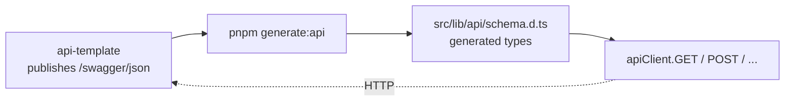

import { Aside } from "@astrojs/starlight/components";

The UI never hand-writes `fetch(...)`. It calls a generated, typed client that knows every path, every request body, and every response shape the API exposes. When the API changes, you regenerate; if the UI now calls a path that no longer exists, TypeScript tells you before the user does.

## How it stays in sync



`pnpm generate:api` runs `openapi-typescript` against the live API (or a saved spec) and emits one big `.d.ts` of paths, params, and response components. `openapi-fetch` wraps native `fetch` and uses those types so every call is path- and shape-checked.

## Design choices

| Decision | Reason |
|---|---|
| Generated, never hand-edited | Drift between server and client is a compile error, not a runtime 500 |
| One client module (`apiClient`); direct `fetch`/`axios` is a lint error | Single place for base URL, headers, error mapping, refresh logic |
| Throws `ApiError` on non-2xx | TanStack Query's `error` is typed and structured; no string parsing |
| Silent refresh on 401 with a single in-flight guard | Parallel queries don't trigger N refresh storms |
| Refresh exempts `/auth/refresh` + `/auth/login` themselves | No infinite loops when the refresh itself fails |

## Using it

```ts
import { apiClient } from "@/lib/api/client";

const { data } = await apiClient.GET("/api/v1/users/me");
//      ^? typed exactly as the API's response shape
```

A path that doesn't exist in the schema is a compile error. A body that doesn't match is a compile error. `data` is fully typed.

Inside TanStack Query:

```ts
useQuery({
  queryKey: ["users", "me"],
  queryFn: async () => {
    const { data, error } = await apiClient.GET("/api/v1/users/me");
    if (error) throw new ApiError(error);
    return data;
  },
});
```

## The middleware layer

`openapi-fetch` accepts middleware. The template ships one: on a 401, kick off a single `/auth/refresh` (with a module-level promise guarding against parallel triggers), then retry the original request. Refresh exempts itself + `/auth/login` so a failed refresh never recurses. If the refresh fails, the original 401 propagates and `ProtectedRoute` redirects to `/login`.

This is the entire reason hand-rolled fetch wrappers are banned in the codebase: re-implementing 401 refresh in twenty places is how token-handling bugs ship.

## Regenerating

| When | Command |
|---|---|
| API spec changed (most common) | `pnpm generate:api` against the running dev API |
| Working from a committed spec | Point `generate:api` at a saved `.json` |
| CI consistency check | `pnpm generate:api && git diff --exit-code src/lib/api/schema.d.ts` |

The CI check fails if a developer changed the API but forgot to regenerate; drift gets caught at PR time, not at runtime.

## Adding a call

There's no "adding". If the API exposes a new endpoint, `pnpm generate:api` makes it available; you call it the same way you call any other.

## Lint coverage

Direct `fetch()` / `axios` / `XMLHttpRequest` outside `src/lib/api/` fails the lint gate. See [Lint as the contract](/architecture/lint-as-contract/).

## Source

[`src/lib/api/`](https://github.com/AI-Starter-Templates/ui-template/tree/main/src/lib/api) on GitHub; client, middleware, error mapper, generated schema.

## Related

- [API template overview](/api/overview/); where the OpenAPI spec comes from.
- [Architecture rules](/ui/architecture-rules/); the component layer that consumes the client via queries.
