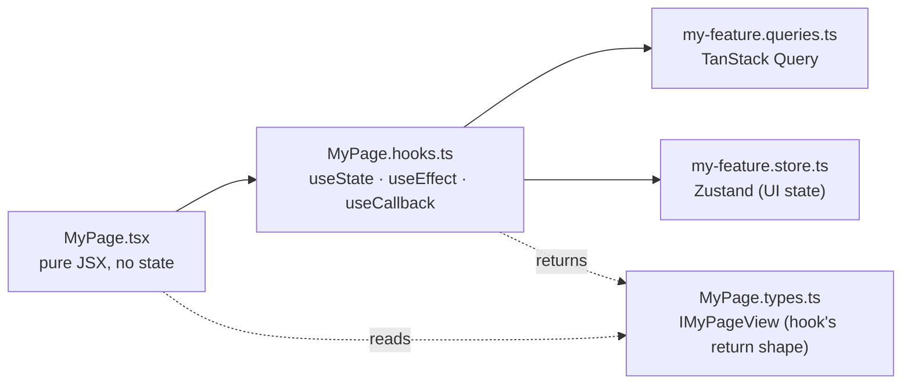

import { Aside, FileTree } from "@astrojs/starlight/components";

A production-shaped SPA. Architecture rules (component anatomy, queries vs stores, OpenAPI client) keep features from turning into 600-line `.tsx` blobs as the codebase grows.

## How a feature is shaped

Components only ever see the **view object** from their hook. They never read TanStack Query directly, never read Zustand directly, never read `import.meta.env` directly. That's what makes any component trivially testable.

## Design choices

| Decision | Reason |
|---|---|
| Component as folder of ~8 files, not one big `.tsx` | Each file has one job; `useState` in `.tsx` is a lint error |
| Server state in TanStack Query, client state in Zustand, never mixed | "Is this fetched or local?" stops being a judgment call |
| Typed client generated from the API's OpenAPI schema | A 404 path or wrong body shape becomes a compile error |
| shadcn/ui + Tailwind 4 `@theme` tokens | Primitives you own (`components/ui/`); design tokens at the CSS layer |
| No MSW | Mocking a real backend is rarely worth the cost; e2e runs against the actual stack |

## File layout

<FileTree>
- src/
  - app/                  App shell: providers, router, main entry
  - features/             Vertical feature folders (auth, dashboard, onboarding, ...)
  - components/
    - ui/                 shadcn/ui primitives
    - core/               Composed components
    - global/             App-shell wrappers
  - lib/
    - api/                openapi-fetch client + generated schema
    - env/                Zod-validated `import.meta.env`
    - auth/               OAuth start helper (server-side flow)
    - logger/             Structured client logs
    - i18n/               react-i18next setup + locales
  - hooks/                Cross-feature hooks
  - store/                App-level Zustand stores
</FileTree>

A page or component folder always looks like:

<FileTree>
- features/dashboard/components/DashboardPage/
  - DashboardPage.tsx        Pure JSX
  - DashboardPage.hooks.ts   All React hooks
  - DashboardPage.types.ts   `IDashboardPageView`
  - DashboardPage.constants.ts
  - DashboardPage.utils.ts
  - DashboardPage.test.tsx
  - DashboardPage.stories.tsx
  - index.ts                 Re-export
</FileTree>

`pnpm new:component <Name>` writes this anatomy. `pnpm new:feature <name>` writes a feature scaffold.

## State, in one decision

| Kind | Where | Tool |
|---|---|---|
| Server (fetched) | `*.queries.ts` | TanStack Query |
| UI / client (modal open, step index) | `*.store.ts` | Zustand |
| Form | `*.hooks.ts` | React Hook Form + Zod |
| Render-derived | `*.hooks.ts` returning `IXxxView` | none |

If you can't tell which bucket something belongs to, that's almost always a sign the boundary is wrong; not a need for a fifth bucket.

## The typed OpenAPI client

The API publishes `/swagger/json`. `pnpm generate:api` reads it and emits the typed client. From there `apiClient.GET("/api/v1/users/me")` autocompletes the path and types the response. Drift between server and client becomes a compile error, not a runtime 500.

See [OpenAPI client](/ui/openapi-client/).

## Testing

| Layer | Tool | What it tests |
|---|---|---|
| Unit | Vitest + Testing Library | Hooks, utilities, schemas |
| Component | Vitest + Testing Library | One component + its hook |
| e2e | Playwright | Multi-page flows against the real stack |
| Visual | Playwright snapshots | Per-platform baselines |

See [Testing](/ui/testing/).

## Lint as the contract

The component anatomy is held in place by [`eslint-plugin-react-component-architecture`](https://github.com/agjs/eslint-plugin-react-component-architecture) plus the shared family. See [Lint as the contract](/architecture/lint-as-contract/) for the full inventory.

## Source

[`ui-template`](https://github.com/AI-Starter-Templates/ui-template) on GitHub. Start in `src/features/` for the feature shape; `src/lib/api/` for the typed client.
