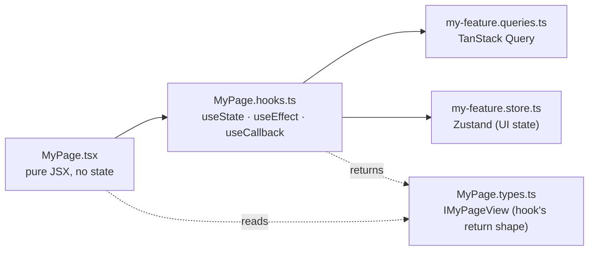

import { Aside, FileTree } from "@astrojs/starlight/components";
import FaqGroup from "../../../components/FaqGroup.astro";
import FaqItem from "../../../components/FaqItem.astro";

The UI is a Vite + React SPA with a typed OpenAPI client: fast local feedback and a compile-time contract with the API. See [Why BoringStack](/architecture/why-boringstack/) and [Separation of concerns](/architecture/separation-of-concerns/).

A production-shaped SPA. Architecture rules (component anatomy, queries vs stores, OpenAPI client) keep features from turning into 600-line `.tsx` blobs as the codebase grows.

## How a feature is shaped

Components only ever see the **view object** from their hook. They never read TanStack Query directly, never read Zustand directly, never read `import.meta.env` directly. That's what makes any component trivially testable.

## Design choices

<FaqGroup>
  <FaqItem title="Component as a folder (~8 files)" open>
    Each file has one job; `useState` in `.tsx` is a lint error.
  </FaqItem>
  <FaqItem title="TanStack Query + Zustand">
    Server state and client state stay in separate buckets.
  </FaqItem>
  <FaqItem title="OpenAPI-generated client">
    Wrong paths and body shapes fail the typecheck.
  </FaqItem>
  <FaqItem title="shadcn/ui + Tailwind `@theme`">
    You own primitives in `components/ui/`; tokens live in CSS.
  </FaqItem>
  <FaqItem title="E2e against the real stack">
    Playwright hits the running API instead of MSW mocks.
  </FaqItem>
</FaqGroup>

## File layout

<FileTree>
- src/
  - app/                  App shell: providers, router, main entry
  - features/             Vertical feature folders (auth, dashboard, ...). Add your own.
  - components/
    - ui/                 shadcn/ui primitives
    - core/               Composed components
    - global/             App-shell wrappers
  - lib/
    - api/                openapi-fetch client + generated schema
    - env/                Zod-validated `import.meta.env`
    - auth/               OAuth start helper (server-side flow)
    - logger/             Structured client logs
    - i18n/               react-i18next setup + locales
  - hooks/                Cross-feature hooks
  - store/                App-level Zustand stores
</FileTree>

A page or component folder always looks like:

<FileTree>
- features/dashboard/components/DashboardPage/
  - DashboardPage.tsx        Pure JSX
  - DashboardPage.hooks.ts   All React hooks
  - DashboardPage.types.ts   `IDashboardPageView`
  - DashboardPage.constants.ts
  - DashboardPage.utils.ts
  - DashboardPage.test.tsx
  - DashboardPage.stories.tsx
  - index.ts                 Re-export
</FileTree>

`pnpm new:component <Name>` writes this anatomy. `pnpm new:feature <name>` writes a feature scaffold.

## State, in one decision

<FaqGroup>
  <FaqItem title="Server (fetched)" open>
    `*.queries.ts` with TanStack Query.
  </FaqItem>
  <FaqItem title="UI / client (modal open, step index)">
    `*.store.ts` with Zustand.
  </FaqItem>
  <FaqItem title="Form">
    `*.hooks.ts` with React Hook Form + Zod.
  </FaqItem>
  <FaqItem title="Render-derived">
    `*.hooks.ts` returning `IXxxView`; no extra store.
  </FaqItem>
</FaqGroup>

If you can't tell which bucket something belongs to, that's almost always a sign the boundary is wrong; not a need for a fifth bucket.

## The typed OpenAPI client

The API publishes `/swagger/json`. `pnpm generate:api` reads it and emits the typed client. From there `apiClient.GET("/api/v1/users/me")` autocompletes the path and types the response. Drift between server and client becomes a compile error, not a runtime 500.

See [OpenAPI client](/ui/openapi-client/).

## Testing

<FaqGroup>
  <FaqItem title="Unit" open>
    Vitest + Testing Library for hooks, utilities, schemas.
  </FaqItem>
  <FaqItem title="Component">
    Vitest + Testing Library for one component and its hook.
  </FaqItem>
  <FaqItem title="e2e">
    Playwright against the running stack.
  </FaqItem>
  <FaqItem title="Visual">
    Playwright snapshots with per-platform baselines.
  </FaqItem>
</FaqGroup>

See [Testing](/ui/testing/).

## Lint as the contract

The component anatomy is held in place by [`eslint-plugin-react-component-architecture`](https://github.com/agjs/eslint-plugin-react-component-architecture) plus the shared family. See [Lint as the contract](/architecture/lint-as-contract/) for the full inventory.

## Source

[`ui-template`](https://github.com/AI-Starter-Templates/ui-template) on GitHub. Start in `src/features/` for the feature shape; `src/lib/api/` for the typed client.
