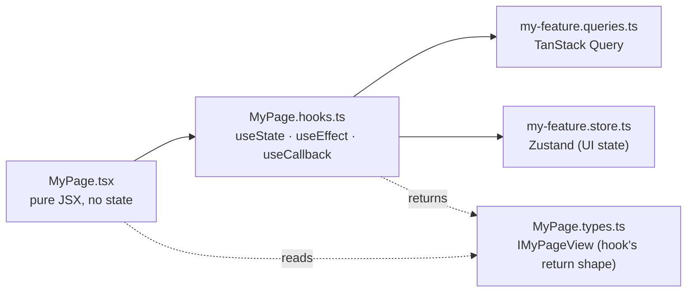

import DocFileTree from "../../../components/DocFileTree";
import FaqGroup from "../../../components/FaqGroup.astro";
import FaqItem from "../../../components/FaqItem.astro";

The UI is a Vite + React SPA with a typed OpenAPI client: fast local feedback and a compile-time contract with the API. See [Why BoringStack](/architecture/why-boringstack/) and [Separation of concerns](/architecture/separation-of-concerns/).

A production-shaped SPA. Architecture rules (component anatomy, queries vs stores, OpenAPI client) keep features from turning into 600-line `.tsx` blobs as the codebase grows.

## How a feature is shaped

Components only ever see the **view object** from their hook. They never read TanStack Query directly, never read Zustand directly, never read `import.meta.env` directly. That's what makes any component trivially testable.

## Design choices

<FaqGroup>
  <FaqItem title="Component as a folder (~8 files)" open>
    Each file has one job; `useState` in `.tsx` is a lint error.
  </FaqItem>
  <FaqItem title="TanStack Query + Zustand">
    Server state and client state stay in separate buckets.
  </FaqItem>
  <FaqItem title="OpenAPI-generated client">
    Wrong paths and body shapes fail the typecheck.
  </FaqItem>
  <FaqItem title="shadcn/ui + Tailwind `@theme`">
    You own primitives in `components/ui/`; tokens live in CSS.
  </FaqItem>
  <FaqItem title="E2e against the real stack">
    Playwright hits the running API directly; there is no mock layer.
  </FaqItem>
</FaqGroup>

## Routes & shell

Every authenticated route renders inside `AppShell`: a brand-marked left sidebar (`AppSidebar` with `NavLink` + `aria-[current=page]:` Tailwind active styling), a sticky header (account switcher · notification bell · theme toggle · logout), and the page content. On mobile the sidebar collapses into a `Sheet` drawer triggered from the header.

| Route                        | Page                                                             | Auth      |
| ---------------------------- | ---------------------------------------------------------------- | --------- |
| `/` and `/login`             | `LoginPage`                                                      | public    |
| `/signup`                    | `SignUpPage` (form → "check your inbox" confirmation)            | public    |
| `/verify-email`              | `VerifyEmailPage` (verifying / success / token errors)           | public    |
| `/oauth/success`             | `OAuthCallbackPage`                                              | public    |
| `/dashboard`                 | `DashboardPage` (DashboardWelcome + StatsSection + ActivityFeed) | protected |
| `/notifications`             | `NotificationsPage`                                              | protected |
| `/notifications/preferences` | `NotificationsPreferencesPage`                                   | protected |
| `/account/invitations`       | `InvitationsPage` (team)                                         | protected |
| `/account/settings`          | `SettingsPage` (placeholder sections)                            | protected |
| `/account/profile`           | `ProfilePage` (read-only `useMe` fields)                         | protected |
| `*`                          | `NotFoundPage` (404)                                             | public    |

`SettingsPage` ships with an explicit "placeholder, fill this in" copy block so a fork knows the page is wired into the nav but the form is yours to write.

## File layout

<DocFileTree
  root="src/"
  title="UI source map"
  caption="typed product surface"
  nodes={[
    { name: "app/", detail: "App shell: providers, router, main entry" },
    { name: "features/", detail: "Vertical feature folders: auth, dashboard, notifications, and yours" },
    {
      name: "components/",
      children: [
        { name: "ui/", detail: "shadcn/ui primitives" },
        { name: "core/", detail: "composed components" },
        { name: "global/", detail: "app-shell wrappers" },
      ],
    },
    {
      name: "lib/",
      children: [
        { name: "api/", detail: "openapi-fetch client + generated schema" },
        { name: "env/", detail: "Zod-validated import.meta.env" },
        { name: "auth/", detail: "OAuth start helper for the server-side flow" },
        { name: "logger/", detail: "structured client logs" },
        { name: "i18n/", detail: "react-i18next setup + locales" },
      ],
    },
    { name: "hooks/", detail: "cross-feature hooks" },
    { name: "store/", detail: "app-level Zustand stores" },
  ]}
/>

A page or component folder always looks like:

<DocFileTree
  root="features/dashboard/components/DashboardPage/"
  title="Component folder anatomy"
  caption="the UI lint rules enforce this split"
  nodes={[
    { name: "DashboardPage.tsx", detail: "pure JSX" },
    { name: "DashboardPage.hooks.ts", detail: "all React hooks" },
    { name: "DashboardPage.types.ts", detail: "IDashboardPageView" },
    { name: "DashboardPage.constants.ts" },
    { name: "DashboardPage.utils.ts" },
    { name: "DashboardPage.test.tsx" },
    { name: "DashboardPage.stories.tsx" },
    { name: "index.ts", detail: "re-export" },
  ]}
/>

Stories ship 1:1 with the components and run under a global theme decorator (`@storybook/addon-themes` wired in `.storybook/preview.tsx`), so every story has a light/dark toggle in the Storybook toolbar with no per-story plumbing.

`pnpm new:component <Name>` writes this anatomy. `pnpm new:feature <name>` writes a feature scaffold.

## State, in one decision

<FaqGroup>
  <FaqItem title="Server (fetched)" open>
    `*.queries.ts` with TanStack Query.
  </FaqItem>
  <FaqItem title="UI / client (modal open, step index)">
    `*.store.ts` with Zustand.
  </FaqItem>
  <FaqItem title="Form">`*.hooks.ts` with React Hook Form + Zod.</FaqItem>
  <FaqItem title="Render-derived">
    `*.hooks.ts` returning `IXxxView`; no extra store.
  </FaqItem>
</FaqGroup>

If you can't tell which bucket something belongs to, that's almost always a sign the boundary is wrong; not a need for a fifth bucket.

## The typed OpenAPI client

The API publishes `/swagger/json`. `pnpm generate:api` reads it and emits the typed client. From there `apiClient.GET("/api/v1/users/me")` autocompletes the path and types the response. Drift between server and client becomes a compile error, not a runtime 500.

See [OpenAPI client](/ui/openapi-client/).

## Testing

<FaqGroup>
  <FaqItem title="Unit" open>
    Vitest + Testing Library for hooks, utilities, schemas.
  </FaqItem>
  <FaqItem title="Component">
    Vitest + Testing Library for one component and its hook.
  </FaqItem>
  <FaqItem title="e2e">Playwright against the running stack.</FaqItem>
  <FaqItem title="Visual">
    Playwright snapshots with per-platform baselines.
  </FaqItem>
</FaqGroup>

See [Testing](/ui/testing/).

## Lint as the contract

The component anatomy is held in place by [`eslint-plugin-react-component-architecture`](https://github.com/agjs/eslint-plugin-react-component-architecture). TanStack Query cache consistency on `*.queries.ts` is enforced by [`eslint-plugin-tanstack-query-cache`](https://github.com/agjs/eslint-plugin-tanstack-query-cache); static translation keys by [`eslint-plugin-i18n-keys`](https://github.com/agjs/eslint-plugin-i18n-keys). Those sit alongside the shared plugin family. See [Lint as the contract](/architecture/lint-as-contract/) for the full inventory.

## Source

[`ui-template`](https://github.com/AI-Starter-Templates/ui-template) on GitHub. Start in `src/features/` for the feature shape; `src/lib/api/` for the typed client.
