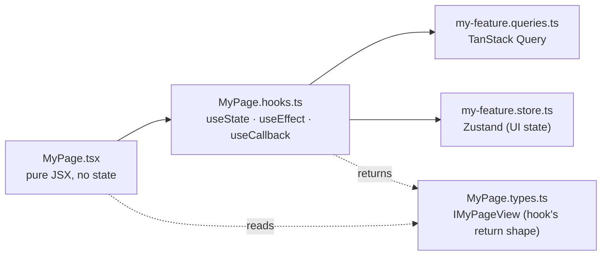

import DocFileTree from "../../../components/DocFileTree";
import DataMatrix from "../../../components/docs-kit/DataMatrix";
import FeatureGrid from "../../../components/docs-kit/FeatureGrid";
import PageIntro from "../../../components/docs-kit/PageIntro";
import SignalGrid from "../../../components/docs-kit/SignalGrid";

<PageIntro
  eyebrow="Typed product surface"
  actions={[
    { label: "OpenAPI client", href: "/ui/openapi-client/" },
    { label: "Testing model", href: "/ui/testing/" },
  ]}
  facts={[
    { value: "Vite", label: "local feedback loop" },
    { value: "React 19", label: "product shell" },
    { value: "OpenAPI", label: "server contract" },
  ]}
>
  The UI is a Vite + React SPA with a typed OpenAPI client: fast local
  feedback and a compile-time contract with the API. Architecture rules keep
  [feature folders](/reference/glossary#feature-folder) small enough for humans and agents to change safely.
</PageIntro>

A production-shaped SPA. Architecture rules (component anatomy, queries vs stores, OpenAPI client) keep features from turning into 600-line `.tsx` blobs as the codebase grows.

## How a feature is shaped

Each UI feature folder splits into role-specific files: a pure-JSX <code>.tsx</code> renders what its hook returns; a <code>.hooks.ts</code> owns all React hooks plus the calls into TanStack Query and Zustand; a <code>.types.ts</code> declares the view-object shape the component reads. Components never touch queries, stores, or env directly.

Components only ever see the [**view object**](/reference/glossary#view-object) from their hook. They never read TanStack Query directly, never read Zustand directly, never read `import.meta.env` directly. That's what makes any component trivially testable.

## Design choices

<SignalGrid
  columns={3}
  items={[
    {
      label: "shape",
      title: "Component as a folder",
      body: "Each file has one job; useState in .tsx is a lint error.",
    },
    {
      label: "state",
      title: "TanStack Query + Zustand",
      body: "Server state and client state stay in separate buckets.",
    },
    {
      label: "contract",
      title: "OpenAPI-generated client",
      body: "Wrong paths and body shapes fail the typecheck.",
    },
    {
      label: "tokens",
      title: "shadcn/ui + Tailwind",
      body: "You own primitives in components/ui while theme tokens stay centralized.",
    },
    {
      label: "tests",
      title: "E2e against the real stack",
      body: "Playwright hits the running API directly; there is no mock layer.",
    },
    {
      label: "agents",
      title: "Lint keeps the surface honest",
      body: "The folder anatomy is enforced before review, not remembered by convention.",
    },
  ]}
/>

## Routes & shell

Every authenticated route renders inside `AppShell`: a brand-marked left sidebar (`AppSidebar` with `NavLink` + `aria-[current=page]:` Tailwind active styling), a sticky header (account switcher · notification bell · theme toggle · logout), and the page content. On mobile the sidebar collapses into a `Sheet` drawer triggered from the header.

<DataMatrix
  caption="Route map"
  columns={["Route", "Page", "Auth"]}
  rows={[
    { cells: ["/ and /login", "LoginPage", "public"] },
    { cells: ["/signup", "SignUpPage with form and check-your-inbox confirmation", "public"] },
    { cells: ["/verify-email", "VerifyEmailPage with verifying, success, and token-error states", "public"] },
    { cells: ["/oauth/success", "OAuthCallbackPage", "public"] },
    { cells: ["/dashboard", "DashboardPage with welcome, stats, and activity feed", "protected"] },
    { cells: ["/notifications", "NotificationsPage", "protected"] },
    { cells: ["/notifications/preferences", "NotificationsPreferencesPage", "protected"] },
    { cells: ["/account/invitations", "InvitationsPage for team invites", "protected"] },
    { cells: ["/account/settings", "SettingsPage placeholder sections", "protected"] },
    { cells: ["/account/profile", "ProfilePage with read-only useMe fields", "protected"] },
    { cells: ["*", "NotFoundPage", "public"] },
  ]}
/>

`SettingsPage` ships with an explicit "placeholder, fill this in" copy block so a fork knows the page is wired into the nav but the form is yours to write.

## File layout

<DocFileTree
  root="src/"
  title="UI source map"
  caption="typed product surface"
  nodes={[
    { name: "app/", detail: "App shell: providers, router, main entry" },
    { name: "features/", detail: "Vertical feature folders: auth, dashboard, notifications, and yours" },
    {
      name: "components/",
      children: [
        { name: "ui/", detail: "shadcn/ui primitives" },
        { name: "core/", detail: "composed components" },
        { name: "global/", detail: "app-shell wrappers" },
      ],
    },
    {
      name: "lib/",
      children: [
        { name: "api/", detail: "openapi-fetch client + generated schema" },
        { name: "env/", detail: "Zod-validated import.meta.env" },
        { name: "auth/", detail: "OAuth start helper for the server-side flow" },
        { name: "logger/", detail: "structured client logs" },
        { name: "i18n/", detail: "react-i18next setup + locales" },
      ],
    },
    { name: "hooks/", detail: "cross-feature hooks" },
    { name: "store/", detail: "app-level Zustand stores" },
  ]}
/>

A page or component folder always looks like:

<DocFileTree
  root="features/dashboard/components/DashboardPage/"
  title="Component folder anatomy"
  caption="the UI lint rules enforce this split"
  nodes={[
    { name: "DashboardPage.tsx", detail: "pure JSX" },
    { name: "DashboardPage.hooks.ts", detail: "all React hooks" },
    { name: "DashboardPage.types.ts", detail: "IDashboardPageView" },
    { name: "DashboardPage.constants.ts" },
    { name: "DashboardPage.utils.ts" },
    { name: "DashboardPage.test.tsx" },
    { name: "DashboardPage.stories.tsx" },
    { name: "index.ts", detail: "re-export" },
  ]}
/>

Stories ship 1:1 with the components and run under a global theme decorator (`@storybook/addon-themes` wired in `.storybook/preview.tsx`), so every story has a light/dark toggle in the Storybook toolbar with no per-story plumbing.

`pnpm new:component <Name>` writes this anatomy. `pnpm new:feature <name>` writes a feature scaffold.

## State, in one decision

<FeatureGrid
  columns={4}
  items={[
    {
      eyebrow: "server",
      title: "Fetched state",
      body: "*.queries.ts with TanStack Query.",
    },
    {
      eyebrow: "client",
      title: "UI state",
      body: "*.store.ts with Zustand for modals, drawers, and step indexes.",
    },
    {
      eyebrow: "form",
      title: "Input state",
      body: "*.hooks.ts with React Hook Form and Zod.",
    },
    {
      eyebrow: "view",
      title: "Render-derived state",
      body: "*.hooks.ts returns IXxxView; no extra store.",
    },
  ]}
/>

If you can't tell which bucket something belongs to, that's almost always a sign the boundary is wrong; not a need for a fifth bucket.

## The typed OpenAPI client

The API publishes `/swagger/json`. `pnpm generate:api` reads it and emits the typed client. From there `apiClient.GET("/api/v1/users/me")` autocompletes the path and types the response. Drift between server and client becomes a compile error, not a runtime 500.

See [OpenAPI client](/ui/openapi-client/).

## Testing

<SignalGrid
  columns={4}
  items={[
    { label: "unit", title: "Hooks and utilities", body: "Vitest + Testing Library for hooks, utilities, and schemas." },
    { label: "component", title: "One component surface", body: "Render the component and its hook together, not a mocked product fantasy." },
    { label: "e2e", title: "Real stack", body: "Playwright runs against the API and UI from Compose." },
    { label: "visual", title: "Snapshot baselines", body: "Per-platform baselines catch layout drift before release." },
  ]}
/>

See [Testing](/ui/testing/).

## Lint as the contract

The component anatomy is held in place by [`@boring-stack-pkg/eslint-plugin-react-component-architecture`](https://www.npmjs.com/package/@boring-stack-pkg/eslint-plugin-react-component-architecture). TanStack Query cache consistency on `*.queries.ts` is enforced by [`@boring-stack-pkg/eslint-plugin-tanstack-query-cache`](https://www.npmjs.com/package/@boring-stack-pkg/eslint-plugin-tanstack-query-cache); static translation keys by [`@boring-stack-pkg/eslint-plugin-i18n-keys`](https://www.npmjs.com/package/@boring-stack-pkg/eslint-plugin-i18n-keys). Those sit alongside the shared plugin family. See [Lint as the contract](/architecture/lint-as-contract/) for the full inventory.

## Source

[`ui-template`](https://github.com/AI-Starter-Templates/ui-template) on GitHub. Start in `src/features/` for the feature shape; `src/lib/api/` for the typed client.

## Related

- [Architecture rules](/ui/architecture-rules/); the component anatomy the lint enforces.
- [OpenAPI client](/ui/openapi-client/); how the React app stays in sync with the API.
- [Testing](/ui/testing/); the three test layers and why there's no mock layer.
- [i18n](/ui/i18n/); type-safe translation keys with linted JSX strings.
- [Notifications](/ui/notifications/); the in-app surface for system and user events.
