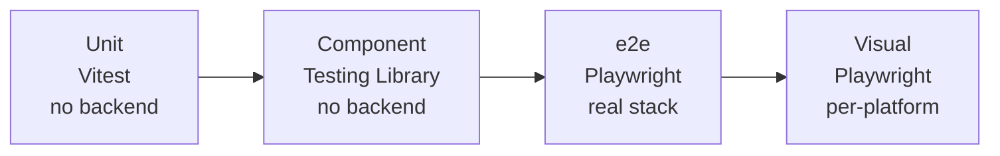

import { Aside } from "@astrojs/starlight/components";
import FaqGroup from "../../../components/FaqGroup.tsx";
import FaqItem from "../../../components/FaqItem.tsx";

Three test layers, each earning its keep:

## Design choices

<FaqGroup>
  <FaqItem title="Three layers, not one" open>
    Unit tests cannot catch routing bugs; e2e cannot catch every hook edge case.
  </FaqItem>
  <FaqItem title="No MSW">
    Hand-written mocks drift from the real backend; HTTP-shaped tests run e2e instead.
  </FaqItem>
  <FaqItem title="e2e runs against the real stack (./dev.sh up -d)">
    Catches API-shape drift and integration regressions for free.
  </FaqItem>
  <FaqItem title="Playwright with Chromium + WebKit">
    Safari behavior bugs surface in CI, not from a user report.
  </FaqItem>
  <FaqItem title="Visual snapshots per-platform">
    macOS vs Linux font rendering differs; baselines committed per OS.
  </FaqItem>
  <FaqItem title="Coverage excludes *.stories.tsx, *.types.ts, *.constants.ts">
    Numbers only count files you can meaningfully test.
  </FaqItem>
</FaqGroup>

## What lives where

<FaqGroup>
  <FaqItem title="Unit / component" open>
    Location: `src/**/*.test.ts` colocated with source. Run: `pnpm test`.
  </FaqItem>
  <FaqItem title="e2e">
    Location: `e2e/*.spec.ts`. Run: `pnpm e2e` (needs dev stack up).
  </FaqItem>
  <FaqItem title="Visual baselines">
    Location: `e2e/visual.spec.ts-snapshots/`. Run: `pnpm e2e:visual:update` to refresh.
  </FaqItem>
  <FaqItem title="Coverage">
    Run via `pnpm test:ci`.
  </FaqItem>
</FaqGroup>

## Why no mock layer

Unit and component tests focus on pure logic; anything HTTP-shaped is e2e against the real backend. Three reasons:

- Drift. Hand-written mocks fall behind the real API shape, and tests pass while the real backend drifts.
- Mental tax. Contributors would have to learn the mocking framework and the real API.
- False signal. "Mock tests are green" isn't "the feature works." Only the e2e tier proves the feature.

## Patterns

Component test: render the component, assert on the rendered output. Don't reach into hook internals; hooks have their own test if they're complex enough to need one.

Hook test: `renderHook` from Testing Library; assert on the returned view object (the `IXxxView` shape). Standard pattern for testing a component's logic without rendering the UI.

E2E test: navigate, interact, assert. Use Playwright's page-object pattern under `e2e/pages/` for anything reused across specs. Baseline visual diffs live in `e2e/visual.spec.ts-snapshots/`.

## When tests break in CI but pass locally

Usually one of three things:

- Visual baselines: different OS font rendering. The CI workflow stores baselines per-platform; run `pnpm e2e:visual:update` on a matching machine, or regenerate baselines in CI itself.
- Flaky timing: Playwright auto-waits, but custom polling loops in app code can race. Look for `setTimeout`-based assumptions.
- API drift: backend changed, `pnpm generate:api` wasn't run. CI catches this via the schema diff check.

## Lint coverage

[`@boring-stack-pkg/eslint-plugin-test-conventions`](https://www.npmjs.com/package/@boring-stack-pkg/eslint-plugin-test-conventions) enforces `tests/` mirrors `src/` and that every test file has a real source file behind it. No orphan tests, no source files without tests for the things that need them.

## Source

[`vitest.config.ts`](https://github.com/AI-Starter-Templates/ui-template/blob/main/vitest.config.ts) · [`playwright.config.ts`](https://github.com/AI-Starter-Templates/ui-template/blob/main/playwright.config.ts) · [`e2e/`](https://github.com/AI-Starter-Templates/ui-template/tree/main/e2e) on GitHub.
