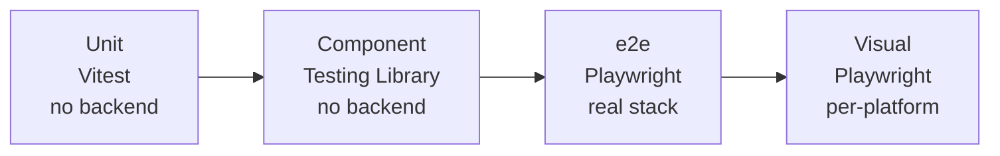

import { Aside } from "@astrojs/starlight/components";

Three test layers, each earning its keep:

## Design choices

| Decision | Reason |
|---|---|
| Three layers, not one | Unit tests can't catch routing bugs; e2e can't catch every hook edge case |
| **No MSW** | Mocking a real backend drifts from the real backend; we removed it on purpose |
| e2e runs against the real stack (`./dev.sh up -d`) | Catches API-shape drift and integration regressions for free |
| Playwright with Chromium + WebKit | Safari behavior bugs surface in CI, not from a user report |
| Visual snapshots per-platform | macOS vs Linux font rendering differs; baselines committed per OS |
| Coverage excludes `*.stories.tsx`, `*.types.ts`, `*.constants.ts` | Numbers only count files you can meaningfully test |

## What lives where

| Test type | Location | Run |
|---|---|---|
| Unit / component | `src/**/*.test.ts` colocated with source | `pnpm test` |
| e2e | `e2e/*.spec.ts` | `pnpm e2e` (needs dev stack up) |
| Visual baselines | `e2e/visual.spec.ts-snapshots/` | `pnpm e2e:visual:update` to refresh |
| Coverage | n/a | `pnpm test:ci` |

## The "no MSW" decision

Earlier iterations of the template shipped MSW for unit tests and offline development. Three problems:

1. **Drift.** Hand-written handlers fall behind the real API shape, and unit tests pass while the real backend drifts.
2. **Mental tax.** Every contributor learns MSW *and* the real API.
3. **False signal.** "MSW tests are green" is not "the feature works."

We pulled it. Unit and component tests focus on pure logic; anything HTTP-shaped is e2e against the real backend. That's the only test that actually proves the feature.

## Patterns

**Component test**: render the component, assert on the rendered output. Don't reach into hook internals; hooks have their own test if they're complex enough to need one.

**Hook test**: `renderHook` from Testing Library; assert on the returned view object (the `IXxxView` shape). This is the canonical pattern for testing a component's logic without rendering the UI.

**e2e test**: navigate, interact, assert. Use Playwright's page-object pattern under `e2e/pages/` for anything reused across specs. Baseline visual diffs live in `e2e/visual.spec.ts-snapshots/`.

## When tests break in CI but pass locally

Usually one of three things:

- **Visual baselines**; different OS font rendering. The CI workflow stores baselines per-platform; run `pnpm e2e:visual:update` on a matching machine, or regenerate baselines in CI itself.
- **Flaky timing**; Playwright auto-waits, but custom polling loops in app code can race. Look for `setTimeout`-based assumptions.
- **API drift**; backend changed, `pnpm generate:api` wasn't run. CI catches this via the schema diff check.

## Lint coverage

[`eslint-plugin-test-conventions`](https://github.com/agjs/eslint-plugin-test-conventions) enforces `tests/` mirrors `src/` and that every test file has a real source file behind it. No orphan tests, no source files without tests for the things that need them.

## Source

[`vitest.config.ts`](https://github.com/AI-Starter-Templates/ui-template/blob/main/vitest.config.ts) · [`playwright.config.ts`](https://github.com/AI-Starter-Templates/ui-template/blob/main/playwright.config.ts) · [`e2e/`](https://github.com/AI-Starter-Templates/ui-template/tree/main/e2e) on GitHub.
